# 01 HTML

## 背景知识

### HTML 发展历程

```
全称  :	Hypertext Markup Language  超文本标记语言（超文本即超链接）
创世纪:
	世界第一个网站：http://info.cern.ch/hypertext/WWW/TheProject.html
	上线时间：1991.08.06
	地址：欧洲核子研究中心
发明人：蒂姆·伯纳斯-李爵士

HTML 1.0 	:1993
HTML 2.0 	:1995
HTML 3.2 	:1996
HTML 4.0 	:1997
HTML 4.1 	:1999
XHTML 1.0	:2000
XHTML 1.1	:2001
XHTML 2.0	:
HTML 5	 	:2013
```

### 浏览器内核

```
webkit内核
blink内核			当前chorm浏览器内核，opear浏览器
presto内核		已经废弃，不是因为差  opear浏览器
Trident内核		IE浏览器
Gecko内核			FF浏览器
```


### IDEA创建HTML

```
new project
删除src文件夹
创建HTML文件夹
```

### HTML注释

```html
<!--注释内容-->
```

### HTML 文档声明

```css
<!-- 文档类型声明，旨在告诉 Browser 应该以何种方式的文档定义类型来解析文档。-->

<!DOCTYPE html>

<!--
浏览器解析页面的方式有两种：
	标准模式：以 W3C 规范进行解析
	混杂模式：
-->
```

###  元素分类

```
分类：
	block 元素
	inlink 元素
block 元素特性：
	块级元素各占一行，默认宽度是父容器的100%，与内容无关
	行内元素会在一条水平线上排列，默认宽度与内容有关
注意：
	1.行内元素不允许设置width、height、
				   margrin-top、margin-bottom
				   padding-top、padding-bottom
			但允许设置line-height
	2.行内元素不允许包含块级元素，a标签除外。【应该被遵守】
	3.块级元素允许包含行内元素和块级元素，其中p标签不允许包含块级元素
	
转换：
	display : block | inline ;
```


### Tag

```
div
span
input
a
img
就这5个
```


## 基础标签

### meta 标签

```html
性质：自闭和标签（单标签）

作用：
	用于描述网站的一些元信息 : https://man.ilovefishc.com/pageHTML5/meta.html

	🦋实例一：指定网页编码
	<meta charset="UTF-8">

	🦋实例二：为搜索引擎提供关键词
	<meta name="keywords" content="小甲鱼,Web开发,HTML5,CSS3,Web编程教学">

	🦋实例三：描述网页内容
	<meta name="description" content="《零基础入门学习Web开发》案例演示">

	🦋实例四：定义网页的作者
	<meta name="author" content="小甲鱼">

	🦋实例五：设置网页尺寸自适应【让页面的宽度等于屏幕的宽度】
	<meta name="viewport" content="width=device-width, initial-scale=1.0">

	🦋实例六：每 n 秒刷新一下浏览器并跳转到指定页面
	<meta http-equiv="refresh" content="5;http://bbs.fishc.com">
```


### hx 系列标题标签

```
种类		:h1 ~ h6
元素类型   :块级元素
作用		:定义标题
```

```css
/* h1 默认样式 */
h1 {
    display				: block;				/* 块级元素 */
    font-size			: 2em;					/* 字体尺寸 */
    margin-block-start	: 0.67em;
    margin-block-end	: 0.67em;
    margin-inline-start	: 0px;
    margin-inline-end	: 0px;
    font-weight			: bold;					/* 字体粗细 */
}
```

### p 段落标签

```
元素类型   :块级元素
作用		:定义段落

注意		:P标签内不能有 块元素   -- 否则会触发修正功能
```

```css
/*	
	1. 任意浏览器的默认字体高都是16px。
	2. 所有未经调整的浏览器都符合: 1em=16px。
*/
p {
    display				: block;
    margin-block-start	: 1em;			/* 1em=16px */
    margin-block-end	: 1em;
    margin-inline-start	: 0px;
    margin-inline-end	: 0px;
}
```

触发修正功能

```
修正方式：
	从P元素标签内部第一个块级元素之前加入</p>闭合标签
```

```html
<!-- src code1-->
<p>
	<span>
        P标签中的内联标签
    </span>
    <p>
    	P标签中的P标签
    </p>
</p>
<!-- 修正 code1-->
<p>
    <span>
        P标签中的内联标签
    </span>
</p>
<p>
    P标签中的P标签
</p>
<p>
</p>
<!-- src code2-->
<p>
    <p>
      P标签中的P标签
    </p>
    <span>
        P标签中的内联标签
	</span>
</p>
<!-- 修正 code2-->
<p></p>
<p>
   P标签中的P标签
</p>
<span>
   P标签中的内联标签
</span>
<p></p>
```

### br 换行标签

```
性质：自闭和标签（单标签）
```

### hr 水平线标签

```
horizontal line 
性质：
	自闭和标签（单标签）
元素类型：
	块级元素
描述：
	一个没有内容高度，宽度自适应的块级元素，可以使用其他方式代替
```

```css
hr {
    display				: block;
    unicode-bidi		: isolate;
    margin-block-start	: 0.5em;
    margin-block-end	: 0.5em;
    margin-inline-start	: auto;
    margin-inline-end	: auto;
    overflow			: hidden;
    border-style		: inset;
    border-width		: 1px;
}
```

### base 解析基准标签

```
性质： 自闭和标签（单标签）
位置： 头部标签内部
作用： 
	1. href   设置URL 解析基准
	2. target 超链接在新页面打开的位置
```

```
属性target：
		_blank 		新窗口
		_parent 	当前父窗口，如果没有父窗口，就是当前窗口
		_self 		当前窗口
		_top  		当前窗口
		framename 	指定窗口
href:
	指定该 HTML 文档中所有相对链接的基准 URL。
```

相对基准

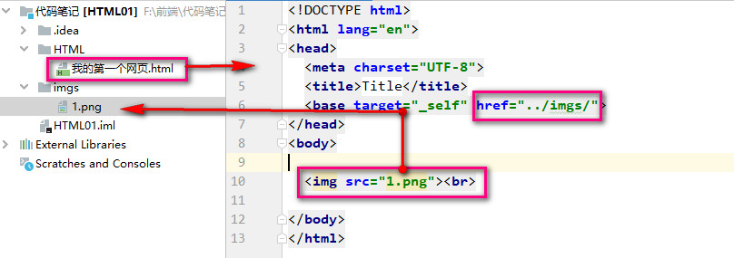

### 实体字符

```
比如：卢布，空格，大于，小于等
```

### img 标签

```html
元素类型：行内元素


属性：
	src 图片的地址
	alt 图片的代替文本

	title 悬停显示
```

### a 超链接

```html
元素类型：行内元素

功能：🐅页面跳转+🐅锚链接+🐅功能链接
	1. 当前页面头部 
		<a href="#"> TO HEAD </a>  【base解析基准标签可能影响跳转位置】
	2. 当前页面尾部
		<a href="#bottom" >TO Bottom</a>  
		<a href="#" id='bottom'> TO HEAD </a>	 <!-- 提供一个id\name -->
	3. 当前页面某个位置
		<a href="#mid" >TO MID</a>
		<a id="mid" ></a>						 <!-- 提供一个id\name  div要配合id-->
	4. 空链接
		<a href="javascript:">啥也不会发生</a>
	5. 某个网址
		<a href="HTTP://百度">百度</a>
	6. 到某个网址的某个位置
		<a href="我的第一个网页.html#bottom" target="_parent"> 到第一个网页底部</a>
	7. 功能链接
		邮件：<a href="mailto:614856415@qq.com">contact me</a>
		qq1：<a href="tencent://message/?uin=qq号&Site=网站名称&Menu=yes">PC端</a>
		qq2：<a href="mqqwpa://im/chat?chat_type=wpa&uin=qq号">移动端</a>
		电话：<a href="tel:电话号码">电话号码</a>
		下载：<a href="下载地址" download="文件名">文件名</a>
		qq推广
属性：
	href
	target 见base
```

### 3种 列表

```
分类：
	有序列表
	无序列表
	自定义列表
```

1. ul 标签用于定义无序列表。(unorder list)

```html
<ul class="min-images">
    <li class="min">1</li>
    <li class="min">2</li>
    <li class="min">3</li>
</ul>
```

​	2. ol 标签用于定义有序列表。（order list）

```html
<ol class="min-images">
 	<li class="min">咖啡</li>
 	<li class="min">牛奶</li>
 	<li class="min">茶</li>
</ol>
```

2. dl  自定义列表： 左右各有1em的margin；

​		dt  定义项目

​		dd 项目描述： 有左margin  40px；

<dl>
    <dt>电影标题</dt>
    <dd>主要演员：刘德华，周润发</dd>
    <dd>影片长度：90分钟</dd>
    <dd>内容介绍：……..</dd>
</dl>


```html
<dl>
    <dt>电影标题</dt>
    <dd>主要演员：刘德华，周润发</dd>
    <dd>影片长度：90分钟</dd>
    <dd>内容介绍：……..</dd>
</dl>
```

### 表格标签

| table    | 定义 HTML 表格                         |                             |
| -------- | -------------------------------------- | --------------------------- |
| caption  | 定义表格标题                           |                             |
| thead    | 定义表格的表头                         |                             |
| tbody    | 定义表格的主体                         |                             |
| tfoot    | 定义表格的页脚                         |                             |
| tr       | 定义表格中的行,配合th\|td              | table row                   |
| th       | 定义表格内的表头单元格(居中的粗体文本) | table head content          |
| td       | 定义表格中的标准单元格                 |                             |
| colgroup |                                        |                             |
| col      | 为表格中一个或多个列定义属性值         | 属性 span元素应该横跨的列数 |

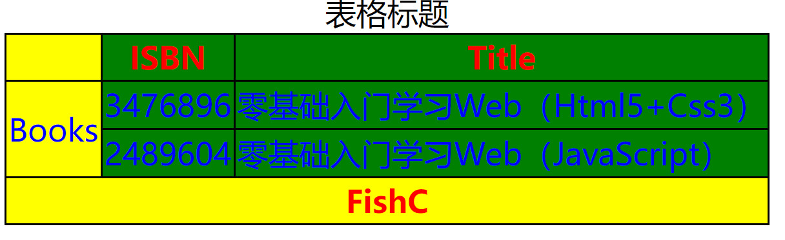

```html
<!DOCTYPE html><html><head><title>表格</title></head>
    <body>
        <table>
            <caption>表格标题</caption>
            <colgroup>
                <col style="background-color:yellow">
                <col span="2" style="background-color:green">
            </colgroup>
            <thead>
                <tr>
                    <th></th>
                    <th>ISBN</th>
                    <th>Title</th>
                </tr>
            </thead>
            <tbody>
                <tr>
                    <td rowspan="2">Books</td>
                    <td>3476896</td>
                    <td>零基础入门学习Web（Html5+Css3）</td>
                </tr>
                <tr>
                    <td>2489604</td>
                    <td>零基础入门学习Web（JavaScript）</td>
                </tr>
            </tbody>
            <tfoot>
                <tr>
                    <th colspan="3">FishC</th>
                </tr>
            </tfoot>
        </table>
    </body>
    <style type="text/css">
			table {
				border-collapse: collapse;}
			table,
			th,
			td {
				border: 1px solid black;}
			thead {
				color: red;}
			tbody {
				color: blue;
				height: 50px}
			tfoot {
				color: red}
		</style>
</html>
```

### 多媒体标签

​	video|audio|source

​			这两者配合source元素

```
属性：
	controls :向用户显示音视频播放控件（比如播放/暂停按钮）
	autoplay:音视频在就绪后马上播放。
	loop：循环播放音视频
	muted：将视频的音视频输出为静音
```

```html
<!-- 音频 -->
	<audio controls >
		<!-- 优先使用第一个：冗余操作 -->
		<source src="./music/芒种.mp3" >
		<source src="./music/芒种1.mp3" >
		<!-- IE8等老版本兼容方式 -->
		<embed src="./music/芒种.mp3" width="100" height="60"  type="audio/mp3"></embed>
		<!-- 您的浏览器不支持 HTML5 video 标签。 -->
	</audio>
<!-- 视频 -->
	<video width="840" height="560" controls  loop="loop">
		<source src="./music/芒种.mp4"  type="video/mp4">
		<!-- IE8等老版本兼容方式 -->
		<embed src="./music/芒种.mp4" width="800" height="500"  type="video/mp4"></embed>
		<!-- 您的浏览器不支持 HTML5 video 标签。 -->
	</video>
<!-- 第三方源引用 -->
	<iframe frameborder="0" src="https://v.qq.com/txp/iframe/player.html?vid=m00253deqqo" allowFullScreen="true">
	 </iframe>
```

audio精细样式控制

```
audio::-webkit-media-controls-panel
audio::-webkit-media-controls-mute-button
audio::-webkit-media-controls-play-button
audio::-webkit-media-controls-timeline-container
audio::-webkit-media-controls-current-time-display
audio::-webkit-media-controls-time-remaining-display
audio::-webkit-media-controls-timeline
audio::-webkit-media-controls-volume-slider-container
audio::-webkit-media-controls-volume-slider
audio::-webkit-media-controls-seek-back-button
audio::-webkit-media-controls-seek-forward-button
audio::-webkit-media-controls-fullscreen-button
audio::-webkit-media-controls-rewind-button
audio::-webkit-media-controls-return-to-realtime-button
audio::-webkit-media-controls-toggle-closed-captions-button
```


### iframe 内联标签

```
inner frame 内联框架
属性
	src: URL
	name: 框架标识名
```

```html
<!-- 使用内联框架 -->
<div class="main">
    <div class="leftNavBar">
        <a href="login.html" target="nac">page one</a>
        <a href="register.html" target="nac">page two</a>
    </div>
    <div class="rightDetaillContent">
        <iframe name="nac" src="login.html">
        </iframe>
    </div>
</div>
```


### 格式化标签

#### 字体样式

```
样式一：粗体
	b	strong（含有语气）
样式二：斜体
	i	em（强调文本）
元素类型：
	行内元素
阐述解释：
	虽然Strog是含有语气加重，em是强调文本。但他们和b、i之间的区别是在搜索引擎或者浏览器方面设计的差别，
	在CSS层面是完全一样的，无任何差别。
```

```css
em {
    font-style: italic;
}
i {
    font-style: italic;
}
strong {
    font-weight: bold;
}
b {
    font-weight: bold;
}
```

#### bdo 文本方向

```html
作用：修改本输出方向
属性：dir
<bdo dir="rtl"> CNN分析佩洛西穿粉色西装原因 </bdo>
```

#### 其他格式化标签

| 格式化标签：                                    |                                   |
| ----------------------------------------------- | --------------------------------- |
| dfn   标签表现定义中的术语。                    |                                   |
| time 标签用于定义日期或时间。                   |                                   |
| b 标签用于定义表示粗体的文本,没有语义。         | 推荐CSS: b {font-weight: bolder;} |
| strong 标签用于定义表示重要的文本。             |                                   |
| sub 标签用于定义下标文本。                      |                                   |
| sup标签用于定义上标文本。                       |                                   |
| meter 标签定义一个范围内的测量值/分数值。       |                                   |
| abbr 标签定义简称或缩写，比如 “WWW” 或 “NATO”。 |                                   |

举例：

1.  每天<time>00:00-08:00</time>进入机器职守高防状态

```html
<p>每天<time>00:00-08:00</time>进入机器职守高防状态</p>
```

2.  <abbr title="World Wide Web">WWW</abbr> 

```html
<abbr title="World Wide Web">WWW</abbr>
```


### 语义化结构标签

| span        | 用于组合文档中的行内元素  |
| ----------- | ------------------------- |
| **div**     |                           |
| **header**  | **H5:网页四部分：头**     |
| **main**    | **H5:网页四部分：主体**   |
| **aside**   | **H5:网页四部分：侧边栏** |
| **footer**  | **H5:网页四部分：脚**     |
| **nav**     | **H5：导航**              |
| **section** | **H5:定义文档中的节**     |
| **data**    | **H5:**                   |
| **details** | **H5:**                   |
| **article** | **H5:**                   |
| **dialog**  | **H5:**                   |
| **summary** | **H5:**                   |

### template标签

| template | 标签是一种用于保存客户端内容的机制，                         |
| -------- | ------------------------------------------------------------ |
|          | 该内容在页面加载时不被渲染，但可以在运行时使用JavaScript进行实例化 |

```html
<!DOCTYPE html>
<html>
<head>
    <meta charset="UTF-8">
    <title>鱼C-零基础入门学习Web（Html5+Css3）</title>
</head>
<body>
    <table id="producttable">
        <thead>
        <tr>
            <td>序列号</td>
            <td>名称</td>
        </tr>
        </thead>
        <tbody>
        <!-- 现有数据可以可选地包括在这里 -->
        </tbody>
    </table>

    <template id="productrow">
        <tr>
            <td class="record"></td>
            <td></td>
        </tr>
    </template>

    <script>
        // 通过检查来测试浏览器是否支持HTML模板元素 
        // 用于保存模板元素的内容属性。
        if ('content' in document.createElement('template')) {  //检擦是否支持template	

            // 使用现有的HTML tbody实例化表和该行与模板
            var t = document.querySelector('#productrow'),       //定位template
                td = t.content.querySelectorAll("td");
            td[0].textContent = "1235646565";
            td[1].textContent = "FishC-U";

            // 克隆新行并将其插入表中
            var tb = document.getElementsByTagName("tbody");
            var clone = document.importNode(t.content, true);	//template内容导入tbody
            tb[0].appendChild(clone);

            // 创建一个新行
            td[0].textContent = "0384928528";
            td[1].textContent = "FishC-Key";

            // 克隆新行并将其插入表中
            var clone2 = document.importNode(t.content, true); //template内容再次导入tbody
            tb[0].appendChild(clone2);

        } else {
            // 找到另一种方法来添加行到表，因为不支持HTML模板元素。
        }
    </script>
</body>
</html>
```


## 表单

### 账户密码

```html
<!DOCTYPE html>
<html>
<head>
    <meta charset="UTF-8">
    <title>登录</title>
</head>
<body>
  <div class="main">

      <label for="UserName"> 用户名: </label>
      <input type="text" name="username" id="UserName" placeholder="请输入用户名"><br>
      <label for="PassWord"> 密 码： </label>
      <input type="password" name="password" id="PassWord" placeholder="请输入密码"><br>
      <input type="button" value="登录" id="submitInfo">

  </div>
</body>
<script>
      let submit1 = document.getElementById("submitInfo") ;
      let submit2 = document.querySelector("input[type=button]")
      submit2.addEventListener("click",function () {
        let username   = document.getElementById("UserName");
        let passwd = document.getElementById("PassWord") ;
        console.log(username.value)
        console.log(passwd.value)
      })
</script>
</html>
```

### form表单

```
属性：
	method : 提交方式
	action : URL 提交目的地
	name   : 规定表单的名称
	target : 规定在何处打开 action URL
	enctype：编码方式
		application/x-www-form-urlencoded 	： HTML默认方式
		multipart/form-data					：　上传非文本数据，音乐，文件
		text/plain							：　
过程：
	通过点击submit 按钮，触发表单提交操作，从而使页面跳转到action URL 所指向的地址
	
onsubmit = "return mySubmit(this)" 
	mySubmit(this) 返回true 则提交表单
	mySubmit(this) 返回false 则不提交表单
```

```html
<!DOCTYPE html>
<html>
<head>
    <meta charset="UTF-8">
    <title>获取form表单的数据</title>
</head>
<body>
  <div class="main">
      <form method="post" action="login.html" name="login" target="_blank" onsubmit="return mySubmit(this)">
          <label for="UserName"> 用户名: </label>
          <input type="text" name="username" id="UserName" placeholder="请输入用户名"><br>
          <label for="PassWord"> 密 码： </label>
          <input type="password" name="password" id="PassWord" placeholder="请输入密码"><br>
          <input type="submit" value="登录" id="submitInfo">
      </form>
  </div>
</body>
<script>
      function mySubmit(form) {
        let formData = new FormData(form);
        let username = formData.get('username');
        let password = formData.get('password');
        console.log(username)
        console.log(password)
        console.log(document.querySelector("form").name);		// 打印表单名
        return true ;  // 允许表单提交
        return false ; // 不允许表单提交
      }
</script>
</html>
```


### input 标签

```html
属性：
	value 		: 指定输入字段默认初始值
	
	maxlength	: 指定用户在文本输入框种的最大字符数
	
	disable		: 是否禁用该Input 元素，无法获取该值
	
	placeholder	: 占位提示符
	
	size		: 指定文本框的宽度
	
	checked		: 默认指定该单选框、多选框
	
	name		: 只有设置了 name 属性的表单才能在提交表单时传递该值

	multiple	: 指定该属性后可以上传多个文件

	form		: 指定所属表单from 的id

	readonly	: 只读
	
	hidden		: 隐藏

	required	: 必须

	autofocus	: 指定是否自动获得焦点

label 属性
	for:对象相关元素id
	form ：同上
```


### 单选框 radio

```html
<!DOCTYPE html>
<html>
<head>
    <meta charset="UTF-8">
    <title>单选框</title>
</head>
<body>
  <div class="main">
      <form method="post" action="login.html" name="login" target="_blank" onsubmit="return mySubmit(this)" enctype="multipart/form-data">
          <label for="apple">苹果</label>
          <input type="radio" name="fruit" id="apple" value="apple" checked/>
          <label for="banana">香蕉</label>
          <input type="radio" name="fruit" id="banana" value="banana" />
          <label for="tomoto">西红柿</label>
          <input type="radio" name="fruit" id="tomoto" value="tomoto" />

          <input type="submit" value="PUT" id="submitInfo">
      </form>
  </div>
</body>
<script>
      function mySubmit(form) {
        let formData = new FormData(form);
        console.log(formData.get("fruit"))
        return true ;
      }
</script>
</html>
```

### 多选框  checkbox

```html
<!DOCTYPE html>
<html>
<head>
    <meta charset="UTF-8">
    <title>多选框</title>
</head>
<body>
  <div class="main">
      <form method="post" action="login.html" name="login" target="_blank" onsubmit="return mySubmit(this)" enctype="application/x-www-form-urlencoded">
          <label for="apple">苹果</label>
          <input type="checkbox" name="fruit" id="apple"  value="apple" checked/>
          <label for="banana">香蕉</label>
          <input type="checkbox" name="fruit" id="banana" value="banana" />
          <label for="tomoto">西红柿</label>
          <input type="checkbox" name="fruit" id="tomoto" value="tomoto" />

          <input type="submit" value="PUT" id="submitInfo">
      </form>
  </div>
</body>
<script>
      function mySubmit(form) {
        let formData = new FormData(form);
        console.log(formData.getAll("fruit"));
        return true ;
      }
</script>
</html>
```

### 5 种按钮

type=button

```html
<!--
	input type='button'定义可点击的按钮，但[没有任何行为]。
	button 类型常用于在用户点击按钮时启动 JavaScript 程序。
-->
<body>
  <div class="main">
      <input type="button" value="button按钮" name="btn2">
  </div>
</body>
<script>
    var btn = document.querySelector("input[name=btn2]")
    btn.addEventListener('click',function () {
      alert("按下了button按钮")
    })
</script>
```

type=submit

```html
<!--
	定义提交按钮。提交按钮用于**向服务器发送表单数据**。
	数据会发送到表单的 action 属性中指定的页面。 
-->
<form method="post" action="login.html" name="login" target="_blank" onsubmit="return mySubmit(this)">
   <input type="submit" value="submit按钮" name="btn1">
</form>
```

图片按钮： type = img

```html
<!-- 同 submit 一样，默认会提交-->
<form method="post" action="login.html" name="login" target="_blank" onsubmit="return mySubmit(this)">
	<input type="image" src="../imgs/1.png" value="图片按钮" name="btn1">
</form>
```

button按钮

```html
<!-- 同 submit 一样，默认会提交-->
<form method="post" action="login.html" name="login" target="_blank" onsubmit="return mySubmit(this)">
   <button> 按钮 </button>
</form>
```

重置按钮type=reset

```html
<form method="post" action="login.html" name="login" target="_blank" onsubmit="return mySubmit(this)" >
     <label for="username">用户名</label>
     <input type="text" name="username" id="username" value="123">
     <input type="reset" value="重置">
</form>
```

### 搜索框

```html
<!DOCTYPE html>
<html>
<head>
    <meta charset="UTF-8">
    <title>搜索框</title>
</head>
<body>
  <div class="main">
      <form method="post" action="login.html" name="login" target="_blank" onsubmit="return mySubmit(this)" enctype="application/x-www-form-urlencoded">
          <label for="search">度娘</label>
          <input type="search" name="search" id="search" >
          <input type=submit value="搜索">
      </form>
  </div>
</body>
<script>
    function mySubmit(form) {
      let formData = new FormData(form);
      console.log(formData.get("search"))
      return true ;
    }
</script>
</html>
```

### 其他功能

```
时间框
日期框
文件框
隐藏框
邮件框
颜色框
滑块框
电话框
URL框
```

### 下拉框

```
select属性：
	autofucus 	: 页面加载后，文本区域自动获得焦点
	disable		: 指定该下拉列表被禁用
	form		: 指定所属表单from 的id
	multiple	: 指定该下拉列表支持多个选项【*】
	name		: 指定该下拉列表的名称
	required	: 指定文本区域是必填的
	size		: 指定下拉列表中可见选项的数目
option属性：
	disabled	: 指定该选项被禁用
	selected	: 指定该选项表现为选中状态【*】
    value		: 指定发到服务器的选项值【*】
```

```html
<!DOCTYPE html>
<html>
<head>
    <meta charset="UTF-8">
    <title>下拉框</title>
</head>
<body>
  <div class="main">
      <form method="post" 
            action="login.html" 
            id="login"
            name="login" target="_blank" onsubmit="return mySubmit(this)" >
          <input type="submit" value="提交">
      </form>
      <select name="fruit" multiple size="3" form="login">
          <option value="banana" selected>
              香蕉
          </option>
          <option value="apple">
              苹果
          </option>
          <option value="Smell">
              榴莲
          </option>
      </select>
  </div>
</body>
<script>
    function mySubmit(form) {
      let formData = new FormData(form);
      console.log(formData.getAll("fruit"))
      return true ;
    }
</script>
</html>
```

### 文本域

```
textarea属性：
	form		:指定所属表单from 的id
	cols		:指定文本区域的可见宽度
	rows		:指定文本区域的可见高度
	name		:指定文本区域的名称
	maxlength	:指定文本区域的最大字符数
	placeholder	:指定文本区域的占位提示文本
	required	:必填项
```

```html
<!DOCTYPE html>
<html>
<head>
    <meta charset="UTF-8">
    <title>文本域</title>
</head>
<body>
<div class="main">
    <form method="post"
          action="login.html"
          id="login"
          name="login" target="_blank" onsubmit="return mySubmit(this)" >
        <input type="submit" value="提交">
    </form>
    <textarea form="login" name="wenbenyu" maxlength="23">
        文本域
    </textarea>
</div>
</body>
<script>
  function mySubmit(form) {
    let formData = new FormData(form);
    console.log(formData.getAll("wenbenyu"))
    return true ;
  }
</script>
</html>
```

### 文件域

```html
</html><!DOCTYPE html>
<html>
<head>
    <meta charset="UTF-8">
    <title>文件域</title>
</head>
<body>
<div class="main">
    <form method="post"
          action="login.html"
          id="login"
          name="login" target="_blank" onsubmit="return mySubmit(this)" >

        <input type="file" name="filedata">
        <input type="submit" value="提交">
    </form>

</div>
</body>
<script>
  function mySubmit(form) {
    let formData = new FormData(form);
    console.log(formData.get("filedata"))
    return true ;
  }
</script>
</html>
```

### 数字框

```html
<!DOCTYPE html>
<html>
<head>
    <meta charset="UTF-8">
    <title>数字框</title>
</head>
<body>
<div class="main">
    <form method="post"
          action="login.html"
          id="login"
          name="login" target="_blank" onsubmit="return mySubmit(this)" >

        <input type="number" name="size" min="0" max="15" step="1">
        <input type="submit" value="提交">
    </form>

</div>
</body>
<script>
  function mySubmit(form) {
    let formData = new FormData(form);
    console.log(formData.getAll("size"))
    return true ;
  }
</script>
</html>
```


### 初级验证

```
placeholder	:提示信息
required	:必填字段
pattern		:正则匹配
```

```html
<!DOCTYPE html>
<html>
<head>
    <meta charset="UTF-8">
    <title>初级验证</title>
</head>
<body>
<div class="main">
    <form method="get" action="login.html" id="login" name="login" target="_blank" onsubmit="return mySubmit(this)" enctype="application/x-www-form-urlencoded">
    </form>
    <label for="username">username</label>
    <input type="text" name="username" id="username" form="login" required  pattern="[0-9]{6,18}">
    <input type=submit value="put" form="login">
</div>
</body>
<script>
  function mySubmit(form) {
    let formData = new FormData(form);
    console.log(formData.get("username"))
    return true ;
  }
</script>
</html>
```


## HTML事件

[W3C支持文档：](https://www.w3school.com.cn/tags/html_ref_eventattributes.asp) 

```html
HTML 中：
		<element onloadstart="*myScript*">

JavaScript 中：
        object.onloadstart=function(){*myScript*};

JavaScript 中, 使用 addEventListener() 方法:
	 	object.addEventListener("loadstart", *myScript*);
```

### body事件

​	(window事件应用到body元素)

​			1.onload 事件会在页面或图像加载完成后立即发生

​					支持该事件的标签：**body** | **img** |frame frameset  iframe  link  script

​					支持该事件的js对象：image ,layer,window

```html
<!DOCTYPE html>
<html>
	<head>
		<meta charset="utf-8">
		<title>body事件</title>
	</head>
	<body onunload="goodbye()" onload="load()">
		
	</body>
	<script>
		function load()
		{
			alert("页面已加载！");
		}	
		function imgload(){
			alert("img is load finish")
		}
	</script>
</html>
```

​			2.onunload 属性会在页面下载时触发（或者浏览器窗口已关闭）。

### 表单事件：

​			1.onblur 属性在元素失去焦点时触发。

```HTML
<!DOCTYPE html>
<html>
	<head>
		<meta charset="utf-8">
		<title>表单事件</title>
	</head>
	<body>
		<p>请输入鱼油的姓名，然后把焦点移动到字段外：</p>
		请输入鱼油的姓名（英文字符）：
		<input type="text" name="fname" id="fname" onblur="upperCase()">
	</body>
	<script>
		function upperCase() {
			var x = document.getElementById("fname").value;
			document.getElementById("fname").value = x.toUpperCase();
		}
	</script>
</html>
```

​			2.onfocus 属性在元素获得焦点时触发。	

```html
	<!DOCTYPE html>	
<html>
	<head>
		<meta charset="utf-8">
		<title>表单事件</title>
	</head>
	<body>
		<p>当输入字段获得焦点时触发函数。此函数改变输入字段的背景色。</p>
		First name: <input type="text" id="fname" onfocus="setStyle(this.id)"><br>
		Last name: <input type="text" id="lname" onfocus="setStyle(this.id)">
	</body>
	<script>
		function setStyle(x) {
			document.getElementById(x).style.background = "green";
		}
	</script>
</html>
```

​			3.onsubmit 属性在提交表单时触发。

```
<!DOCTYPE html>
<html>
	<head>
		<meta charset="utf-8">
		<title>表单事件</title>
	</head>
	<body>
		<p>当表单被提交后，触发函数并弹出提示信息。</p>
		    <form onsubmit="checkform()">
		        输入鱼油的名字: <input type="text" name="name">
		        <input type="submit">
		    </form>
	</body>
	<script>
		function checkform() {
			alert(document.querySelector("input").value)
		}
	</script>
</html>
```

​			4.onselect 属性在元素中的文本被选中时触发。

​					支持该事件的表单类型 ： <input type="password|text">   以及 <textarea>

```
<!DOCTYPE html>
<html>
	<head>
		<meta charset="utf-8">
		<title>表单事件</title>
	</head>
	<body>
		<form action="#" onsubmit="check()" method="post">
			一些文本：<input type="text" value="请选中我！" onselect="showMsg('text')">
			一些文件：<input type="file" onselect="showMsg('file')">
			密码：<input type="password" value="请选中我！" onselect="showMsg('password')">
			文本域：<textarea rows="5" cols="4" name='area' onselect="showMsg('textarea')"></textarea>
			<input type="submit" />
		</form>

	</body>
	<script>
		function showMsg(para) {
			alert("鱼油选中了" + para);
		}
		document.querySelector("textarea").value = "哈哈哈哈";

		function check() {
			alert(document.querySelectorAll("input")[1].value)
		}
	</script>
</html>
```

​		5.onreset 事件在表单被重置后触发。

​		6.onchange 在元素值改变时触发。

​					支持该事件的元素 input  textarea  select

```html
<!DOCTYPE html>
<html>
	<head>
		<meta charset="utf-8">
		<title>表单事件</title>
	</head>
	<body>
		<p>请修改输入字段中的文本，然后在字段外随意点击，便可触发 onchange。</p>
		<select name="id" onchange="checkField(this.value)">
			<option value=""></option>
			<option value="1">1</option>
			<option value="2">2</option>
			<option value="3">3</option>
		</select>

	</body>
	<script>
		function checkField(val) {
			alert("输入值已更改。新值是：" + val);
		}
	</script>
</html>
```

### 鼠标事件：

| 1.onclick 鼠标单击触发                      |
| :------------------------------------------ |
| **2.ondblclick 属性在鼠标双击元素时触发。** |

```html
<!DOCTYPE html>
<html>
	<head>
		<meta charset="utf-8">
		<title>鼠标事件</title>
	</head>
	<script>
	        function copyText()
	        {
	            document.getElementById("field2").value=document.getElementById("field1").value;
	        }
	    </script>
	</head>
	<body>
	    区域1: <input type="text" id="field1" value="Welcome to FishC"><br>
	    区域2: <input type="text" id="field2"><br><br>
	    <p ondblclick="copyText()">当按钮被单击时触发函数。此函数把文本从 区域1 复制到 区域2 中。</p>
	</body>
</html>
```

| 3.onmousedown 属性在鼠标按钮在元素上按下时触发。 |
| ------------------------------------------------ |
| **4.onmouseup 属性在松开鼠标按钮时触发。**       |

```html
<html>
	<head>
		<meta charset="utf-8">
		<title>鼠标事件</title>
	</head>
	<script>
		function myFunction(elmnt, clr) {
			elmnt.style.color = clr;
		}
	</script>
	</head>
	<body>
		<p onmousedown="myFunction(this,'red')" onmouseup="myFunction(this,'green')">
			单击文本改变颜色。触发一个带参数函数,当鼠标按钮被按下,文本变红<br>
			当释放鼠标按钮，再一次触发其他参数函数
		</p>
	</body>
</html>
```

| **5.onmousemove 属性在鼠标指针在元素上移动时触发。(后触发，区域内一直触发)** |
| ------------------------------------------------------------ |
| **6.onmouseout 属性在鼠标指针移动到元素外或其中的子元素外时触发。** |
| **7.onmouseover 属性在鼠标指针移动到元素上或其中的子元素上时触发。(先触发，进入时触发）** over:翻过；跨过 |
| **解释 ：时间上 onmouseover 事件触发后，再触发 onmousemove 事件。** |
| **8.onmouseenter 属性在当指针移动到元素上时，发生此事件。**  |
| **9.onmouseleave 属性在当指针从元素上移出时，发生此事件。**  |
|                                                              |

```html
<!DOCTYPE html>
<html>
	<head>
		<meta charset="utf-8">
		<title>鼠标事件</title>
	</head>
	<script>
		function bigImg(x) {
			x.style.height = "168px";
			x.style.width = "718px";
		}

		function normalImg(x) {
			x.style.height = "84px";
			x.style.width = "359px";
		}
		var index = 0;

		function change() {
			console.log("changeing" + index)
			index++;
		}
	</script>
	</head>
	<body>
		
		<p>函数 bigImg() 在鼠标指针移动到图像上时触发。</p>
		<p>函数 normalImg() 在鼠标指针移出图像时触发。</p>
	</body>
</html>
```

### 键盘事件：

| 1.onkeydown  | 在用户按下按键时触发。 （先发生） 连续触发           |
| ------------ | ---------------------------------------------------- |
| 2.onkeypress | 在用户敲击按钮时触发（只监听数字和字符）。（再发生） |
| 3.onkeyup    | 当用户释放按键时触发。（最后发生）                   |

​		配合表单元素 input | textarea

​		当监听字母和数字时：onkeypress在则onkeyup不会起作用,

```html
<!DOCTYPE html>
<html>
	<head>
		<meta charset="utf-8">
		<title>鼠标事件</title>
	</head>
	<script>
		function displayResult(para){
				alert(para)；
                alert(event.key)
		}
	</script>
	</head>
	<body>
		<input type="text" onkeydown="displayResult('1')" onkeypress="displayResult('2')" value="down">
		<input type="text" onkeypress="displayResult('2')" onkeyup="displayResult('3')"  value="up">
		<input type="text" onkeypress="displayResult(this.value)" value="press">
		<textarea rows="10" cols="30" onkeypress="displayResult(this.value)">我是一个文本框.</textarea>
	</body>
</html>
```

### 图片事件:

​		1.onabort 事件会在图像加载被中断时发生。

​				支持该事件的元素  **img**

​		2.onload事件

```html
<!DOCTYPE html>
<html>
	<head>
		<meta charset="utf-8">
		<title>图片事件</title>
	</head>
	<body>
		

	</body>
	<script>
		function load(){
			alert("load over")
			document.getElementsByTagName('img')[0].setAttribute('src',"./日常网页功能/轮播图/img/02.jpg")
		}
		function checkField() {
			alert("图片加载中断");
		}
	</script>
</html>
```


### 媒体事件

其他信息见[JavaScript高阶](03_JavaScript高阶.md)：

当音频/视频处于加载过程中时，会依次发生以下事件：

1. onloadstart:当浏览器开始寻找指定的音频/视频时，会发生 loadstart 事件。即当加载过程开始时。

```
html同上

var myVid=document.getElementsByTagName("video")[0] ;
myVid.onloadstart=alert("浏览器开始寻找指定的音频/视频");
```

​	2.ondurationchange:当指定音频/视频的时长数据发生变化时，发生 durationchange 事件。

​		当音频/视频加载后，时长将由 "NaN" 变为音频/视频的实际时长。

```
myVid.ondurationchange=alert("时长将由 NaN 变为音频/视频的实际时长");
```

​	3.onloadedmetadata:当指定的音频/视频的元数据已加载时，会发生 loadedmetadata 事件。

​	音频/视频的元数据包括：时长、尺寸（仅视频）以及文本轨道。

```
myVid.onloadedmetadata=alert("元数据包括：时长、尺寸（仅视频）以及文本轨道");
```

​	4.onloadeddata:当当前帧的数据已加载，但没有足够的数据来播放指定音频/视频的下一帧时，会发生 loadeddata 事件。

```
myVid.onloadeddata=alert("期待其他缓存进去，当权数据不够播放");
```

​	5. onprogress:当浏览器正在下载指定的音频/视频时，会发生 progress 事件。

```
myVid.onprogress=alert("正在下载视频");
```

​	6.oncanplay:当浏览器能够开始播放指定的音频/视频时，发生 canplay 事件。

```
myVid.oncanplay=alert("视频可以播放");
```

​	7.oncanplaythrough:当浏览器预计能够在不停下来进行缓冲的情况下持续播放指定的音频/视频时，会发生 canplaythrough 事件。

```js
myVid.oncanplaythrough=alert("预计能一直播放");
```

```js
// var myVid=document.getElementsByTagName("video")[0] ;
// myVid.onloadstart=alert("浏览器开始寻找指定的音频/视频");
// myVid.ondurationchange=alert("时长将由 NaN 变为音频/视频的实际时长");
// myVid.onloadedmetadata=alert("元数据包括：时长、尺寸（仅视频）以及文本轨道");
// myVid.onloadeddata=alert("期待其他缓存进去，当权数据不够播放");
// myVid.onprogress=alert("正在下载视频");
// myVid.oncanplay=alert("视频可以播放");
// myVid.oncanplaythrough=alert("预计能一直播放");
```

------


# 02 CSS3

MDN网址：https://developer.mozilla.org/zh-CN/docs/Web/CSS/padding-inline-start

## CSS3基础

### 背景知识

#### CSS发展史

```
Cascading Style Sheet 层叠样式表

CSS 1.0 :
CSS 2.0	: DIV + CSS
CSS 2.1	: 浮动、定位
CSS 3.0	: 圆角、阴影、动画、兼容性等等
```

####  CSS引入方式

```css
方式一： 内联样式 style=""
方式二： 内部样式 <style></style>
方式三： 外部引用样式<link rel="stylesheet" type="text/css" href="cssfile">
方式四： @import “url”
```

```css
<style type="text/css">
    @import "../css/style.css" ;
    @import url("../css/style.css");
    div{
        background-color:  fuchsia;
    }
</style>
/* import规则一定要先于除了@charset的其他任何CSS规则 */
```

#### 导入式与链接式区别

```
导入式是CSS2.1  新增的。不要使用
```

#### css注释

```css
/* css 注释 */
```

#### CSS优势

```
1. 内容与表现分离
2. 网页结构单一、可以实现复用
3. 样式十分丰富
4. 利用SEO、容易被搜索引擎收录
```

#### em和rem

```css
em 相对于元素字体大小计算
	1em = 16px
rem 相当于根元素字体计算
	html{ font-size:55px ;}
```

### 选择器

#### 基本选择器

```css
1.	* 				通用选择器					 	0 0 0 0 
2.	element 		元素选择器  					 	0 0 0 1
3.	.class 			类选择器					  	 0 0 1 0
4.	#id	 			id选择器					   	 0 1 0 0 
```

#### 复合选择器

##### 交并集选择器

```css
1.	element.class 		交集选择器，找到指定标签间的共有部分
1.	element#id  		交集选择器，找到指定标签间的共有部分		【element 必须为元素选择器】
2.	element1,element2	并集选择器，找到所有满足的标签			  【element 为基本选择器即可】
```

##### 关系选择器

权重:0 0 0 0 

```css
3.	element1 element2	后代选择器，选择elment1元素内部的element2元素			【element 为基本选择器即可】
4.	element1 > element2	子元素选择器，选择element1元素中符合直接子元素的element2元素
					注意：如果元素不是父元素的直接子元素，则不会被选择。	 		 【element 为基本选择器即可】
					
5.	element1 + element2 相邻兄弟选择器，选择具有相同父元素且同级的element1相邻的element2、
					注意：两种元素必须拥有相同的父元素，但是 element2 必须直接紧随 element1。
						且最后选择的是element2			   					【element 为基本选择器即可】
6.	element1 ~ element2	通用兄弟选择器，选择具有相同父元素且同级的element1之后的element2
					注意：两种元素必须拥有相同的父元素，但是 element2 不必直接紧随 element1。
																		 【element 为基本选择器即可】
```


#### 属性选择器

权重：0 0 1 0

```css
[attribute] 		选择器用于选取带有指定属性的元素。
1.	[attribute=value]	选择器用于选择带有指定值属性的元素
2.	[attribute^=value] 	选择器匹配属性值中且以value开头的元素
3.	[attribute$=value] 	选择器用于选取属性值中且以value结尾的元素。

4.	[attribute~=value] 	选择器用于选取属性值中【包含】指定词汇的元素。
						场景：class="a b c d ..."

5.	[attribute*=value] 	选择器匹配属性值包含指定值的【每个】元素。 
						场景：class="a b c d ..."
						
6.	[attribute|=value] 	选择器用于选取带有以指定值开头的属性值的元素。
						要求属性值要么是唯一完整的单词、要么以-分隔
						场景：class="a-b" , class="a"
	
```

1. 比较~=\\*=

```html
 <style>
     [fishcName*=cat]
     {
         width: 55px;
         background:green;
     }
</style>
<p fishcName="xiaojiayu xiaojiayu1 cat2">小甲鱼</p>
<p fishcName="xiaojiayu2 dog cat">小甲鱼</p>
<p fishcName="xiaojiayu3 cat">小甲鱼</p>
```

```html
 <style>
     [fishcName~=cat]
     {
         width: 55px;
         background:green;
     }
</style>
<p fishcName="xiaojiayu xiaojiayu1 cat2">小甲鱼</p>
<p fishcName="xiaojiayu2 dog cat">小甲鱼</p>
<p fishcName="xiaojiayu3 cat">小甲鱼</p>
```

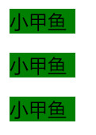这个是*=的效果：指定字符要求包含匹配

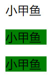这个是~=的效果：指定字符要求完全匹配

------


2. 解析|=

```html
<style>
    [fishcName|=xiaojiayu]
    {
        width: 55px;
        background:green;
    }
</style>
<p fishcName="xiaojiayu">小甲鱼</p>
<p fishcName="xiaojiayu-dog cat">小甲鱼</p>
<p fishcName="xiaojiayu3 cat">小甲鱼</p>
```

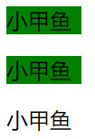要么是唯一完整的单词、要么以-分隔

------


#### 伪类选择器

权重：0 0 1 0 

当前共33个

```
结构： 【:伪类名】
分类：
	1.超链接的伪类
	2.表单的伪类
	3.子元素的伪类
```

##### 超链接伪类

共4个

```css
1. :link 				选取未被访问的链接
2. :hover				鼠标指针浮动在上面的元素，可用于所有元素，不只是链接
3. :active				当在一个链接上点击时，它就会成为活动的【按下未释放】
4. :visited				选取已被访问的链接
注意事项：
	四个状态同时存在时，有先后顺序： a:link→a:visited→a:hover→a:active
	:visited	只能设置color属性，这时浏览器为安全角度作出的考虑
```

##### 表单的伪类

###### input 相关的选择： 共11个

```css
:enabled 			选择器匹配每个已启用的元素（大多用在表单元素上）。【含:required，:optional】
:disabled			选择器匹配每个被禁用的元素

:required			选择器在表单元素是必选项时设置指定样式。
:optional 			选择器在表单元素是可选项时设置指定样式。

:valid				表单元素中的值是合法时设置指定样式	
:invalid			表单元素中的值是非法时设置指定样式

:checked			选择器用于表示选中状态的radio、checkbox、select-option
:default			选择器用于表示默认状态checked的按钮type="button"、radio、checkbox、select-option

:read-only 			选择器用于选取设置了 “readonly” 属性的元素
:read-write 		选择器用于选取设置非 “readonly” 属性的元素。

:focus				用于选取获得焦点的元素autofocus
```


##### 子元素伪类

###### child 相关伪类：共5个

```html
<body>
<p>小甲鱼1</p>
<p>小甲鱼2</p>
<p>小甲鱼3</p>
<div>
    <p>小甲鱼4</p>
</div>
</body>
```

过程：先向上爬一层确定共同父元素，然后确定该父元素的子元素范围

```css
/*单匹配*/	
p:first-child 		匹配共同父元素下的【第一个子元素】					匹配小甲鱼1
p:last-child		匹配共同父元素下的【最后一个子元素】				   匹配小甲鱼3
p:nth-child(2)		匹配共同父元素下的【第n个子元素】，n从1开始			  匹配小甲鱼2
P:only-child		匹配共同父元素下唯一子元素						  匹配小甲鱼4
p:nth-last-child(1) 匹配属于其元素的第 n 个子元素的每个元素，
					不论元素的类型，从最后一个子元素开始计数。   		 匹配小甲鱼4, 【不匹配小甲鱼3】
/*nth-多匹配及高级玩法*/
p:nth-child(n+2)    [2,无穷]从第2个开始							   匹配小甲鱼2，匹配小甲鱼3
p:nth-child(-n+2)   [1,2]第二个以前									匹配小甲鱼1，匹配小甲鱼2
p:nth-child(n+2):nth-child(-n+4)  [2,4]  匹配第2个到第4个
p:nth-child(odd|even) 奇数偶数匹配
p:nth-child(3n+1)	 匹配1、4、7

p:nth-last-child(n+2) 玩法与p:nth-child()相同，主方向相反
p:nth-last-child(n+2):nth-last-child(-n+4):nth-last-child(even)
```

###### type 相关伪类：共5个

```html
<div class="xiaojiayu">小甲鱼0</div>
<p  class="xiaojiayu">小甲鱼1</p>
<p  class="xiaojiayu">小甲鱼2</p>
<div class="xiaojiayu">
    <p class="xiaojiayu">小甲鱼3</p>
</div>
<p  class="xiaojiayu">小甲鱼4</p>
```

过程：先向上爬一层确定共同父元素，然后确定该父元素的子元素范围

```css
.xiaojiayu:first-of-type		匹配共同父元素下相同类型的子元素中的第一个		 匹配小甲鱼0，匹配小甲鱼1，匹配小甲鱼3		
.xiaojiayu:last-of-type			匹配共同父元素下相同类型的子元素中的最后一个		匹配小甲鱼3，匹配小甲鱼4
.xiaojiayu:only-of-type			匹配共同父元素下唯一类型的子元素				匹配小甲鱼3
.xiaojiayu:nth-of-type(3)       匹配属于共同父元素的指定类型的第 n 个子元素		  匹配小甲鱼2，匹配小甲鱼3
.xiaojiayu:nth-last-of-type(2)	匹配属于父元素的指定类型的倒数第 n 个子元素		 匹配小甲鱼0，匹配小甲鱼2
/*高级玩法*/
.xiaojiayu:nth-last-of-type(n+1):nth-last-of-type(-n+3)				全匹配
.xiaojiayu:nth-of-type(even)										匹配小甲鱼2，匹配小甲鱼3
```

###### 根元素伪类

1个

```css
/*定义公共变量*/
:root{
	--black: #333;
	--white: #fff;
	
	--color2:#ff0 ;
	--color3:#0f0 ;
	--color4:#df2fff ;
	--color5:#ff308f ;
}
```

剩余 8

```
:empty
:in-range
:indeterminate
:lang(language)
:not(selector)
:out-of-range
:target
```


#### 伪元素选择器

权重： 0 0 0 1

```
::after					选择器在【被选元素的内容后面】插入内容，使用 content 属性来指定要插入的内容
::before				选择器在【被选元素的内容前面】插入内容，使用 content 属性来指定要插入的内容

::first-letter			选择器用于选取指定选择器的首字母
::first-line			选择器用于选取指定选择器的首行
::selection				匹配元素中被用户选中或处于高亮状态的部分
```


#### 选择器权重

$$
\begin{aligned}
&第一等:内联样式 \qquad& 如: style=^”color:red;fontsize:29px^” \qquad&权值为1，0，0，0\\
&第二等：ID选择器\qquad & 如: \#content \qquad&权值为0，1，0，0\\
&第三等：类class，伪类和属性选择器 \qquad& 如.content、:hover、[attr] \qquad&权值为0，0，1，0\\
&第四等：元素选择器和伪元素选择器\qquad& 如:div、 p、::after\qquad&权值为0，0，0，1\\
&第五等：通配符和关系选择器\qquad& 如:*、+、>、～、空格space  \qquad&权值为0，0，0，0\\
&第五等：继承样式\qquad&  \qquad&没有权值\\
\\
&其他权值计算\qquad&交集选择器:element\#id \qquad& 权值1+100=0101\\
&其他权值计算\qquad&交集选择器:element.class \qquad& 权值01+10=0011\\
&其他权值计算\qquad&！important\qquad& 权值最高，超过内联样式\\
\end{aligned}
$$


### 样式

#### 字体样式

共6个

```
@font-face				待了解
font-variant			待了解
```

```
font-size				设置字体的尺寸
font-weight				设置文本的粗细。
font-family				规定元素的字体系列
font-style				定义字体的风格，比如斜体
```

```css
/*一行实现 font 全部功能*/
font: font-style font-variant font-weight font-size/line-height font-family ;
/*font-size和font-family的值是必需的*/
/*还有一些其他稀奇古怪的属性*/
```

#### 文本样式

共16个

```css
1. color					规定文本颜色
2. text-indent				规定文本块中首行文本的缩进，允许负值。2em,
3. word-spacing				增加或减少字与字之间的空白[针对英文及空格]
4. letter-spacing			增加或减少字与字之间的空白[针对中英文及空格]				【通用】

5. white-space 				如何处理元素内的空白，可以做到保留换行符【nowrap/*规定段落中的文本不进行换行*/】
6. direction				规定文本的方向 / 书写方向,效果与dir="rtl"属性一样
7. line-height				设置行间的距离（行高),baseline到baseline的距离		【一般用于块级元素种文本垂直居中】
```


```
 除此之外，还有text-top,text-bottom,sub,sup 共八条线
```


```css
8. text-decoration-line			文本的装饰线位置，如a标签自带默认属性	
   text-decoration-color		文本的装饰线颜色
   text-decoration-style		文本的装饰线款式

9. text-align					文本的水平对齐方式，							【一般对块级元素有效】
10.text-overflow 				规定当文本溢出包含元素时发生的事情。			   【默认clip】【一般对块级元素有效】
								需配合：white-space: nowrap; 不换行
	                                   overflow: hidden;	裁切或滚动
       		                           text-overflow: ellipsis;表达方式为 ...
11.text-shadow					一个或多个阴影文本		
								:h-shadow v-shadow blur color; 水平移动 竖直移动 模糊距离 阴影颜色

12.text-transform				文本的大小写							
```

```css
13.vertical-align					设置一个元素与其他元素的垂直对齐，效果和flex的align-items效果一样
		
应用：
	图片白边问题：
		img 的对齐方式默认是baseline ,改成bottom 即可
```

```html
<span>
    创建一个附加的嵌入层面,
    
    创建一个附加的嵌入层面
    
</span>
<style>
	img{vertical-align: bottom}
</style>
```


剩余

```
word-wrap				待了解
word-break				待了解
unicode-bidi			待了解
```


#### 列表样式

```css
list-style-type:			列表项所使用的预设标记
list-style-position:	 	设置在何处放置列表项标记。inside 在content内，outside在content外
list-style-image:			使用图像来替换列表项的标记。

/*一行实现 list 全部功能*/
list-style:list-style-type | list-style-position | list-style-image ;
```

div 模仿列表:  核心是 display = list-item ;

```html
<!DOCTYPE html>
<html>
<head>
    <meta charset="UTF-8">
    <title>div 模仿列表</title>
    <style>
        .list{
            list-style-type: circle;
            list-style-position: outside;
            padding-inline-start: 40px;
        }
        .list-item{
            display: list-item;
        }
    </style>
</head>
<body>
    <div class="list">
        <div class="list-item">1</div>
        <div class="list-item">1</div>
        <div class="list-item">1</div>
        <div class="list-item">1</div>
    </div>
</body>
</html>
```

#### 背景样式

基础共8个

##### 基础了解

```css
background-image 		为元素设置背景图像

background-color		设置一个元素的背景颜色。
		:color			指定背景颜色。
		:transparent	默认，指定背景颜色为透明
		:inherit		从父元素继承
		:linear-gradient(to right, red ,blue);		线性渐变

background-repeat  		设置是否及如何重复背景图像。
		:默认水平垂直全部重复
		:水平重复
		:垂直重复
		:不重复
		:继承父元素方式

background-size 		规定背景图像的尺寸
		:length
		:percentage
		:cover			把图像缩放(等比)到足够大，以使背景图像img完全覆盖背景区域area,【图像的某些部分也许无法显示在把背景区域中】
		:contain		将图像缩放(等比)到足够大，以使图像高度宽度能够被背景区域容纳，【背景区域可能足够大，能放1.x个图像】
		理解：
			cover 	图片去盖住area
			contain	图片被容纳进入area
```

##### 基础提升

```css
background-position 	设置背景图像在块级元素内的相对位置。
		: top left right bottom center			如：background-position:center center; 位于元素框内中心
		: x% y%
		: xPx yPx
		注意事项：
			需要把 background-attachment 属性设置为 "fixed"，才能保证该属性在 Firefox 中正常工作。

background-origin		理解一：规定 background-position 属性相对于什么位置来定位	
						理解二：设置背景图像的起始位置
		:border-box		相对于边框盒来定位
		:padding-box	相对于内边距框来定位
		:content-box	相对于内容框来定位
		注意事项：
			如果背景图像的 background-attachment 属性为 “fixed”，则该属性没有效果。

background-clip			指定背景绘制区域
		:border-box		默认值。剪切成边框方框,以border在外层为最终尺寸
		:padding-box	剪切成padding方框，以padding在外层为最终尺寸
		:content-box	剪切成content方框，以content在外层为最终尺寸
		-webkit-background-clip: text;	实现文本颜色渐变

```

 *position = left center ; origin = border-box ; clip = border-box 的效果*

```css
background-attachment	背景图像是否固定或者随着页面滚动
		:fixed	背景图像是固定的								【当它开启时，会使得background-origin失效】
															 这时origin是屏幕左上角位置
		:scroll	背景图片随页面的其余部分滚动。这是默认
		:local	背景图片随滚动元素滚动	
```


##### 高级知识

```css
background-blend-mode: 		待了解
```


##### 渐变色

提供现成效果的网址： https://www.grabient.com/

```
线性渐变			 linear-gradient
重复线性渐变			repeating-linear-gradient
径向渐变			 radial-gradient
重复径向渐变          repeating-radial-gradient
```


#### 边框样式

##### 普通边框

```
border
```

##### 圆角边框

```
border-radius
```

##### 边框阴影

```
box-shadow
```

##### 轮廓边框

```
位于边框边缘的外围
outline : 颜色 样式 宽度 ;
```


### 盒子模型

$\bf\textcolor{red}{四部分：外边距margin、边框border、填充padding、内容content}$

#### 盒子类型

```
box-sizing:
	border-box		IE盒子	【一旦设置了width\height 那这个盒子的最终大小就已经固定,不考虑margin】
	content-box 	标准盒子   【即使设置了width\height 那这个盒子的最终大小就也不固定,仍受padding,border尺寸影响
							   同样不考虑margin】
							   content + padding + border 为最终大小
```


#### 等式

```css
子元素:													  父元素:
	content_width + 左右padding + 左右border + 左右margin ==      content_width
```

```
注意事项:
	1. 这七个值如果没有设置auto的情况下，则margin-right会被浏览器【自动修正】，以满足公式。
									即使设置了margin-right为某个值也是无效的。
	
	2. 子元素如果未设置width,则width为父容器的width
	3. 如果子元素的width为auto,则最终子元素width为父元素的width
	
	4. 左右margin同时为auto，则平分剩余空间
	
	5.padding是不支持auto设置的，只能设置具体的值 
	左右padding距同时为auto，则左右padding为0，margin-right 获取全部剩余空间
	【 padding 设置为 auto 就计算为0 】
	
	6. margin-left =auto,则margin-left 获取全部剩余空间【利益最大化】
	   margin-right=auto,则margin-left 获取全部剩余空间【利益最大化】
	【 margin 设置为 auto 就进行利益最大化计算 】
```

#### 水平居中

```css
要求：
	块元素有固定的宽度

1: 块级元素水平居中
	 margin左右为 auto
2: 文字水平居中
	 text-align: center ;
```

#### 垂直居中

```
1： 文字居中
		块行高 和 块height相同
```

#### 垂直外边距折叠

（只有该方向才会发生）

$\bf\textcolor{red}{Margin\;\; 我们称为盒子的安全距离,即对方border到我方border安全距离}$

```
情况一: 兄弟元素
	兄弟元素间的相邻垂直方向会取两者最大值（不考虑负值）
	若为其一负值，则计算两者和
	若都是负值，则取【绝对值】最大者

情况二: 父子元素
	原因：
		父子元素的相邻外边距，子元素的会传递给父元素（上外边距）
	处理方法一：
			父元素设置padding-top:1px 颜色与父元素背景色相同
			再修改父元素的宽度								进行减一
	处理方法二：
			父元素加入border-top:1px 颜色与父元素背景色相同
			再修改父元素的高度								进行减一
			再修改子元素的margin-top 					 	  进行减一	
```


## CSS3布局

### 文档流

```css
normal flow 标准流
	标准流中只有block和inline，其中block独占一行，inline排在一行，排满自动换行。

	网页是一个多层结构，一层叠加着一层。Css可以为每一层设置样式	用户只能看到顶层。
	最底下的那一层称为文档流，我们创建的元素都是在文档流中进行排列
	
文档流的三种影响元素的方法
	1. Display
	2. Float
	3. Position

脱离文档流
	1. 浮动  float  半脱离文档流（仍被保留显示空间，即环形文字效果	）
	2. 绝对定位 absolute 完全脱离文档流（不被保留显示空间）
	3. 固定定位 fixed    完全脱离文档流 （不被保留显示空间）
```

```
display:
	none 
	block
	inline
	inline-block
	list-item
	flex       
```


### 浮动布局

```
原理:
	使当前元素脱离普通流，自动从左向右从上到下，像水一样进行填满。
影响：
	可能存在使得父元素无法撑开--【内容塌陷】

清除浮动：父容器高度仍然未被撑开
	方式一：在box2处设置清除浮动clear:both
	
闭合浮动：
	方式一： box1设置overflow:hidden
	
	方式二： box1设置display=table
	
	方式三： box1添加伪元素											【优选】
	
			display:block;
            content:"";
            clear:both;
            
    方式四： 通过在浮动元素的末尾添加一个空元素，设置 clear：both属性; 
			<div style="clear: both;"></div>
```

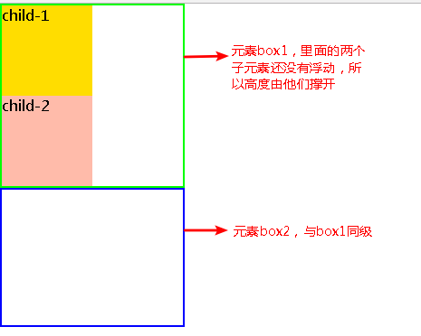                                        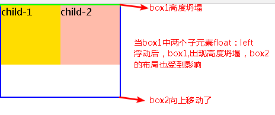 

​									清除浮动																									闭合浮动：overflow:hidden 在box1中

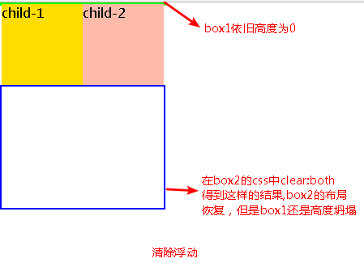                                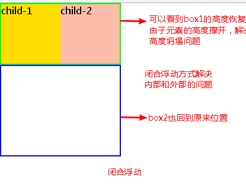 


```css
/*清除浮动*/
/*.box2{*/
/*    clear: both;*/
/*}*/

/*闭合浮动一*/
/*.box1{*/
/*    overflow: hidden;*/
/*}*/

/*闭合浮动二*/
/*.box1{*/
/*    display: table;*/
/*}*/

/*闭合浮动三*/
/*.box1:after{*/
/*    display:block;*/
/*    content:"";*/
/*    clear:both;*/
/*}*/

/*闭合浮动四*/
    <div style="clear: both;"></div>
```


### flex布局

```
flex弹性盒布局总结：
	三个核心概念：container(容器) items(元素) direction(轴向)
	三者关系：容器中存放一个或者多个元素，各个元素根据轴向进行排列。容器有两个轴向。
	
	1)弹性盒布局开关：
		在容器中使用： “display:flex” 进行开启弹性布局
	
	2)容器属性介绍：
		共有5+1个属性：
		1. flex-direction:
			共有4个值(row column col-reverse column-reverse)
			功能：
				控制主轴的方向，即项目如何从上到下排列
				*row 主轴main-axis为水平方向,main-start 在左端，main-end在右端,
					主轴上的item从左往右排列,多主轴时，主轴依次从上往下排列
				column 主轴为main-axis为竖直方向，main-start在上端，main-end在下端,
					主轴上的item从上往下排列,多主轴时，主轴依次从左往右排列
				row-reverse 主轴main-axis为水平方向,main-start 在右端，main-end在左端,
					主轴上的item从右往左排列,多主轴时，主轴依次从上往下排列
				column-reverse 主轴为main-axis为竖直方向，main-start在下端，main-end在上端,
					主轴上的item从下往上排列,多主轴时，主轴依次从左往右排列
		2. flex-wrap:
			共有3个值(nowrap wrap wrap-reverse)
			功能：
				项目因空间问题不在一根轴线上如何处理
				*nowrap 不处理，全部就放在一条轴线上
				wrap 	元素尺寸和一旦超过容器尺寸，立刻换行，产生多根主轴
				wrap-reverse 换行,第一行在最下方，第二行在第一行上方，逐次... 。
					同时它将cross-start 和 cross-end 进行了调换。
		3. justify-content:
			共有6个值(flex-start flex-end center space-between space-around sapce-evenly)
			功能：
				主轴上的items在有剩余空间时如何排列
				*flex-start item左对齐，即从main-start开始排队
				flex-end  item右对齐
				center 	item居中对齐
				space-between items的两端分别与main-start 和main-end分别对齐，剩余空间平分。
					计算规则：3个item,剩余空间60px,第一个item左侧齐平main-start,最后一个item齐平main-end.
							那两个空间各分30px
				space-around  每个item左右均获得相同的剩余空间比例，
					计算规则：3个item,剩余空间60px,则每个item左右均获得10px
				space-evenly n个item有n+1个空间,这n+1个空间平分剩余空间。
					计算规则：3个item,剩余空间60px,
							有4个空间，每个空间拿到15px
		4. align-items
			共有5个值(stretch flex-start flex-end center baseline)
			功能：
				条件：只有单根主轴
				调节单根主轴上item在交叉轴上的对齐方式
				*stretch  主轴上的items将占据容器的全部高度,从cross-start 到 cross-end。
				flex-start 主轴上的items在交叉轴起点对齐。
				flex-end 主轴上的items在交叉轴终点对齐。
				center 主轴上的items在交叉轴中点对齐。
				baseline 主轴上的items在第一行的文字基线对齐。(英文四格线的倒数第二根)	
		5. align-content
			共有7个值(stretch flex-start flex-end center space-around space-between space-evenly)
			功能：
				条件：多根主轴
				调节多根主轴上item集在交叉轴上的对齐方式
				*stretch  轴线沾满整个交叉轴
				flex-start 多根轴线依次排序，起点与cross-start对齐
				flex-end 多根轴线依次排序，起点与cross-end对齐
				center 多根轴线依次排序，起点与交叉走中点对齐
				space-around 多根轴线两侧均获得相同剩余空间
					计算规则：n根轴线共有2n各侧边，剩余空间x,每根轴线一侧均获得x/2n 剩余空间
				space-between 多根轴线中第一根轴线和最后一根轴线分别对齐cross-start 和 cross-end
							剩余空间平分
				space-evenly  :以轴线为单元进行计算
					计算规则：n根轴线，共有n+1个空间，将将剩余空间进行除以n+1,各自平分即可
		6.flex-flow
			flex-direction 和 flex-wrap 简写
				默认值： row nowrap
	容器属性介绍完毕！now  let us to talk about item.
		
	3)元素属性介绍：
		共有5+1个属性：
		1. order 
			值<integer整数> 
			功能：调节items的排列顺序，数值越小越靠前，默认为0，可以为负值。
		2. align-self
			共有6个值(auto flex-start flex-end center baseline stretch)
			功能：
				允许单个项目有与其他项目不一样的对齐方式，
			注意：
				1.单根轴线时，可覆盖align-items属性
				2.多根轴线时，只有align-content为stretch时才进入工作。
				
				*auto 表示继承父元素的align-items属性。
				flex-start 当前元素与当前轴的cross-start对齐
				flex-end 当前元素与当前轴的cross-end对齐
				center 当前元素与当前轴的交叉轴中心对齐
				baseline 当前元素与第一行的文字基线对齐
				stretch 当前元素沾满整个交叉轴
		3. flex-basis
			值<length>|auto
			功能：
				在分配多余空间之前，项目占主轴的空间。
			注意：浏览器根据该值计算主轴是否有多余空间。优先级大于width|height
			
				*auto item原本的大小
				具体值
		4. flex-grow
			值<number>|default 0
			功能：
				定义主轴上存在剩余空间时item的放大比例，默认为0
				*0 即使在有剩余空间的情况下,也不进行放大。
				具体数值,含小数
		5. flex-shrink
			值<number>|default 1
			功能：
				定义主轴上空间不足时item的缩小比例，默认为1
			注意：
				缩小时并不是无限制缩小，不得小于于item内容，item内容必须被完全展示
				*1  当空间不足时，都将按比例缩小
					计算规则：
						第一步确定主轴长度，各个item的flex-basis长度和。
						第二部确定容器在主轴方向上的长度。
						第三步确定需要缩减的长度：主轴长度和容器长度之差的绝对值。
						第四步缩减值除以容器的数量，就是各个item需要缩减的值。
						第五步缩减值不得缩减的比内容尺寸小，否则以内容尺寸进行展示
				其他值 缩减的值计算规则同上,只不过按权值进行计算
				0 该item不进行缩减，按flex-basis的尺寸进行展示。
		6. flex
			flex-grow flex-shrink flex-basis 的简写
			*0 1 auto  
			auto [1 1 auto]  
			none [0 0 auto]
			其他值
	item属性介绍完毕！
Flex 弹性盒布局全部内容介绍完毕！共130行。
```

### 定位

#### 属性介绍

```css
完全脱离文档流：绝对定位absolute和固定定位fixed	

注意：
	完全脱离文档流的盒子，不参父元素宽度的计算

position :static | fixed | relative | absolute |sticky
	五个值对应五种定位方式
	*static 遵循HTMl文档流
	
	relative "相对定位" 
			遵循HTMl文档流,配合TOP等可以在文档流的位置上进行移动
	
	absolute "绝对定位" 
			完全脱离文档流,前面的内容显示完毕后，
			它之后的内容将占据他的位置。它就在它的位置上进行显示，like 层叠效果
			然后通过z-index 进行确定谁在下层
			移动时通过配合TOP等，但是他的移动定位是根据包含它的【父元素】位置及进行移动
			注意：最近的已定位父元素
				只要父级元素设了(position|transform|perspective)并且不是static                  
				那么设定了absolute的子元素即以此为包含块（最近的）。
		
	fixed "固定定位"
			完全脱离文档流,窗口是滚动的它也不会移动
			配合TOP等固定位置
	
	sticky "粘滞定位"
			相当于relative和fix的结合产品，需配合top等，才可以使得粘性定位生效。
			元素定位表现为在跨越特定阈值前为相对定位，之后为配合TOP实现固定定位。
			注意：
				【由于sticky不是脱离文档流，当其所在的父元素失去展示机会时，他也消失了，即不是绝对的fixed】
```

#### 定位常见用法

相对-绝对定位：[定位布局]

​			父元素设置position:relative 进行占位(不脱离文档流)

​			子元素设置position:absolute 进行相对相对于最近的已定位父元素，利用top.left等进行调节


#### 层叠设置

```
z-index

条件：
	依赖position属性的relative、absolute或者fixed 。属性设置元素的堆叠顺序，值大者在上面。
```


## CSS3高级


### BFC范式

```
BFC（Block Formatting Context）块格式化上下文
作用：
	1、解决外边距折叠问题
	2、制作两栏布局
	3、清除元素内部的浮动

知识：
	1. 外边距折叠（Margin collapsing）也只会发生在属于同一BFC的块级元素之间。
	2. BFC的区域不会与浮动的元素区域重叠。
	3. 子元素的浮动，导致父元素的高度无法撑开
```

### BFC定义

```
BFC就是页面上的一个隔离的独立容器，容器里面的子元素不会影响到外面的元素。
```

### BFC创建

```
1. 根元素，即HTML标签

2. 浮动元素：float值为left、right

3. overflow值不为 visible，为 auto、scroll、hidden

4. display值为 inline-block、table-cell、
			  table-caption、table、
			  inline-table、flex、
			  inline-flex、grid、inline-grid

5. 定位元素：position值为 absolute、fixed
```


### 2D和3D

```
8.transform2/3D转换    平移、缩放、旋转、倾斜
9.perspective透视
```


### 过渡

```
transition: 过渡属性 ， 过渡持续时间 ， 速度曲线 ，过渡效果何时开始

```


### 动画关键帧

基本使用

```css
@keyframe identifyName{
    from{
        
    }	
    to{
        
    }
}
@keyframe identifyName{
    0%{
        
    }
    50%{
        
    }
    100%{
        
    }
}
animation-name:indetifiName;
animation-duration:2S;
```


## CSS3问题

### img那些事

#### 图片底部白边

```css
原因：
	基线问题baseline
解决方法：
	1.	img{	vertical-align:bottom ;}
	2.  如果图片父元素没有文字，将父元素字体设置为0 font:0;
	3.  img变块盒
```

#### 图片横向间隙

```
解决方案：
	1. 父容器  font-size:0;
	2. 使用浮动
	3. 设置margin-left\right
```

### 元素隐藏

```
display:none				【消失，位置消失】

visibility:hidden			【消失, 位置保存】

opacity:0;					【消失, 位置保存】
```


​	

​	


## CSS自实现

### 登录实现

效果：

```html
<!DOCTYPE html>
<html lang="en">
<head>
    <meta charset="UTF-8">
    <title>鱼C-零基础入门学习Web（Html5+Css3）</title>
    <style>
        body{
            height: 100vh;
            background-color: #4158D0;
            background-image: linear-gradient(114deg, #4158D0 0%, #C850C0 46%, #FFCC70 100%);

            display: flex;
            justify-content:center;
            align-items: center;
        }
        .wrapper{
            background-image: url("../imgs/一伊那尔栖4k壁纸_彼岸图网.jpg");
            background-position: center center;
            height: 400px;
            width: 300px;
            background-color: #fff;
        }
        .login-page > div:first-child{
            height: 78px;
            padding-top: 22px;
            font-size: 44px;
            font-weight: 900;
            line-height: 80px;
            text-align: center;
            font-family: 楷体, Arial;
            color: whitesmoke;
        }
        .login-page > div:nth-child(2){
            color: whitesmoke;
            height: 220px;
        }
        .labelbox , .inputbox{
            font-weight: 500;
            font-size: 24px;
            font-family: 楷体, Arial;
        }
        .inputbox{
            height: 60px;
            text-align: center;
            line-height: 60px;
        }
        .labelbox{
            height: 30px;
            margin-left: 48px;
            position: relative;
            top: 10px;
        }
        input[id=username],input[id=password]{
            height: 36px !important;
            padding-left: 1em ;
            padding-right: 1em ;
            width: 168px;
            border-radius: 15px;
            font-size: 24px;
        }

        .login-page > div:nth-child(3) :first-child{
            width: 80px;
            height: 40px;
            font-size: 22px;
            font-weight: bolder;
            font-family: 楷体, Arial;
            color: black;
            background-color:aquamarine;
            border-radius: 5px;
            border:0px;

            display: block;
            margin-left: auto;
            margin-right: auto;
            position: relative;
            top: -20px;
        }
        .login-page > div:nth-child(3) :first-child:hover{
            opacity: 0.5;
        }
        .login-page > div:nth-child(3) :first-child:active{
            opacity: 0.99;
            background-color:#a18cd1;
        }
    </style>
</head>
<body>
    <div class="wrapper">
        <div class="login-page">
            <div> 登陆页面 </div>
            <div>
                <form action="#" name="logininfo" method="post"  id="login" onsubmit="return mySubmit(this)">
                    <div class="labelbox"><label for="username">用户名</label></div>
                    <div class="inputbox"><input type="text" maxlength="18" name="username" id="username"></div>

                    <div class="labelbox"><label for="password">密码</label></div>
                    <div class="inputbox"><input type="password" name="password" id="password"></div>
                </form>
            </div>
            <div>
                <input type="submit" value="登录" form="login">
            </div>
        </div>
    </div>
</body>
<script>
  function mySubmit(form) {
    let formData = new FormData(form);
    let username = formData.get('username');
    let password = formData.get('password');
    console.log(username)
    console.log(password)
    console.log(document.querySelector("form").name);		// 打印表单名
    return true ;  // 允许表单提交
    return false ; // 不允许表单提交
  }
</script>
</html>
```


# 03 JavaScript

## JS基础
重难点：

```
1.执行上下文：
	生命周期
2.原型链
3.	箭头函数
4.	new
5.	this绑定
6.	闭包
```


### 第一章：数据类型

#### 类型种类

​	在ES5中数据类型有 6 种: Number 、String 、 Boolean 、undefined 、 Object 、Null 。

​	在ES6后新增了两种数据类型：Symbol 、BigInt。这时已经有了8种数据类型了。

#### 类型分类

​	JS数据类型可以分为两类：第一类是基本类型(除Object 类型外) ； 第二类是引用类型即指针类型(即Object 类型)，其中Object下又包含多种类型。分别有Array|function|Date|Object 等

#### Number类型

​	我们先介绍第一个数据类型，即Number 类型：数字类型

​	 在强类型语言中数字类型是一个非常丰富和繁杂的类型，它包含着好几种类型，有无符号整型uint，有符号整型int，32位浮点型，64位浮点型，甚至存在短整型，长整型。整型和浮点型数字都有其固定的存储方式。很幸运 JS 并非强类型语言 ，它不区分整数类和浮点型类。JS中所有数字均采用 IEEE745标准定义64位浮点格式存储数据。

##### 定义

定义一个数字

```js
let num = new Number(3.14)	   // 包装类	
```

```js
let e = Number(2.7)
```

整数

```js
let vari = 17
```

小数

```js
let e = 2.7
```

科学计数法

```js
let Max = 15e3   //10为底 Max = 15000
let Min = 1.5e-3 //Min = 0.0015
```

##### 精度

​	IEEE745 标准定义的64位浮点类型的数据会存在精度的问题，

​	而对于整数来说“浮点数在在超大数之间的数字间隙大于1，导致会遗漏整数值”。

​	单精度浮点在 [-2^24^ ~ + 2^24^ ] 大约1680万之间的每个整数都有一个精确的二进制表示。

​	而JS 使用的是双精度浮点，故整数最多为**15**位。当整数长度大于该长度时，某一个整数会无法被表达。从而产生精度损失

整数精度损失

```js
var x15 = 999999999999999;
x15.toString().length  == 15				// 999999999999999
var x16 = 9999999999999999;
x 											// 10000000000000000
```

小数精度损失

```js
var temp = 0.05+0.01
temp    				0.060000000000000005
console.log((1/3)===(1-2/3)) 		 		false
```

小数的精度损失出现的频率远大于整数精度损失的频率。

- [x] 结论：不要使用浮点数的结果做条件判断

##### 进制

```
0x70	十六
070		八
0b10	二
```


##### 特殊值

当出现Js所能表示的数字上限时，将由Infinity 表示

- Infinity  无穷大
- -Infinity 负无穷大

```js
let infi = Infinity
let infi = 2/0
let infi = -2/0
let infi = -Infinity
```

无穷大是等于无穷大的

```js
Infinity === Infinity 	  //true
Infinity == Infinity 	  //true
```

- ​	NaN   它也是一个特殊的Number,表示非数字值

```js
typeof NaN               //true
```


##### Number 原型对象

原型对象是一个生疏的概念，这里只需要了解，下面的函数全部会被Number实例对象继承，而构成Number实例对象的方法群。

```js
toExponential: ƒ toExponential()
toFixed: ƒ toFixed()  							按照指定的小数位返回数值的**字符串**形式，会进行4舍5入。
toPrecision: ƒ toPrecision()					返回**固定长度的字符串**数字，会进行4舍5入
toString: ƒ toString() 							可以传递一个表示基数的参数，告诉它返回几进制数值的字符串
```

示例：

```js
var num = 9.8584
num.toPrecision(4)			'9.858'
num.toPrecision(2)			'9.9'

var num	= 10;
num.toFixed(3)				'10.000'    保留3位小数点
var tenp = 10.0005
tenp.toFixed(3)				'10.001'    保留3位小数点，四社五入
tenp.toFixed(2)				'10.00'		保留2位小数点。


toString数字变字符,可以传递一个表示基数的参数，告诉它返回几进制数值的字符串
var num	= 10;
num.toString()			'10'
num.toString(16)		'a'
双点解析变字符串
10..toString()
```


##### Number 函数

Number构造函数中定义了一些常量属性和方法。 

```
EPSILON: 2.220446049250313e-16
MAX_SAFE_INTEGER: 9007199254740991
MAX_VALUE: 1.7976931348623157e+308
MIN_SAFE_INTEGER: -9007199254740991
MIN_VALUE: 5e-324
NEGATIVE_INFINITY: -Infinity
NaN: NaN
POSITIVE_INFINITY: Infinity

isFinite: ƒ isFinite()												判断传递的参数是否为有限数字
isInteger: ƒ isInteger()											判断传递的参数是否为整数
isNaN: ƒ isNaN()													判断传递的参数是否为NaN
isSafeInteger: ƒ isSafeInteger()									判断传递的参数是否为安全整数
length: 1
name: "Number"
parseFloat: ƒ parseFloat()                                          将字符串转换成浮点数，
parseInt: ƒ parseInt()											   	将字符串转换成整型数字
```

##### **运算符***3

当我们介绍完Number类型完毕以后，就不得不介绍运算符了。在我们的数学中几乎处处存在计算，而运算符就是计算机中的数字之间操作，这一小节内容有些许重要。请同学们掌握。

运算符的总类还是很对多的，共有如下几类：**算数运算符**、**赋值运算符**、**比较运算符**、**逻辑运算符**、类型运算符、字符串运算符、**位运算符**、三元运算符, 而ES6也扩充了更多的运算符。

我们先介绍算术运算符和赋值运算符

###### **1算术运算符**

|  +   |                   |
| :--: | :---------------- |
|  -   |                   |
|  *   |                   |
|  /   | 会得到浮点数      |
|  %   | 取余              |
|  ++  | 自增              |
|  --  | 自减              |
|  **  | 指数运算符（es6） |

###### 2**赋值运算符**

|  =   |                |
| :--: | :------------- |
|  +=  |                |
|  -=  |                |
|  *=  |                |
|  /=  |                |
|  %=  |                |
| **=  | 指数赋值运算符 |

###### 3**位运算符**

|    &    | AND 位与 ；1&1 =1 其他为0              |
| :-----: | -------------------------------------- |
| **\|**  | **OR 位或； 0\|0=0 其他为1**           |
|  **^**  | **XOR 位异或；0^1 =1 、1^0=1 其他为0** |
|  **~**  | **NOT 位反**                           |
| **<<**  | **零填充左移**                         |
| **>>**  | **有符号右位移**                       |
| **>>>** | **零填充右位移**                       |


#### Boolean类型

##### Boolean值

```
在谓词中会存在两个对立的状态，真与否，即true和false
```

初始情况下：什么情况下会是False

```
//布尔
	Boolean(false)			// 包装类	
    Boolean()
//数字类型
    Boolean(0)
    Boolean(NaN)
//字符串"空串"
    Boolean('')|Boolean("")
// null 和 undefined
	Boolean(null)
	Boolean(undefined)
```

```js
if(!NaN){
    console.log("NaN 转布尔 false")
}
if(!undefined){
    console.log("undefined 转布尔 false")
}
if(!null){
    console.log("null 转布尔 false")
}
if(!''){
    console.log('空串 转布尔 false')
}
if(!0){
    console.log("0 转布尔 false")
}
```


##### 运算符*2

###### 1**比较运算符**

```js
非数值情况：
	对于非数字进行比较时，会将其转换为数字，然后进行比较,见String 类型互转
		false >= ""   //true    \\ false 转0 ;空串转0
		"12" > null   //true    \\null 转0
		"12" < Infinity //true  \\字符转数字 
	任何值和NaN都不相等【Number.isNaN(b)】
		12 < undefined //false  \\undefined转NaN
		NaN != NaN	   //true  
	字符串与字符串进行比较，则按照Unicode进行比较，除非其中一个或多个主动转成数字类型【+】
    	"a" < "b"		//true 
		"12" > "11"     //true   
		"a" < +"b"		//false  \\b主动转成NaN,NaN与任何值作比较为NaN

特殊情况：相等运算符
	null 有时不会转0
	null ==  0				//false
    null == "0"  			//false
    null == false 			//false
    null == ""	 			//false	
```

|  **>**  |                                                            |
| :-----: | ---------------------------------------------------------- |
| **>=**  |                                                            |
|  **<**  |                                                            |
| **<=**  |                                                            |
| **!=**  |                                                            |
| **==**  | 【原因：==等会进行自动类型转换，===不会进行自动 类型转换】 |
| **===** | **类型也需要相同**                                         |
| **!==** | **类型也需要相同**                                         |
    if(!(NaN == 0)){
        console.log("NaN 不转 0")
    }
    if(!(undefined == 0)){
        console.log("undefined 不转 0")
    }
    if(!(null == 0)){
        console.log("null 不转 0")
    }
    if('' == 0){
        console.log('空串 转 0')
    }
```js
let a = 1
let b = '1'
a != b				false
a == b				true
a ===b				false
```


###### 2**逻辑运算符**

| **&&**   | 逻辑与【短路运算符】                     |
| -------- | ---------------------------------------- |
| **\|\|** | 逻辑或【短路运算符】                     |
| **!**    | 逻辑非【先将值转换成布尔类型，然后取反】 |

```js
逻辑或：遇真就返回【当前值】，遇假继续执行后面的运算
var a = 1 || 2 || 0
a 						1
var a = 0 || 1 || 2
a						1
逻辑与：遇假就返回【当前值】，遇真继续执行后面的运算
var b = 0 && 1 && 2
b						0
var b = 1 && 2 && 0
b						0

var c = 1 && 2 || 0     	优先级1&& 优先级2|| ；先执行左侧都为真 2||0，在执行右侧，遇真返回，结果为2
c						2
var c = 0 || 1 && 2							  ：先执行右侧都为真 0||2，在执行左侧，遇真返回，结果为2
c						2
```

##### 技巧

```
1. 通过 !! 为任意数据类型进行隐式的布尔值转换：  let a = !!a ;
2. &&与运算
		如果第一个值为ture,则必然返回第二个值
		如果第一个值为false,则直接返回第一个值
	
3. ||或运算
		如果第一个值为false,则返回第二个值
		如果第一个值为false,则直接返回第一个值 
```


#### null类型

##### 数据类型

​	null 类型起初被设置为**Object类型**特殊值 ，后来便继承了该方式。它的本质就是一个特殊值，表示没有。

​	它有一个可以被赋值给一个实例对象，从而将该实例利用回收机制进行回收

```js
let p = new Promise()
p = null
typeof p   				 // object
null instanceof object 	 // false
```

##### 自动转0

在做运算时，null 会被自动转成数值0。比如做比较运算(除==之外)、算数运算、赋值运算、位运算。

```js
let a = 2
let b = null
a+b 			2
a>b				true
a+=b			2
~b				-1
```

##### null值比较

```js
null == null 			//ture
null ==  undefined	    //true
// null 不转0
null ==  0				//false
null == "0"  			//false
null == false 			//false
null == ""	 			//false
```


#### undefined类型

```
undefined 的出现时为了弥补null 的不足而产生的类型。
null的不足之处有二：
	其一：null被当作了Object，它本应该就是null,表示什么都没有，
			这是由于历史原因导致的问题，虽然在ES6草案中修改了，但因为兼容问题又改回了Object。
	其二：就是null的自动转0的问题，会导致一些不容易被发现的错误。

于是 undefined 诞生了。
```


##### undefined类型

​	undefined 就是undefined 类型的唯一值。

```
typeof undefined  //  undefined
```

##### undefined产生情景

- [x] 在声明变量而没有赋值的情况下。
- [x] 在函数应该提供参数时而未形参为收到参数下。
- [x] 函数没有返回值，默认返回undefined.
- [x] 对象没有赋值的属性也会产出undefined.

##### 与null的关系

相同处：

- [x] 在不严格的比较下，与null等价   ： null  == undefined  //ture

不同处：

- [x] 它们类型不同，null是object类型，undefined是undefined类型


#### String类型

我们现在要学Sting类型，String类型是我们常常接触的一个类型，在计算机世界有着不可撼动的地位。

##### 定义

数组是如何存储的呢？ 很简单，是以连续数组的方式存在内容中。

```js
let str = new String("hellow")		// 包装类	
									// 包装类对应的基本类可以直接使用包装类对应的方法和属性
```

```js
let str = String("hello")
```

```js
let str = 'hello'
```

##### 性质

```
不可变对象
```

##### string 原型对象

```js
//属性
length: 0	
//方法
sub: ƒ sub()							返回由标签包裹的字符'<sup>nihao</sup>'
sup: ƒ sup()							返回由标签包裹的字符
bold: ƒ bold()							返回由标签包裹的字符
small: ƒ small()						返回由标签包裹的字符
big: ƒ big()							返回由标签包裹的字符
fontcolor: ƒ fontcolor()				返回由标签包裹的字符
fontsize: ƒ fontsize()					返回由标签包裹的字符
link: ƒ link()							返回由标签包裹的字符	a Tag href=""
anchor: ƒ anchor()						返回由标签包裹的字符  a Tag name=""
italics: ƒ italics()					返回由标签包裹的字符
blink: ƒ blink()						返回由标签包裹的字符
strike: ƒ strike()						返回由标签包裹的字符
fixed: ƒ fixed()						返回由标签包裹的字符

concat: ƒ concat()									多字符串连接(arg1,arg2,...)
includes: ƒ includes(substr)						是否包含子串
startsWith: ƒ startsWith()							判断
endsWith: ƒ endsWith()								判断
toLocaleLowerCase: ƒ toLocaleLowerCase()
toLocaleUpperCase: ƒ toLocaleUpperCase()
toLowerCase: ƒ toLowerCase()						大小写转换
toUpperCase: ƒ toUpperCase()						大小写转换
trim: ƒ trim()										删除字符串两端空白
trimStart: ƒ trimStart()							删除字符开始端空白
trimEnd: ƒ trimEnd()								删除字符结束端空白
trimLeft: ƒ trimStart()
trimRight: ƒ trimEnd()
indexOf: ƒ indexOf(subStr[,startIndex])				获取子串索引	Search from left to right		
lastIndexOf: ƒ lastIndexOf()						返回指定文本在字符串中最后一次出现的索引
substr: ƒ substr()									substr(startindex,length) :获取指定长度字符串
substring: ƒ substring()							切片[a,b)  a,b不可负,会自动交换
slice: ƒ slice()									切片[a,b)  a,b可负
at: ƒ at()											返回指定index的字符
charAt: ƒ charAt()									返回字符串中指定下标（位置）的字符串
charCodeAt: ƒ charCodeAt()							返回字符串中指定索引的字符 unicode 编码
codePointAt: ƒ codePointAt()						返回字符串中指定索引的字符 unicode 编码
								
localeCompare: ƒ localeCompare()
normalize: ƒ normalize()
padEnd: ƒ padEnd()
padStart: ƒ padStart()								字符串填充
repeat: ƒ repeat()									重复n次

split: ƒ split()							字符串切分转数组，根据分隔符
match: ƒ match()							将一个字符串中将符合的内容提取出来，以列表的方式返回
matchAll: ƒ matchAll()
replace: ƒ replace()						子串替换
replaceAll: ƒ replaceAll()
search: ƒ search()							搜索特定值的字符串，并返回匹配的位置【支持正则匹配】

toString: ƒ toString()				
constructor: ƒ String()
valueOf: ƒ valueOf()
Symbol(Symbol.iterator): ƒ [Symbol.iterator]()
```

上面提到的函数方法，将会被String 实例对象进行完全继承

##### 运算符*1

 对于字符串来说，也存在一个运算符，就是 **+** 运算符，它可以把字符串和其他类型及字符串类型的数据进行连接

它会调用String函数将其转换成字符串，将结果进行连接。

```js
 function Product(){
     this.name = ""
     this.toString=function(){
         return "product"
     }
 }
let p = new Product()
String.prototype.toString = function(){
    return "MYString:"
}

let str = "123"
let str1 = new String("123")

str1									String {'123'}
str1.toString()							'MYString:'
str1+p									'123product'
```


##### 数据类型互转

```
number|boolean -> String
	toString   【.. 双点解析】  10..toString  12.234.toString()
	String()
其他类型 -> String
	+""

其他类型 -> number
	Number()		
				转为NaN  “abc" -> NaN   undefined -> NaN
				转为0    "" -> 0        false-> 0 	   null -> 0  
				转为1    true -> 1
				
	+			a = +a 直接转换从number类型
	
String -> number
	parseInt()
	parseFloat()
```

##### unicode串

```
"\u1234"
```


#### Object类型

​	在一切皆对象的洪流中，js也义不容辞的接受了这种思想。所以Object是一个很难详细介绍的一个数据类型。在js中可以说处处都是Object类型。所以在本节内容中我们以介绍为主，并为了符合介绍JS基础语法基础的思想，我们将选举几个Object典型的例子来讲解，让同学们对面对对象的思想就行一个入门的理解。

##### 定义一个object

```js
let obj1 = new Object({age:12})   
let obj2 = {
            name:'wang',
            age:12}				

//“索引”	//“索引越界”返回undefined
obj["name"]
obj.name

遍历方法：
	for ... in  遍历     						for (index in obj)
	Object.keys()遍历 											配合 forEach
	Object.getOwnPropertyNames()遍历 （等价于Object.keys()） 		配合 forEach
```


##### 基本类型变Object

我们前面介绍到的几种基本类型，也是可以变成Object类的。比如number类型，boolen类型,   string类型

```js
var num = new Number(1)
typeof num
'object'
```

```js
let flag = new Boolean(false)
typeof flag
'object'
```

```js
let str = new String("hello")
typeof str
'object'
```


##### 运算符*1

这里我们介绍一个运算符：类型运算符

```
运算符:
	typeof
作用:
	使用它我们可以知道一个数据的类型是什么。
```


#### 运算符优先级

```
单目运算符、赋值运算符、三目运算符 具有自右向左的结合性
```

| 运算符                                | 描述                                         |
| ------------------------------------- | -------------------------------------------- |
| . [] new  ()                          | 字段访问、数组下标、函数调用以及表达式分组   |
| ++ --  -  ~  ! delete new typeof void | 一元运算符、返回数据类型、对象创建、未定义值 |
| *    /     %                          | 乘法、除法、取模                             |
| +    -   +                            | 加法、减法、字符串连接                       |
| <<     >>     >>>                     | 移位                                         |
| <  <=  >  >=   instanceof             | 小于、小于等于、大于、大于等于、instanceof   |
| ==      !=      ===     !==           | 等于、不等于、严格相等、非严格相等           |
| &                                     | 按位与                                       |
| ^                                     | 按位异或                                     |
| \|                                    | 按位或                                       |
| &&                                    | 逻辑与                                       |
| \|\|                                  | 逻辑或                                       |
| ?:                                    | 条件                                         |
| = =                                   | 赋值、运算赋值                               |
| ,                                     | 多重求值                                     |


#### 值类型与引用类型

​	[局部变量存放在栈空间、对象存在堆空间 ]

​	看两段代码：

```js
var a = 100;  
var b = a;
a = 200;
console.log (b);     // 100
a,b都是局部变量；存的值是值类型--> number ,boolean ,string (是引用类型但是可以当成基本类型来使用)
证明：
代码列			结果列
var a=10;
var b = a;
b;				10
typeof b;		'number'
```

```js
var a = {age : 20};
var b = a;
b.age = 21;
console.log(a.age);
a,b都是局部变量；存的值是引用类型-->指针
证明：
var a = {age:10};
var b = a;		
typeof b;		'object'
```


#### BigInt类型

​	前面我们讲过对于整数，iEEE745是存在整数精度损失的，当然浮点数也是存在精度损失的。对于计算机来讲它本身就是计算的工具，为了让计算机计算更大的数据，便引入了BigInt类型。一支持大数运算。

用法：

```js
let biga = BigInt(123)
let bigb = BigInt(456)
let bigc = 789n
biga**=bigb
biga.toString().length
```

BIgIng 类型只支持BigInt类型间的计算


#### Array类型	

​	Array 又称为数组类型，是Object类型的一种。

##### 定义

```js
let arr = [1,2,3,4]
let arr = new Array(1,2,3,4)

//“索引”  //“索引越界”返回undefined
arr[1]
arr["1"]
```

##### Array 原型对象

```js
reverse: ƒ reverse()				【原地】翻转
pop: ƒ pop()						【原地】出栈
push: ƒ push()						【原地】入栈【返回值】数组长度
shift: ƒ shift()					【原地】队列头部移出
unshift: ƒ unshift()				【原地】队列头部添加
sort: ƒ sort()						【原地】排序【默认从小到大|输入排序规则】
splice: ƒ splice()					【原地】数组截断|插值【start,count,values】
fill: ƒ fill()						【原地】数组填充【value,start,end】
at: ƒ at()							返回数组中index的元素，越界返回undefined
indexOf: ƒ indexOf()				寻找元素在数组中的位置【第一次出现】
lastIndexOf: ƒ lastIndexOf()		寻找元素在数组中的位置【最后一次出现】
includes: ƒ includes()				数组中是否包含指定元素【searchElem,?fromIndex】
slice: ƒ slice()					切片
flat: ƒ flat()						数组展平
concat: ƒ concat()					数组连接
join: ƒ join()						数组内容进行字符串连接，可以指定分隔符
// 键值迭代器
keys: ƒ keys()						【迭代器】键	
values: ƒ values()					【迭代器】值
entries: ƒ entries()				【迭代器】[键，值]

find: ƒ find()						【返回成员】查找出第一个符合测试条件的数组成员，并返回该成员
										【(item,ind,arr)=>{条件}】
filter: ƒ filter()					【返回成员】返回满足测试的的所有成员构成的数组
										【(item,ind,arr)=>{return true}】
findIndex: ƒ findIndex()			【返回索引】返回符合传入测试（函数）条件的第一个数组元素索引。
										【(item,ind,arr)=>{return true}】
some: ƒ some()          			是否有元素满足指定测试条件
										【(item,ind,arr)=>{return true}】
every: ƒ every()					检查数组中的每个元素是否全部通过测试
										【(item,ind,arr)=>{return true}】
forEach: ƒ forEach()				遍历
										【(item,ind,arr)=>{code}】


copyWithin: ƒ copyWithin()
flatMap: ƒ flatMap()
map: ƒ map()
reduce: ƒ reduce()
reduceRight: ƒ reduceRight()
toLocaleString: ƒ toLocaleString()
toString: ƒ toString()
```

上面提到的函数方法，将会被Array实例对象进行完全继承

##### Array 构造函数

```
“类方法”
from: ƒ from()
isArray: ƒ isArray()
of: ƒ of()
```

 上面提到的方法是Array构造函数作为对象的静态方法。

##### Array 对象方法

- [x] 1 forEach遍历

​		arr.forEach(function(item,index,arr){},this);

​		参数item：数组当前遍历的元素

​		参数index:数组当前遍历的元素在数组中的下标

​		参数arr：当前数组本身

​		参数this: 回调函数中this的指向

```js
var arr = ['a','b','c','d']
var obj = {a:1}

arr.forEach(function(item,index,arr){
    console.log(index)
    console.log(obj)  //打印obj本身
},obj)
```

- [x] 2 push:向数组的末尾添加一个或更多元素，并返回新的长度。

- [x] 3 unshift:  将新元素添加到数组的开头，并返回新的长度。

- [x] 4 sort：排序函数

```
array.sort(sortfunction)
list.sort((a,b)=>{return a.id-b.id})
```

- [x] 5 indexOf:搜索数组中的元素，并返回它所在的位置。

- [x] 6 some: 方法用于检测数组中的元素是否满足指定条件（函数提供）。

​					依次执行数组的每个元素：如果有一个元素满足条件，则表达式返回*true* , 剩余的元素不会再执行检测

- [x] 7 findIndex：返回符合传入测试（函数）条件的数组元素索引。

```
var inde = list.findIndex(item => {
    if (item.id == id) {
    	return true
    }
})
list.splice(inde, 1)
```

- [x] 8 filter:检测数值元素，并返回符合条件所有元素的数组。


#### Date类型

​	计算机作为辅助工具，在今天信息发达的时代，人类对于时间的控制有更强烈的需求。计算机对于该方面有着巨大的优势！

##### 定义

1 获取当前时间对象

```js
let now = new Date() | new Date("1-2-2211 11:13:14:999")|new Date("8/1/2211 11:13:14:999")
```

2 获取当前时间字符串

```
let now = Date()
```

3 获取当前时间戳

```
let now = Date.now()
```

4 获取指定时间的时间戳

```
Date.UTC(year,month,day[,hours[,minutes[,seconds[,millisec]]]])
```

| 参数    | 描述                                 |
| ------- | ------------------------------------ |
| year    | 必需。表示年份的四位数字。           |
| month   | 必需。表示月份的整数，介于 0 ~ 11。  |
| day     | 必需。表示日期的整数，介于 1 ~ 31。  |
| hours   | 可选。表示小时的整数，介于 0 ~ 23。  |
| minutes | 可选。表示分钟的整数，介于 0 ~ 59。  |
| seconds | 可选。表示秒的整数，介于 0 ~ 59。    |
| ms      | 可选。表示毫秒的整数，介于 0 ~ 999。 |

获取指定时间对象

```
let someday = new Date(year, month, day, hours, minutes, seconds, milliseconds)
let simeday = new Date(milliseconds);
let simeday = new Date(dateString);
```

```js
let date = new Date("2021-12-12 12:30:30")
```

##### Date原型对象

利用\__proto__属性可以查到Date原型对象，原型对象中的方法将全部被实例对象继承。

```
getDate: ƒ getDate()					 	(1 ~ 31)
getDay: ƒ getDay()							(0周日 ~ 6)
getFullYear: ƒ getFullYear()				四位数字返回年份
getHours: ƒ getHours()						(0 ~ 23)
getMilliseconds: ƒ getMilliseconds()		(0 ~ 999)
getMinutes: ƒ getMinutes()					(0 ~ 59)
getMonth: ƒ getMonth()						(0 ~ 11)
getSeconds: ƒ getSeconds()					(0 ~ 59)
getTime: ƒ getTime()						1970 年 1 月 1 日至今的毫秒数
getTimezoneOffset: ƒ getTimezoneOffset()	本地时间与格林威治标准时间 (GMT) 的分钟差

getUTCDate: ƒ getUTCDate()					【世界时】(1 ~ 31)
getUTCDay: ƒ getUTCDay()					【世界时】(0 ~ 6)
getUTCFullYear: ƒ getUTCFullYear()			【世界时】四位数的年份
getUTCHours: ƒ getUTCHours()				【世界时】(0 ~ 23)
getUTCMilliseconds: ƒ getUTCMilliseconds()	【世界时】(0 ~ 999)
getUTCMinutes: ƒ getUTCMinutes()			【世界时】(0 ~ 59)
getUTCMonth: ƒ getUTCMonth()				【世界时】(0 ~ 11)
getUTCSeconds: ƒ getUTCSeconds()			【世界时】(0 ~ 59)

getYear: ƒ getYear()						【废弃】
setDate: ƒ setDate()
setFullYear: ƒ setFullYear()
setHours: ƒ setHours()
setMilliseconds: ƒ setMilliseconds()
setMinutes: ƒ setMinutes()
setMonth: ƒ setMonth()
setSeconds: ƒ setSeconds()
setTime: ƒ setTime()
setUTCDate: ƒ setUTCDate()
setUTCFullYear: ƒ setUTCFullYear()
setUTCHours: ƒ setUTCHours()
setUTCMilliseconds: ƒ setUTCMilliseconds()
setUTCMinutes: ƒ setUTCMinutes()
setUTCMonth: ƒ setUTCMonth()
setUTCSeconds: ƒ setUTCSeconds()
setYear: ƒ setYear()						【废弃】
toDateString: ƒ toDateString()
toGMTString: ƒ toUTCString()				【废弃】
toISOString: ƒ toISOString()
toJSON: ƒ toJSON()
toLocaleDateString: ƒ toLocaleDateString()
toLocaleString: ƒ toLocaleString()
toLocaleTimeString: ƒ toLocaleTimeString()
toString: ƒ toString()
toTimeString: ƒ toTimeString()
toUTCString: ƒ toUTCString()
```


#### JSON

```
分类：
	对象:{}
	数组:[]
值：
	字符串
	数组
	布尔值
	null
	对象
	数组
键： ”键名“
```

json 转字符串

```js
代码										结果
var content2 = {name: 'Alice', age: 23};
JSON.stringify(content2);				'{"name":"Alice","age":23}'
typeof JSON.stringify(content2);		'string'
```

字符串转json

```
代码										结果
var a = '{"name":"Alice","age":23}'
JSON.parse(a)					{name: 'Alice', age: 23}
```

eval()

```js
let str = '{"name":"xwn"}'

// 用来执行一段字符串形式的JS代码，并将执行结果返回
console.log(eval("JSON.parse(str)"));
```


#### base64编解码

```
window.atob()  base64 解码ascii to binary 4字节变3字节
window.btoa()  base64 编码binary to ascii 3字节 变4字节  结果类型：字符串
```


### **第二章：变量常量**

####  常量

在ES6中提供个关键字 const 可以用于常量定义，但是我们在定义一些常量时，任然需要遵守常量全大写的规则

```js
const PI = 3.14
const TURE = true
```

#### 变量

在数学中我们处处可以接触到函数，函数中的y=f(x),x就是一个变量。而在计算机的世界中，与数学处处相通。

用于声明一个变量有两个关键字，分别为 var 和 let 。这里我们一般更加倾向使用let 声明变量。关于在 let  var const 它们声明变量的异同，我们将在之后的内容中进行讲解。

```
let arr = []
for(let i=0;i<5;i++){}
```

####  let等关键字

```js
var	  声明的变量会发生变量提升，即会被绑定到window对象下
let   是一个块级作用域，出了作用域后，该变量就会消失。	  【块级作用域没有变量提升】
const 是一个块级作用域，没有变量提升					【块级作用域没有变量提升】

  
let	必须先声明后使用，否则报错！              var 声明可以在使用后，但是也必须被声明
let	不支持重复定义(声明),                   var 支持重复定义

const 不能重复定义(声明)
const 声明常量，即无法在被重新赋值（修改），且要赋初始值。
const 声明常量，但是常量里面的属性可以被修改，若想连属性也不能被修改，需要用Object.freeze(obj);冻结变量
```

let作用：

 	1. 经典的for循环
 	2. 不污染全局变量

```js
var arr = []
for(var i = 0 ; i<10 ; i++){
    arr[i] = function(){
    	return i
    }
}
console.log(arr[1]())  //10
```

##### 1 var

- [x] var 声明可以在使用后，但是也必须的声明【变量提升：本质就是上下文】

```js
<script>
	'use strict'
	// var
	// var variable ;这句代码由编译器自动补充
	console.log(variable) //undefined
	var variable = 2 ;
</script>

并未报错
是因为打印时遇到未定义的变量，却在后面定义了，会默认执行var variable ; 在log()前
```

```js
<script>
	'use strict'
	// var
	console.log(variable) //Uncaught ReferenceError: variable is not defined
</script>

这里报错了
因为variable从未定义
```

我们看一个经典的例子

```js
console.log(a)
if(false){
	var a = "welcome"
}
//打印 undefine
```

为什么会这样，我们需要在后面的J上下文中介绍！

- [x] `var`会穿透`if`、`for`等代码块，进入更上层的作用域。$\textcolor{red}{但是，如果在function内定义的变量，则不会影响函数外部}$。

​	     【上下文的单元就是funtion】

在没有`let`的时代，用**立即执行的函数表达式（IIFE）**通过创建一个函数，并立即执行，就像上面的例子一样，可以完美解决变量提升的缺陷。

```js
(function() {
 	var message = "Hello";
    alert(message); // Hello
})()
```

------

- [x] var声明的变量会发生变量提升，即会被绑定到window对象下

```js
if(true){
    var upVar = 25 ;
}

浏览器
window.upVar			25
```

------

- [x] var支持重复定义

```
var variable = 2 ;
var variable = 3 ;
```

------

##### 2 let

- [x] let必须先声明后使用，否则报错！

```js
<script>
	'use strict'
	//let
	console.log(letribale)   //Uncaught ReferenceError: letribale is not defined
	let letriable = 2	
</script>
    
这里报错了，不得在未定义变量之前进行引用
```

------

- [x] let是一个块级作用域，出了作用域后，该变量就会消失。

```js
if(true){	let upLet = 25 ;}
```

```js
浏览器window.upLet	undefined   没有这个值upLet			
//VM476:1 Uncaught ReferenceError: upLet is not defined							出了作用域
```

------

- [x] let不支持重复定义

```js
let letriable = 2
let letriable = 3 //Uncaught SyntaxError: Identifier 'letriable' has already been declared
```

------

##### 3 const

- [x] const是一个块级作用域

```js
if(1){	const MAX = 65535 ;}
```

```js
MAX				//VM704:1 Uncaught ReferenceError: MAX is not defined
```

------

- [x] const没有变量提升

```js
const MAX = 65535 ;
```

```js
window.MAX		undefined
```

------

- [x] const不能重复定义(声明)

```js
const MAX = 65535 ;
const MAX = 65534 ;  //Uncaught SyntaxError: Identifier 'MAX' has already been declared
```

------

- [x] const声明常量，即无法在被重新赋值（修改），且要赋初始值。

```js
const MAX = 65535 ;
MAX = 65534 ;			//Uncaught TypeError: Assignment to constant variable.
```

```js
const MAX ;				//Uncaught SyntaxError: Missing initializer in const declaration
```

------

- [x] const声明常量，但是常量里面的属性可以被修改，若想连属性也不能被修改，需要用Object.freeze(obj);冻结变量

```js
const obj = {    MON : 1,    WED : 2,}
obj = true ;  //test.html:16 Uncaught TypeError: Assignment to constant variable.
```

------

属性值被修改！

```js
obj.MON = 2;

浏览器
	obj{MON: 2, WED: 2}
```

冻结属性

```js
const obj = {    MON : 1,    WED : 2,}
Object.freeze(obj)
obj.MON = 2;

浏览器
	obj{MON: 1, WED: 2}
```


### **第三章：流程控制**

这里我们讲流程控制，在任何计算机语言中，如Java,Python,C,C++ 等等。全部都有流程控制，流程控制一共包含三块内容：分支结构、循环结构，顺序结构。


#### 1 顺序结构


程序默认自上而下指向，成为顺序执行。

```js
let a = 1 ;
let b = 2
let c = a + b
c					3
```


#### 2 分支结构


所谓分支结构就是多中选一，满足条件的分支执行。

##### 2.1  if-else 分支

多分枝结构

情景一：

​		if(condition1){}

​		if(condition2){}

​		...

​		if(conditionn){}

```
let num = 3
if (num==1){alert(num)}
if (num==2){alert(num)}
if (num==3){alert(num)}
```

情景二：

​		if(condition){}

​		else if(condition2){}

​		else if(conditon3){}

​		...

​	 	else if(conditionn){}

​		else{}

```
let num = 4
if (num == 1) { alert(num) }
else if (num == 2) { alert(num) }
else if (num == 3) { alert(num) }
else { alert(num)}
```

##### 2.2 switch-case分支

switch(var){

​	case value: 函数体；break;

​	case value: 函数体；break;

​	case value: 函数体；break;

​	...

​	default :  函数体；break;

}

提示：没有break的函数体，在满足条件后，之后的函数体语句默认被执行

情景一：No break

```js
let num = 4
switch(num){
    case 1 : console.log(num);
    case 2 : console.log(num);
    case 3 : console.log(num);
    case 4 : console.log(num);
    default:console.log(num);
}
打印2次，分别在 case 4 和 default
```

情景二：With break

```js
let num = 'b'
switch(num){
    case 'a' : console.log(1); break ;
    case 'b' : console.log(2);break ;
    case 'c' : console.log(3);break ;
    case 'd' : console.log(4);break ;
    default: console.log(num);break ;
}
因为有了Break,只在 'b' 下的函数体中打印一次b
```

##### 2.3运算符

这里我们介绍一个之前按提到过的运算符：三元运算符

 **conditon ? result1 : result2**

当condition 为ture 返回 result1 ;反之 返回result2


#### 3 循环结构


循环的本质是重复执行，知道不满足条件后，才停止重复

##### 3.1 for 循环

for(;condition;){}

```
for(let i=1;i<4;i++){
	console.log(i)
}
```

for...in

```
for(let i in obj){
	obj[i]
}
```


##### 3.2 while循环

while(condition){}

```
let i = 1
while (i<4){
    console.log(i)
    i++
}
```

##### 3.3 do-while循环

```
 let i = 1
 do{
     console.log(i)
     i++
 }while(i<4)
```

##### 3.4 break

break 用来跳出循环体

##### 3.5 continue

continue 用来跳出当前循环一次


#### 4 语句组

代码块

```
{
	语句代码 ;
}

大括号包的语句是一组语句，要么都执行，要么都不执行
```

```js
// let 无法穿透代码块,在浏览器中唯独访问不到 c
let a = 1 ;
var b = 2 ;
{
    let c = 1 ;
    var d = 2 ;
}
```


#### 5 质数

```
1.	2 是 质数
2.	i 从 3 开始
3.	i 每次 加2
4.	flag 当能够被整除时，改变flag
5.	根号向下取整【因数分解：49=7*7】
```


### **第四章：异常处理**

#### 1 错误类型

​		js 的报错信息共分为两大类：分别是【语法错误】、【异常错误】。语法错误是会在预解析过程中遇到的，它会导致整个js文件无法执行；异常错误会导致出错行之后的js代码无法执行。

7类错误：

​		1.语法错误：SyntaxError

​		2.引用错误：Uncaught ReferenceError（不能捕获的引用错误）

​		3.范围错误：RangeError

​		4.类型错误：TypeError

​		5.URL错误：URLError

​		6.eval()函数执行错误:EvalError

​			ES5以上的JavaScript中已经不再抛出该错误，但依然可以通过new关键字来自定义该类型的错误提示。

​		7.Error()错误

#### 2 创建错误对象

​	

```
语法： 
/**
* @param message: 错误信息 
* @param fileName: 发生错误所在文件名     
* @param lineNumber: 发生错误所在行号 
*/ 
new Error([message[, fileName[,lineNumber]]])
new TypeError(message)
```

```
	message属性：	错误相关信息
​	stack属性：	函数调用栈记录信息
```


#### 3 try-catch处理异常

```
try {
    //可能会导致错误的代码
} catch (error) {
    //在错误发生时怎么处理
} finally {
 	//发生错误也必须要执行的语句
}
```

```
try {
    someFunction();
} catch (error) {
    if (error instanceof TypeError) {
        //处理类型错误
    } else if (error instanceof ReferenceError) {
        //处理引用错误
    } else {
        //处理其他类型的错误
    }
}finally {
 	//发生错误也必须要执行的语句
}
```


#### 4 throw抛出异常

```
try {
    throw new Error("我故意扔出一个异常")
} catch (error) {
    console.log(error.message)
}finally {
 	console.log("必须被执行的语句")
}
结果：
    我故意扔出一个异常
    必须被执行的语句
```

```js
try {
	if (true) throw new Error("我故意扔出一个异常")
} catch (error) {
    console.log(error.message)
}finally {
 	console.log("必须被执行的语句")
}
结果：
    我故意扔出一个异常
    必须被执行的语句
```

#### 5 try-catch 和 throw 综合

```js
function sub(arg){
    if(arg){
        throw 'ok'
    }else{
        throw new Error("no args")
    }
}

function BV(){
    try{
        sub(5)
    }catch(e){
        console.log(e)
    }finally{
        console.log("BV function done")
    }
}
BV()
```


### **第五章：*函数定义**

#### 1 函数

```js
function funName(){

}
```

##### 带参函数

```js
function funName(arg1,arg2,...args){
    
}

少的参数变成undefined
多的参数也不会被赋值
```

##### argumens关键字

​	argument 可以获取函数的的传入的全部参数

##### 剩余运算符

```
运算符：
	... 
	称为扩展运算符
	也称为剩余运算符

它有两个作用，传参时是扩展运算符，接受参数时是剩余运算符。
剩余运算符和arguments 都可以接受参数，在ES5中使用arguments获取参数。
```

##### 一等公民

```
在 JS 中，函数是一等公民。

在编程语言中，一等公民是指:
	函数可以作为函数的参数
	函数可以作为返回值
	函数可以赋值给变量
```

##### 函数运行

​	函数的运行可以在函数定义前。

```js
this.Run()
function Run(){
    let str2 = "world"
    console.log(str2)
}
```


#### 2 普通函数

​	这里我们写一个普通函数，以及调用它。

​	普通函数没有首字母大写的习惯，惯用驼峰法命名(xxxXxxXxx)

```js
function sum(...res){
    this.value = 0
    res.forEach(item=>{
        this.value +=item
    })
}
```

```js
//调用sum普通函数
sum(1,2,...[3,4,5])
//获取结果
window.value
```

- [x] this指向：普通函数中的this 指向的是 **window**
- [x] 调用方式：直接使用函数名加括号，是以普通方式调用该函数。


#### 3 匿名函数

```js
let fun1 = function(...){
	...
}
```

```js
let Product = function () {
    this.name = "Product 实例对象"
    this.toString = function(){
        // this 指向 Product实例
        return this.name
    }
}
let p = new Product()
```

##### IIFE

匿名函数的立即执行方式：**IIFE**

```js
(function (str){
		    console.log("Smith"+str);
})("好帅！")
//or 
(function (str) {
    console.log("Smith" + str);
}("好帅！"))
```

##### 类型提升

```js
r1() ;  // 打印 r1

function r1(){
    console.log("r1")
}

// a();  // 报错
// b();  // 报错
let a = function () {
    console.log("a")
} ;
var b = function () {
    console.log(b)
} ;
```


#### 4 *构造函数

​    构造函数与普通函数无异，但其调用方式有所区别。构造函数需要使用 new 进行生成实例对象。

##### 1 new 的过程

首先定义一个函数(构造函数)

```
//定义一个构造函数
function Product(){
}
//这时就系统也已经创建好了原型对象
```

使用 new 关键字调用

```js
let p = new Product()
```

过程解析：

​	1):  创建一个原生obj对象 ，obj = {}

​	2):  给 obj 原生对象设置内部属性（[[PropertyName]]),分别有[[Prototype]],[[Constructor],[[Extensible]],[[Scope]],[[class]]

​	3):  设置obj 原型内部属性 [[class] ] = Object ;

​    4):  设置obj 原型内部属性 [[Extensible]] = true ;

​	5):  **将  \__proto__ 值设置为 函数Product  的 prototype 值 ;**

​	6):  如果\_\_proto\_\_ 是对象类型，则设置 obj 内部属性 [[Prototype]] 值为 \__proto__ .**进行原型链关联，实现继承的关键**

​	7):  如果\_\_proto\_\_ **不是对象类型**，则设置 `obj` 的内部属性 `[[Prototype]]` 值为内建构造函数 **Object** 的 `prototype` 值；

​		（**函数 `prototype` 属性可以被改写**，如果改成非对象类型，`obj` 的 `[[Prototype]]` 就指向 Object 的原型对象）

```js
p.__proto__
    {constructor: ƒ}
        constructor: ƒ Product()
        [[Prototype]]: Object
修改Prototype后会看到Object原型对象
Product.prototype = ""
p.__proto__
	{constructor: ƒ, __defineGetter__: ƒ, __defineSetter__: ƒ, hasOwnProperty: ƒ, __lookupGetter__: ƒ, …}
        constructor: ƒ Object()
        hasOwnProperty: ƒ hasOwnProperty()
        isPrototypeOf: ƒ isPrototypeOf()
        propertyIsEnumerable: ƒ propertyIsEnumerable()
        toLocaleString: ƒ toLocaleString()
        toString: ƒ toString()
        valueOf: ƒ valueOf()
        __defineGetter__: ƒ __defineGetter__()
        __defineSetter__: ƒ __defineSetter__()
        __lookupGetter__: ƒ __lookupGetter__()
        __lookupSetter__: ƒ __lookupSetter__()
        __proto__: （…）
        get __proto__: ƒ __proto__()
        set __proto__: ƒ __proto__()

```

​	8):  **$\bf\textcolor{red}{将this 指向原生 obj对象，故 this = \{\}}$**

​	9):  $\bf\textcolor{red}{执行 函数Product内容 ,将返回值赋值给result}$ 

```js
Product.call(obj);  // 8步9步的执行内容【配合函数上下文EC理解】
```

​	10): 如果result 是Object 对象，返回result ,如果不是返回 this


##### 2 强行调用new

```js
 function Product() {
     if(!(this instanceof Product)){
         return new Product()
     }
 }

//
let pro  = Product()
let pro2 = new Product()
```

##### 3 prototype修改

```js
function Person(name,hobit) {}
function Product() {}

Person.prototype = "abc"
Product.prototype = 'efg'
let per = new Person("wang","MV")
let pro = new Product()
console.log(per.__proto__ == pro.__proto__); //true 等于object原型对象
```


#### 5 *箭头函数

箭头函数是匿名函数，是一个语法糖，但箭头函数没有[[constructor]]属性，故需要注意以下事项

注意事项：

- [x] 1	箭头函数的内部没有**arguments**
- [x] 2	箭头函数不能使用new 来实例化对象
- [x] 3    箭头函数没有原型Prototype

- [x]  4   **箭头函数不绑定this(箭头函数没有this)**，会捕获其所在上下文的this，作为自己的this【根据闭包的词法环境变量进行理解】

​			【这句话需要注意的是，箭头函数的外层如果有普通函数，

​				那么箭头函数的this就是这个外层的普通函数的this，

​				箭头函数的外层如果没有普通函数，那么箭头函数的this就是 全局变量】

- [x] 6  使用call,apply,bind并不会改变箭头函数中的this指向

```js
// 2 的证明
let Person = ()=>{};	
const p = new Person()  //test.html:15 Uncaught TypeError: Person is not a constructor
```

```js
// 4 的证明
let a = {}
let b = {name:1221}
function Run(exec) {
    exec()
}
function f() {
    return ()=>{
        console.log(this)}
}

let exec1 = f.call(a);      //将f的this进行显示绑定修改为{}
Run.call(b,exec1)           // 期望的得到 {}

let exec2 = f()				//f进行默认绑定，this执行window
Run.call(b,exec2)           // 期望的得到 window


function Run2() {
    exec = ()=>{		
        console.log(this)
    }
    exec()
}							// 将Run2进行显示绑定修改为{name:1221}
Run2.call(b)                // 期望得到{name:1221}
```


##### 1 使用格式

​		使用格式：参数

​				· 一个参数:参数括号可以省略 

​						x => x*x ;

​				· 0个参数：参数括号必须写

​						()=> 3.14

​				· 多个参数：参数括号必须写

​						(x,y,z) => x+y+z

​		使用格式：函数体

​				· 函数体内只含一条表达式：return 和{} 可以省略

​						同上

​				· 函数体内包含多天表达式：return 和{} 不可省略

​					x => { var temp = x*x ; var pi = 3.14 ;retuen temp+pi }

##### 2 小括号的用法

```js
let getObj = id =>({id: id ,name: "小马哥"});
let obj = getObj(1);
	
console.log(obj);
```

##### 3 this指向

- [x] 1-1) 函数-箭头模式-new【指向实例对象本身】

```js
function Product() {
    this.name = "Product 实例对象"
    this.toString = ()=>{
        // this 指向 Product实例
        return this.name
    }
}
let pro2 = new Product()
pro2.toString()  //"Product 实例对象"
```

- [x] 1-2) 函数-function模式-new【指向实例对象本身】

```js
function Product() {
    this.name = "Product 实例对象"
    this.toString = function (){
        // this 指向 Product实例对象
        return this
    }
}
let pro2 = new Product()
pro2.toString()  //"Product 实例对象"
```

- [x] 1-3) 函数-闭包模式-new【指向Window对象】

```js
var name = "window 对象"
function Product(){
    this.name = "Product 实例对象"
    function getName(){
        console.log(this)           // Window{}
        console.log(this.name)      // window 对象
    }
    getName()
}

let p1 = new Product()
```

- [x] 2-1)  对象-箭头模式【指向Window对象】

```js
let lname = "let 未提升 对象名"
var name = "var 已提升 对象名"
let obj = {
    name:"obj 对象名",
    toString:()=>{
        return this.name
    }
}
obj.toString()  //var 已提升 对象名,  箭头函数的this是继承来的
```

- [x] ​	小结论：var  变量会被存放到window 对象下--**变量提升**

- [x] 2-2) 对象-函数模式【指向实例对象本身】

```js
let obj = {
    name:"obj 对象名",
    toString:function(){
        return this.name
    }
}
obj.toString()   // "obj 对象名"
```


- [x] 3-1）箭头单模式【指向Window对象】

```js
 const app = ()=>{console.log(this)}
 app()			//Window
```

- [x] 3-2) 箭头参数模式【指向Window对象】

```js
 const app = ()=>{console.log(this)}
 function Run(app){
     app()
 }
Run(app)  //window
new Run(app)  //window
```


### 第六章：*闭包

闭包是一个经典的内容，是一个必须详细介绍的内容，在任何计算机语言中，闭包都占着很重要的地位。而闭包这个概念是一个很抽象的概念，一旦同学们学会了闭包，就会感觉非常的酸爽。

本章和第七章属于并行内容，知识体系相同

#### 1 λ演算

​	lambda calculus or λ-calculus λ演算是[图灵完备](https://zh.wikipedia.org/wiki/圖靈完備性)的

##### 1.1 变量

​	约束变量

​	自由变量

##### 1.2 抽象

​	就是函数

​	比如 js 中：x=>x+1

​	 λ演算:  λx.x+1

##### 1.3 应用

​	调用函数

​	比如 js 中：（x=>x+1)(8)

​	 λ演算:  (λx.x+1)(8)

##### 1.4 闭合表达式

​	比如 js 中：（x=> y => x+y)(8)(1)

```js
let a = x=>y=>x+y
a(4)(5)   //9
```

​	 λ演算:  (λx.(λy.x+y)(1))(8)

##### 1.5 开合表达式

​	 λ演算:  (λx.x+y)(1)

​	假设程序没有错误，y是实际村在的，只不过不在当前表达式中

​	我们可以**预先定义**一个 **环境** ，使得表达式中的每一个自由变量都绑定一个值，这时开合表达式就变成的闭合表达式。

​	于是我们就构建了一个闭包 。

  


#### 2 调用栈分析

​	当我们自己定义一门语言时：

```js
 (function fout() {
     const a = 1; 
     function fin() {
         console.log(a);
     }
     return fin;
 })()()
```

在执行第一组括号时，将fout压入栈内，执行第二组括号时，将fin压入栈内。在执行fin内的console.log(a)语句时，因为我们自己定义的语言是不允许函数访问自己作用域之外的变量。且在fin 内我们没有定义 a 。这里就会有一个矛盾：我们要a的值需要执行完fin后去fout中找，而为了执行完fin,我们就需要知道a的值。总的来说就是因为a的未知阻止了fin的执行。最根本的原因是

1. **函数嵌套定义并作为返回值**
2. **函数的执行使用了调用栈来实现**
3. **内部函数使用了外部函数的变量**

解决方案：

​	在js 中函数是一等公民，故原因一不能修改

​	在所有的语言中使用栈实现是程序执行最简单的方案，而使用堆调用虽然很可以克服该问题，但是堆的维护等复杂性很高

​	我们只能从第3个原因入手，在函数执行之前，我们先定义一个闭包，当fin执行时，它只需要在自己的环境(公文包)中寻找就可以了。

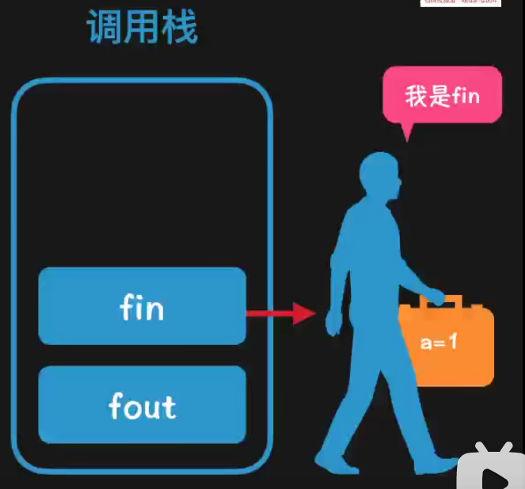


#### 3 什么是闭包

​	**闭包 = 包含了一个  λ  表达式 + 使它闭合的 环境**    

​	闭包 = **函数** + 使函数的每一个自由变量获得绑定值的 **环境**

   个人总结：拥有一个合适外部环境的函数

面试：什么是闭包

​	闭包就是包含一个 λ  表达式 和能够使它闭合的环境，或者说函数和是函数每一个自由变量获得绑定值的环境。

​	


#### 4 *词法环境分析

```
【JS 中 [[Environment]] 每个函数都拥有，用来存放词法环境的引用】
在V8引擎中无法读写。具体含义是使的函数“闭合”的环境，在函数运行时作为外部环境来使用。
```


- [x] **[[Environment]] 产生的条件：**

```
【整个脚本文件执行前会产生一个】   	： 即全局词法环境对象
【函数实例[fun()]创建后会产生一个】： 在fa 和 fb 那里产生,其实就是调用函数的时候产生

原因是该函数的实例会返回或者产生一个函数
```

示例

```js
function fout(){
    let a = 0
    return function fin(){
        return ++a
    }
}

let fa = count()
let fb = count()
console.log(fa())   	//1
console.log(fb()) 		//1
console.log(fa()) 		//2
console.log(fb())		//2
```

**函数实例创建后**会产生一个fa ，它的[[environment]]指向fin的词法作用对象，该对象存在一个外部词法环境引用指向fout词法环境对象，同理fout词法环境对象中存在一个外部词法环境引用指向全局词法环境对象。如下图

**函数实例创建后**会产生一个fb ，它的[[environment]]指向fin的词法作用对象，该对象存在一个外部词法环境引用指向fout词法环境对象，同理fout词法环境对象中存在一个外部词法环境引用指向全局词法环境对象。如下图


同上我们在看一个例子

```js
function A(){
    let count = 0
    return function B(){
        return function C(){
            return ++count
        }
    }
}

let b  = A()  //A的实例，获得B函数
let c1 = b()  //B的第一个实例，获得C函数
let c2 = b()  //B的第二个实例，获得C函数

console.log(c1())  //1
console.log(c2())  //2
```

它的分析图如下：


如图上所表现的那样，最终的打印结果分别为1 和 2


#### 5  闭包的特性

- [x] ​	**函数嵌套函数**
- [x] ​	**函数内部可以引用函数外部的参数和变量**
- [x] ​	**参数和变量不会被垃圾回收机制回收**


下面我们介绍一个和Promise中很像的闭包结构，请认真观看：

```js
function A(exec){
    let count = 0
    function add1(){
        return count++
    }
    function sub1(){
        return count--
    }
    exec(add1,sub1)
}
let exec = (add1,sub1)=>{
    let result = add1()
    console.log(result)
    result = sub1()
    console.log(result)
}
A(exec)
```

count 是变量，能够被闭包中的add1和sub1进行使用

```js
 let exec = (run)=>{
     run()
 }
 function App(exec){
     let self = "a"
     function Run(){
         console.log(self)
     }
     exec(Run)
 }
let app = App(exec)
```

Run函数可以访问self变量，这就是闭包


#### 6 JS语言的闭包

​	**在JS 中，每当函数被创建，就会在函数生成时生成闭包([[Enviorment]])**

​	在JS 中闭包也可以理解为是在一个函数内部创建另一个函数，内部函数可以访问外部函数作用域


### 第七章：*执行上下文

​	Execution Content [EC] 执行上下文是一个很抽象的概念，我们先来一个第一步理解：“昨天小明跟我情敌约战，今天我给警察叔叔打了个电话，并告诉了他们打架的地点，\_______\___” 。我们现在要对这个句子填空。通过对前面的背景信息进行理解，我们可以合理的填入相关信息。这些背景信息就叫做上下文content。

#### 1 基础介绍

​	在JS 中，**执行上下文：函数执行前需要进行的工作（称为执行上下文）**，指当前执行环境中的 变量，函数声明，参数，作用域链，this等。

函数的定义方式有两种，分别如下：

- ​	**函数声明方式： function fun(){...}**                      
- ​	**函数表达式方式：var fun = function(){...} **      【变量接收函数方式】

我们看一下它们在代码执行之间的微妙的变化

```js
function Run(){
    let str2 = "run1"
    console.log(str2)
} 
Run() 						//run2 
function Run(){
    let str2 = "run2"
    console.log(str2)
}  
Run()						//run2
```


```js
var run = function (){
    let str2 = "run1"
    console.log(str2)
} 
run()						//run1 
var run = function (){
    let str2 = "run2"
    console.log(str2)
}  
run()						//run2
```

这种微妙的变化，需要我们了解JS 引擎的一个内容，即 JS 上下文。

1.1变量声明提升

```js
console.log(a)  //undefine
var a = 10 
```

什么是变量提升，如以上代码所示，我们在未定义变量a之前，就已经要去打印a,且没有报错。

这里不报错的原因就是系统在我们打印a之前默认的做了如下的事

```js
var a            //系统替我们做的事，默认把a绑定到window对象之下，即创建变量对象【变量提升】
console.log(a)  //undefine
var a = 10 
```


1.2 函数变量提升

在上篇3.1.6中我们写了这么一段话 “  **函数的运行可以在函数定义前   **”。

```js
console.log(Run)     //   <----它是变量
function Run(){		 //   <----它是函数
    let str2 = "hello"
    console.log(str2)
} 

console.log(f2)
var f2  = function (){console.log("Ni_Hao")}
```

```js
//打印结果
ƒ Run(){
    let str2 = "world"
    console.log(str2)
}

undefined   // 打印undefined 的原因是，f2 是变量声明提升
```

当函数和变量同名且**都会被提升的情况下**，因为**函数声明优先级比较高**，因此**变量声明会被函数声明覆盖掉**。这就是打印Run的原因。


#### 2 EC 执行上下文类型

- [x] 全局执行上下文（Global EC)
- [x] 函数执行上下文（Function EC)
- [ ] Eval 函数执行上下文 


##### 2.1 全局执行上下文

​	这是默认的，最基础的执行上下文

- 不在函数内部的的代码都位于全局执行上下文中

- 全局上下文做了两件事：1.创建了一个全局对象，在浏览器中就是Window对象。2.将this指针指向这个全局对象。

  【this的指向只能是对象】

- 一个程序中只有一个全局执行上下文。

##### 2.2 函数执行上下文

- **每次调用函数时，都会为该函数创建一个执行上下文。**

- 每个函数都有自己的执行上下文，但是该上下文只有 **函数被调用** 的时候才会创建。

- 一个函数的执行上下文可以有多个

- 每当一个新的执行上下文被创建，它都会按照特定的顺序执行一系列步骤

  ```js
  function Run(){
  
  }
  
  this.Run()    // 函数调用时，会产生【函数上下文】
  ```


函数执行上下文存在多个，且每次调用函数都会产生函数上下文，那么这么多上下文该如何管理呢？


#### 3 执行上下文栈

 执行上下文栈也叫“ 调用栈 ”。执行栈用于存储代码执行期间创建的多有的上下文，具有FILO性质。

JS代码首次运行，都会创建一个全局执行上下文，并压入到栈中，之后每当调用函数，都会创建一个新的函数上下文并压入栈内。

```js
function getName() {
    const year = getYear();

    const name = 'DZQQQ';
    console.log(`${name} ${year} years old this year`);
}

function getYear() {
    return 1900;
}

getName(); 
```

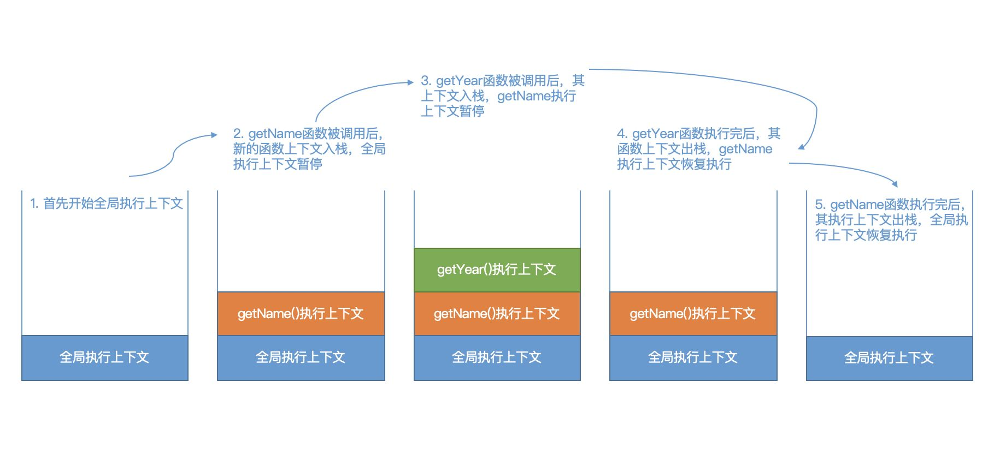

过程：

​	1.首先创建全局执行上下文，当前全局执行上下文处于活动状态

​	2.全局代码中有两个函数，然后调用getName函数，JS 引擎**暂停**执行全局执行上下文，创建函数执行上下文，且将该执行上下文进行入		栈。

​	3.getName函数中调用了getAge函数，JS 引擎**暂停**执行getName函数执行上下文，创建getAge函数执行上下文，且将其入栈。

​	4.getAge执行完毕后，其执行上下文出栈，等待垃圾回收，回到getName执行上下文中继续执行

​	5.getName执行完毕后，其执行上下文出栈，回到全局上下文中。


#### 4 执行上下文的结构

- [x] ES3 版本

```js
const ExecutionContextObj = {
    VO: window, // 变量对象
    ScopeChain: {}, // 作用域链
    this: window
};

```

- scope：作用域，也常常被叫做作用域链。
- variable object：变量对象，用于存储变量的对象。
- this value：this值。

- [x] ES5版本

```js
ExecutionContext = {  
    // 确定this的值
    ThisBinding = <this value>,
    // 创建词法环境组件
    LexicalEnvironment = {},
    // 创建变量环境组件
    VariableEnvironment = {},
    
};
```

- lexical environment：词法环境，当获取变量时使用。
- variable environment：变量环境，当声明变量时使用。
- this value：this值。

- [x] **在ES6中唯一的区别：在于词法环境用于存储函数声明与let const声明的变量，而变量环境仅仅存储var声明的变量。**

- [x] 当然还有ES9

- lexical environment：词法环境，当获取变量或者this值时使用。
- variable environment：变量环境，当声明变量时使用
- code evaluation state：用于恢复代码执行位置。
- Function：执行的任务是函数时使用，表示正在被执行的函数。
- ScriptOrModule：执行的任务是脚本或者模块时使用，表示正在被执行的代码。
- Realm：使用的基础库和内置对象实例。
- Generator：仅生成器上下文有这个属性，表示当前生成器。


#### 5 *执行上下文的生命周期

**创建阶段 ---- 执行阶段 ---- 回收阶段**

##### 5.1  创建阶段

```js
ES6与ES5中唯一的区别在于:
		【词法环境】用于存储函数声明与let const声明的变量，而【变量环境】仅仅存储var声明的变量。
        
创建阶段：【函数被调用时，而函数未被执行前】。会做以下几件事
    >>确定 this指向：
         官方称呼为“ this binging”
         一.【在全局执行上下文中，this这种指向全局对象】
         二.【在函数执行上下文中，this 的值取决于函数的调用方式,具体见this绑定】

    >>创建词法环境组件（LexicalEnvironment）：
     词法环境是一个包含标识符变量的映射结构，
     	这里的标识符表示 “let变量<uninit>、const变量<uninit>、函数” 的名称， 变量是原始值引用、实际对象【含-函数类型对象】。
        
     词法环境由“【环境记录】”和“【对外部环境引入记录】” 两个部分组成。
     	🐅其中环境记录用于存储当前环境中的变量和函数声明的实际位置；
     	🐅外部环境引用记录则记录自身可以访问的其他外部环境

    >>创建变量环境组件（VariableEnvironment）：
	  【变量环境仅仅存储var声明的变量】
```


下面我们分析这段代码是如果建立上下文的：

```js
let a = 20;  
const b = 30;  
var c;

function multiply(e, f) {  
 var g = 20;  
 return e * f * g;  
}

c = multiply(20, 30);
```

1.首先创建全局上下文:

```
1.扫描当前上下文，将let const 函数声明等注射到词法环境中【script对象】
2.将var声明\function 注射到变量环境中【window对象】
3.倘若var 变量声明与函数声明出现同名，则函数声明覆盖var 变量
4.let const声明出现同名，则抛出异常！
```

```js
//全局执行上下文
GlobalExectionContext = {
    // this绑定为全局对象window
    ThisBinding: <Global Object>,
    // 词法环境
    LexicalEnvironment: {  
          //环境记录
          EnvironmentRecord: {  
            Type: "Object",  // 对象环境记录
            // 标识符绑定在这里 let const创建的变量a b在这
            a: < uninitialized >,  
            b: < uninitialized >,  
            multiply: < func >  
          }
          // 全局环境外部环境引入为null
          outer: <null>  
    },
  
    VariableEnvironment: {  
          EnvironmentRecord: {  
            Type: "Object",  // 对象环境记录
            // 标识符绑定在这里  var创建的c在这
            c: undefined,  
          }
          // 全局环境外部环境引入为null
          outer: <null>  
    }  
  }
```

2.进入全局执行阶段:

```
给a,b赋值，调用multiply，这时因为调用函数，故暂停全局上下文，创建函数上下文。

	1. 检索当前上下文中的参数。
			该过程生产Arguments 对象，并建立以形参变量名为属性名，形参变量值为属性值。
	2. 检索当前上下文中的函数声明。
			该过程建立以函数名为属性名，函数所在的内存地址引用为属性名的属性值。
			倘若函数在if\for代码块内则进行穿透，函数变量值为undefined
	3. 检索当前上下文中的变量声明。
			该过程建立以变量名为属性名，undefined为属性值的属性。
			【如果变量名和已经声明的“形参变量”或“函数名”相同，则该变量声明不会干扰已经存在的这类属性】
	4. this绑定
```

```js
// 函数执行上下文
  FunctionExectionContext = {
    //由于函数是默认调用 this绑定同样是全局对象
    ThisBinding: <Global Object>,
    // 词法环境
    LexicalEnvironment: {  
          EnvironmentRecord: {  
            Type: "Declarative",  // 声明性环境记录
            // 标识符绑定在这里  arguments对象在这
            Arguments: {0: 20, 1: 30, length: 2},  
            e:20,
            f:30,
            ARun:<func>
          },  
          // 外部环境引入记录为</Global>
          outer: <GlobalEnvironment>  
    },
  
    VariableEnvironment: {  
          EnvironmentRecord: {  
            Type: "Declarative",  // 声明性环境记录
            // 标识符绑定在这里  var创建的g在这
            g: undefined  
          },  
          // 外部环境引入记录为</Global>
          outer: <GlobalEnvironment>  
        }  
  }
```

multiply函数上下文执行完毕。弹出函数上下文，进入全局上下文。


##### 5.2 执行阶段

执行阶段：执行**变量的赋值**、函数的引用和代码的执行。

##### 5.3 回收阶段

回收阶段：执行上下文出栈，当没有引用指向时等待垃圾回收机制进行回收。


#### 6 *this绑定

我们在基础篇中提到过this指向，也在执行上下文中了解了thisBinding 值。

##### 6.1 this默认绑定

默认绑定可以理解为 “函数调用时没有任何前缀”的情景。 默认绑定时this指向全局对象，严格模式下this指向undefined。


```js
function fn1() {
    "use strict";
    console.log(this); //undefined
    console.log(this.name); //TypeError: Cannot read property 'a' of undefined
};
var name = '听风是风';
fn1() 
```

在调用fn1时，该上下文中的this 指向window。 严格模式下this指向undefined。


##### 6.2 this隐式绑定

###### 1.隐式绑定

- [x] $\bf\textcolor{red}{如果函数在调用时，前面存在调用它的对象，创建该函数的上下文时，this就会隐式的绑定到这个对象上}$。

- [x] 如果函数前存在多个调用对象，this将绑定到最近的对象上。

```js
function fn() {
    console.log(this); //原指向window
    console.log(this.name);
};

let obj = {
    name:"GUO GUIFEI",
    introduc: fn,
}

obj.introduc()
/*
    {name: 'GUO GUIFEI', introduc: ƒ}
    GUO GUIFEI
*/

```

```js
function fn() {
    console.log(this); //原指向window
    console.log(this.name);
};

let obj = {
    name:"GUO GUIFEI",
    introduc: fn,
}
let objs = {
    lists : [obj]
}
objs.lists[0].introduc()
/*
    {name: 'GUO GUIFEI', introduc: ƒ}
    GUO GUIFEI
*/
```


```js
function Fn() { };
Fn.prototype.name = '时间跳跃';

function fn() {
    console.log(this.name);
};

let obj = new Fn();

obj.func = fn;

let obj1 = {
    name: '听风是风',
    o: obj
};
obj1.o.func() //?  时间跳跃   this 已经修改成了obj
```

**番外------作用域链与原型链的区别：**

**作用域链**： 当访问一个**变量**时，解释器会先在当前作用域查找标识符，如果没有找到就去父作用域找(闭包，利用词法环境变量)，作用域链顶端是全局对象window，如果window都没有这个变量则报错。

**原型链** ：   当在对象上访问某**属性**时，首选会查找当前对象，如果没有就顺着原型链往上找，原型链顶端是null，如果全程都没找到则返一个undefined，而不是报错。


###### 2.隐式丢失

在特定情况下会存在隐式绑定丢失的问题，最常见的情况就是“ 作为参数传递以及变量赋值 ” 。

1.参数传递

```js
var name = "GUO ERNV"
let oob = {
    name :"不期过去",
    fn:function(){
        console.log(this.name)
    }
}

function fn1(param){
    param()
}

fn1(oob.fn)  //GUO ERNV
```

我们将oob.fn 也就是一个函数传递给fn1中进行运行，这里只是**单纯的传递了一个函数**而已，所以this丢失，而指向了window。

第二个引起丢失的问题是变量赋值，其实本质上与传参相同

2.变量赋值

```js
var name = '行星飞行';
let obj = {
    name: '听风是风',
    fn: function () {
        console.log(this.name);
    }
};
let fn1 = obj.fn;
fn1(); //行星飞行
```

隐式绑定丢失并不是都会指向全局对象

```js
var name = '行星飞行';
let obj = {
    name: '听风是风',
    fn: function () {
        console.log(this.name);
    }
};
let obj1 = {
    name: '时间跳跃'
}
obj1.fn = obj.fn;
obj1.fn(); //时间跳跃
```

虽然丢失了 obj 的隐式绑定，但是在赋值的过程中，又建立了新的隐式绑定，这里this就指向了对象 obj1


##### 6.3 this显示绑定

通过call,apply,bind等方法进行改变this 的行为。

```js
let obj1 = {
    name: '听风是风'
};
let obj2 = {
    name: '时间跳跃'
};
let obj3 = {
    name: 'echo'
}
var name = '行星飞行';
function fn() {
    console.log(this.name);
};
fn(); //行星飞行
fn.call(obj1); //听风是风
fn.apply(obj2); //时间跳跃
fn.bind(obj3)(); //echo
```

**番外-----call、apply与bind有什么区别？**

1.call、apply与bind都用于改变this绑定，但call、apply在改变this指向的同时还会执行函数，而bind在改变this后是返回一个全新的boundFcuntion绑定函数，这也是为什么上方例子中bind后还加了一对括号 ()的原因。

2.bind属于硬绑定，返回的 boundFunction 的 this 指向无法再次通过bind、apply或 call 修改；call与apply的绑定只适用当前调用，调用完就没了，下次要用还得再次绑。

3.call与apply功能完全相同，唯一不同的是call方法传递函数调用形参是以散列形式，而apply方法的形参是一个数组。在传参的情况下，call的性能要高于apply，因为apply在执行时还要多一步解析数组。

```
fun.call(thisArg, arg1, arg2, ...)
```


##### 6.4 new绑定

对于new 绑定的详细过程我们不多做介绍，在js基础的new过程中由详细介绍new 过程。


##### 6.5 this 绑定优先级

显式绑定 > 隐式绑定 > 默认绑定

new绑定 > 隐式绑定 > 默认绑定


new 和显示同时出现时会报错

```js
function Fn(){
    this.name = "WanFeng"

}
let obj ={
    name:"WeiWei"
}
let echo = new Fn().call(obj)  //Uncaught TypeError: (intermediate value).call is not a function
```

```js
//显式>隐式
let obj = {
    name: '行星飞行',
    fn: function () {
        console.log(this.name);
    }
};
obj1 = {
    name: '时间跳跃'
};
obj.fn.call(obj1);// 时间跳跃
```

```js
//new>隐式
obj = {
    name: '时间跳跃',
    fn: function () {
        this.name = '听风是风';
    }
};
let echo = new obj.fn();
echo.name;//听风是风
```

```js
//隐式绑定 > 默认绑定
function fn() {
    console.log(this); 
    console.log(this.name);
};
let obj = {
    name: "GUO GUIFEI",
    introduc: fn,
}
obj.introduc()
```

#### 7  **箭头函数的this**

```
准确来说，箭头函数中没有this。
	箭头函数的this指向取决于外层作用域中的this
	外层作用域或函数的this指向谁，箭头函数中的this便指向谁。
	那么箭头函数的this就是这个外层的普通函数的this，
	【箭头函数的外层如果没有普通函数，那么箭头函数的this就是【全局变量】】
```

```js
function fn() {
    return () => {
        console.log(this.name);
    };
}
let obj1 = {
    name: '听风是风'
};
let obj2 = {
    name: '时间跳跃'
};
let bar = fn.call(obj1); // fn this指向obj1
bar.call(obj2); //听风是风
```

$\bf\textcolor{red}{一旦箭头函数的this绑定成功，也无法被再次修改，有点硬绑定的意思}$

当然，箭头函数的this也不是真的无法修改，我们知道箭头函数的this就像作用域继承一样从上层作用域找，因此我们可以修改外层函数this指向达到间接修改箭头函数this的目的。

```js
function fn() {
    return () => {
        console.log(this.name);
    };
};
let obj1 = {
    name: '听风是风'
};
let obj2 = {
    name: '时间跳跃'
};
fn.call(obj1)(); //fn this指向obj1,箭头函数this也指向obj1
fn.call(obj2)(); //fn this指向obj2,箭头函数this也指向obj2
```


### **第八章：*原型原型链**

**为了了解原型以及原型链问题，我们先从构造函数讲起。**


#### **1 构造函数**

**构造函数也是一个普通函数，创建方式和普通函数一样。只是构造函数习惯首字母大写。**

**需要使用 new 关键字来调用的方式是构造函数的调用方式，而普通函数的调用方式是直接调用即可**

**这里我们预先提一个概念：括号的左边是函数，点的左边是对象。**

**进入构造函数的定义和调用：**

```js
//定义一个构造函数
function Product(){
}
//调用构造函数
let pro = new Product()
在此之上时ES5使用的方法
```


#### **2 原型对象**

**只要创建一个新(或者叫构造)函数, js就会根据一组特定的规则为该函数创建一个`prototype`属性。**

**这个prototype 指向一个对象，这个对象就是我们说的原型对象。**

**原型对象是有了构造函数就会产生的。**

****


**显示原型与隐式原型：**

- ​	**显示原型:prototype**

- ​	**隐式原型：\__proto__**

  **prototype    是 `Function`  独有的属性,  是在定义时自动添加            , 默认值为：{constructor: ƒ}**

​	   **\__proto__     是每个对象都具有的属性，是在创建对象时自动添加的，默认值为构造函数的prototype**

****

 **它们之间的关系为：**

​				**Function.prototype  ===   fn.\__proto__**

**而我们在浏览器中查看到的  [[prototype]]   其实就是 \__proto__    ,  均表示对象的内部属性,其值指向对象原型。**

****


#### **3 实例对象**

**实例也就是实例对象，也称为对象。实例对象是通过构造函数进行 创建 。也就是 通过 new 关键字进行创建。**

**实例对象创建时会自动添加一个 \__proto__ 属性。和拥有一个constructor属性。**


#### **4 Object 原型对象**

**我们看一下Object的prototype值**

**Object.prototype   即Object 原型对象**

```js
{
    constructor: ƒ Object()              指向Object构造函数本体
    hasOwnProperty: ƒ hasOwnProperty()
    isPrototypeOf: ƒ isPrototypeOf()
    propertyIsEnumerable: ƒ propertyIsEnumerable()
    toLocaleString: ƒ toLocaleString()
    toString: ƒ toString()
    valueOf: ƒ valueOf()
    __defineGetter__: ƒ __defineGetter__()
    __defineSetter__: ƒ __defineSetter__()
    __lookupGetter__: ƒ __lookupGetter__()
    __lookupSetter__: ƒ __lookupSetter__()
    __proto__: null
    get __proto__: ƒ __proto__()
    set __proto__: ƒ __proto__()
}
```

​	**Object.prototype.\__proto__  等于 null** 


#### **5 Function原型对象**

**这是一个我们从未接触到的概念，但它却也有着重要的地位。**

**Function.prototype 即Function 原型对象**

```js
apply: ƒ apply()
arguments: (...)
bind: ƒ bind()
call: ƒ call()
caller: (...)
constructor: ƒ Function()
length: 0
name: ""
toString: ƒ toString()
Symbol(Symbol.hasInstance): ƒ [Symbol.hasInstance]()
get arguments: ƒ ()
set arguments: ƒ ()
get caller: ƒ ()
set caller: ƒ ()
```


#### **6 *原型链**

- [x] **法则一：\_\_proto__ 必指向原型对象**
- [x] **法则二：constructor 必指向构造函数**
- [x] **法则三：原型对象的构造函数(constuctor)必指回原构造函数**
- [x] **法则四：函数对象的构造器需要继承(constuctor)，且一般指向Function系统函数**
- [x] **法则五：Object原型对象为一切原型对象的源头**

**1.我们来看一下实例对象p:**

​		①**作为对象它会存在两个属性：**

​			**第一是 由Product作为对象身份继承而来的constructor属性，它指向Product构造函数本身**

​			**第二是 \__proto__ 属性，*根据一条法则，\_proto__ 必指向原型对象*，这里当然就是Product原型对象。**

**2.我们来看一下Product 构造函数：它有两个身份，分别为函数和对象**

​		①**我们先讨论函数这个身份：作为函数本身，它会有一个Protptype属性，指向Product原型对象。**

​		②**我们在谈论对象这个身份：作为对象本身，它向实例对象一样，自然拥有两个属性：**

​			**第一个属性 constructor,因为是对象，所以应该存在一个构造函数来指导它的生成，而这个构造函数就是Function系统函数，**

​			**我们做了验证 ：`Product.constructor === Function  //true`**

​			**第二个属性 \_\_proto\_\_,根据法则一，应该存在一个Function 原型对象，由当前 \_\__proto__指向它.**

​			**我们做了验证 ：`Product.__proto__ == Function.prototype //true`

**3.我们来看一下Product原型对象：**

​		①**作为对象它存在两个属性：**

​			**第一个属性 constructor,由法则二知，它指向构造函数，由法则三，故这里构造函数为Product函数。**

​			**第二个属性 \__proto__属性应该指向原型对象，而它本身就是原型对象,故向上指一级，于是应该存在一个原型对象，故它指向Objec**

​			**原型对象.**

**4.我们来看一下Object 原型对象：**

​		①**作为对象它存在两个属性：**

​			**第一个属性constructor,由法则二知，它指向构造函数，由法则三，故这里构造函数为Object函数。**

​			**第二个属性\__proto__属性应该指向原型对象，但是Object 原型对象就是一切原型对象的源头，这里为null。**

**5.我们来看一下Object 函数：它有两个身份，分别为函数和对象**

​		**我们先讨论函数这个身份：作为函数本身，它会有一个Protptype属性，它应该指向原型对象，当然是Object原型对象咯。**

​		**我们在谈论对象这个身份：作为对象本身，它向实例对象一样，自然拥有两个属性：**

​			**第一个属性constructor,因为是对象，根据法则二，它要指向构造函数，同Product一样它指向Funtion系统(构造)函数。**

​			**第二个属性\__proto__属性应该指向原型对象，于是它指向Function函数对应的原型对象，即Function原型对象。**

**6.Function原型对象：**

​		**作为对象它存在两个属性：第一个属性constructor,由法则二和三知，它指向Function系统函数**

​		**第二个属性\__proto__属性应该指向原型对象，而它本身就是原型对象,故向上指到Object原型对象。**

**7.Function系统函数：它有两个身份，分别为函数和对象**

​		**我们先讨论函数这个身份：作为函数本身，它会有一个Protptype属性，它应该指向原型对象，当然是Function原型对象咯。**

​		**我们在谈论对象这个身份：作为对象本身，它向实例对象一样，自然拥有两个属性：**

​			**第一个属性constructor,因为是对象，根据法则二，它要指向构造函数，因为它就是构造函数的源头，故它指向它自己。**

​			**第二个属性\__proto__属性应该指向原型对象，故指向Function原型对象。**

**小结：**

​		**只要是对象的身份其\__proto__，就指向原型对象。而Function原型对象可视为Object的实例对象，同Product原型对象一样，**

​		**其\__proto__属性都指向 Object 原型对象。具体的可视化图片如下，本人花费了好大一番功夫才将其弄透彻！web 浏览器关于**

​		**Object原型对象的显示或许是存在些问题的，会使人产生迷晕。**

**`p.__proto__.__proto__ === p.__proto__.__proto__.constructor.__proto__.__proto__\\ture null `** 

**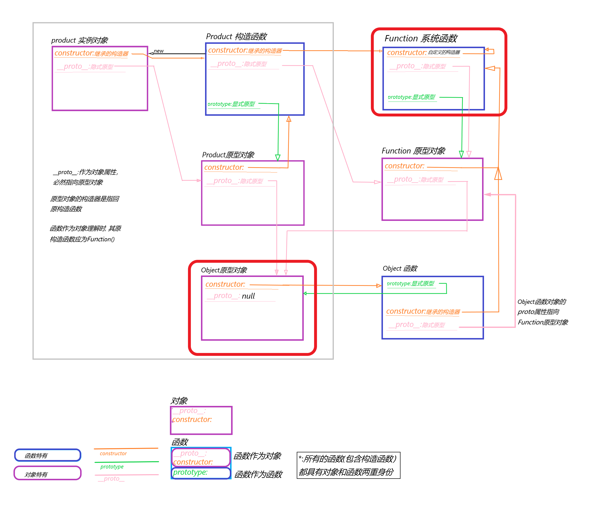

------


### 第九章:   面对对象

概念：括号的左边是函数，点的左边是对象。

#### 1 对象的分类

```js
1. 内建的对象
	Math String Number ...
2. 宿主对象
	由浏览器提供的对象，如BOM、DOM
3. 自定义对象
	var obj = {}
    obj.name = "wangzhe"
	delete obj.name
```


#### 2 三种方法

我们先介绍一点比较重要的东西：类方法、对象方法、原型方法

首先我们写一个函数

```js
function Quene(){
    this.quene = []
}
```

###### 2.1 **类方法**

```js
 Quene.Run = function (){
     return "我是类方法，不需要New操作，直接调用即可"
 }
```

```js
Quene.Run()  //"我是类方法，不需要New操作，直接调用即可"
```

###### 2.2 **原型方法**

```js
Quene.prototype.push = function (data) {
    this.quene.push(data)      //函数被实例化后，this指向实例对象
}
Quene.prototype.pop = function () {
    return this.quene.shift()  //函数被实例化后，this指向实例对象
}
```

```js
let q = new Quene()
q.push("push1")
q.pop()			
/*
quene: ['push1']
[[Prototype]]: Object
    pop: ƒ ()
    push: ƒ (data)
    constructor: ƒ Quene()
*/
```

​	原型上的 this 指向实例对象

###### 2.3 **对象方法**

```js
function Quene() {
    this.quene = []
    // 对象方法
    this.detail = function (){
        return this.quene
    }
}
let q = new Quene()
// 对象方法
q.copy = function (){
    let newlise = []
    this.quene.forEach(item=>{
        newlise.push(item)
    })
    return newlise
}
```


#### 3 继承

```
当前内容尚且不了解
```

继承的方式

```js
方式一:原型链继承
	子类的原型对象指向父类的实例
	// 核心代码：
    	Child.prototype = new Parent()

方式二:借用构造函数继承(构造函数继承)(call继承)：本质是通过call或apply实现
	在子类的构造函数中，执行父类的构造函数，并且为其绑定子类的this
    // 核心代码：
        function Child() {
          this.childname = ['子类']
          Parent.call(this)
        }
	缺点:	
		构造函数继承可以继承到父类上的属性和方法，但是继承不到父类原型上的属性和方法

方式三：组合继承：利用原型链继承和构造函数继承的混合
方式四：混入继承：将一组对象中的所有属性和方法克隆到一个对象中
方式五: 寄生组合继承模式=借用构造函数+原型链继承+寄生继承
```


#### 4 继承方法介绍

```js
hasOwnProperty() 		// 使用该方法时只有对象自身拥有该属性时返回true				继承于object原型对象


eg:
    function Person(name,hobit) {

    }
    Person.prototype.name = "wang"
    let per = new Person("DZQ","MV")
    per.hasOwnProperty()  							//false

	function Person(name,hobit) {
		this.name = name
    }
    let per = new Person("DZQ","MV")
    per.hasOwnProperty()  							//true
```


### 第十章：回调函数

#### 定义

​	首先我们要知道什么是回调函数。

​	函数实际上对象，它是可以被存储在variable 变量中，1)能在函数中作为参数传递，2)能在函数中被创建，3)能从函数中返回。

​	回调函数是：一个函数**A**作为参数传递给另一个函数（这里我们把另一个函数叫做“**B**”），回调函数在**B**中被调用。

```js
let name = "window"

function A(){
    console.log(this.name)
}

function B(callback){
    let name = "B function"
    callback()
}

B(A)  //window
```

#### 分类

​		同步回调函数

​		异步回调函数

​			区别在于callback 是否会被立即执行

#### 同步回调

​	**callback 会被立即执行**，全部执行完毕后才结束，不会进入回调队列中

```js
let arr = ['guo','ding','wu','shi']
arr.forEach(item=>{console.log(item)})  //遍历回调
console.log("forEach 之后")
```

我们谈论一下它们的执行顺序：

​	按照顺序执行的原则，首先声明数组，然后执行forEach函数，因为forEach不是异步回调函数，故callback会被立即执行，而不放入回调队列，待callback执行完毕后，退出forEach函数。再执行第三行代码。

#### 异步回调

​	**callback 不会被立即执行**，callback会被放入回调队列中，在合适情况下执行。

```js
setTimeout(()=>{console.log("2s 后打印哎呦喂")},1000)
setTimeout(()=>{console.log("1s 后打印哎呦喂")},2000)
setTimeout(()=>{console.log("哎呦喂")},3000)
console.log('3s 后打印哎呦喂')
```

我们谈论一下它们的执行顺序：

​	按照顺序执行的原则，我们分别进入第一行，第二行，第三行，因为setTimeout是异步回调函数，它们的callback全部进入回调队列，分别在指定时间执行，然后进入了第四行，马上打印提示信息 


## JS高级

#### 1 整体架构

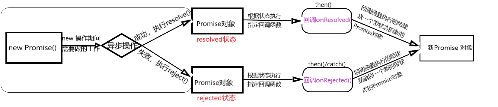

**IIFE：**IIFE（Imdiately Invoked Function Expression 立即执行的函数表达式


#### 2 细节实现

##### 2.1 填充构造函数

```js
function Promise(executor){
    function reslove(){}
    function reject(){}
    executor(reslove,reject)
}
```

##### 2.2 状态，数据和回调函数

```js
const PENDING = 'pending'
const RESOLVED = 'resolved'
const REJECTED = 'rejected'
function Promise(executor){
    this.status = PENDING  
	this.data = undefined 
	self.callbacks = [] // 每个原生的解构为：{onResolved(){},onRejected(){}}
    function resolve(data){}
    function reject(err){}
    executor(resolve,reject)
}
```

##### 2.3 指定函数callback的分析

```
then和 catch原型方法是用来指定callback
	先获得数据，后指定callback
	先指定callback，后获得数据
```

```js
let p = new Promise((resolve,reject)=>{
	resolve("立即获得数据，但未指定callback")
})
p.then((data)=>{console.log(data)},(err)=>{})
```

```js
let p = new Promise((resolve,reject)=>{
	setTimeout(()=>{
		resolve("延时获得数据，且已指定callback")
	},1000)
})
p.then((data)=>{console.log(data)},(err)=>{})
```

##### 3.4 resolve \ reject函数实现

```
细节1:  状态只能修改一次，故需要做状态判断。
细节2:  如果先指定callback，进行“异步”执行
```

```js
function resolve(data) {
    if (self.status !== PENDING) return 
    self.data = data
    self.status = RESOLVED
    if (self.callbacks.length > 0) {
        self.callbacks.forEach(item => {
            item.onResolved()
        })
    }
}
```

##### 2.5 执行器异常分析

```
执行器也会抛出异常，那么在我们的代码中就需要对这个错误进行捕获，并主动调用reject修改状态和数据
```

```js
//执行器异常处理
try {
    executor(resolve, reject)
} catch (e) {
    reject(e)
}
```

##### 2.6异常穿透和中断分析

```js
Promise.prototype.then = 
	function (onResolved = (data) => { return data }, onRejected = (err) => { throw err }) //异常穿透
```

```js
function handler_async(callback) {
    try {
        let res = callback(self.info);
        if (res instanceof Mypromise) {
            res.then(
                (data) => {
                    r(data);
                },
                (err) => {
                    j(err);
                }
            );
        } else {
            r(res); 
        }
    } catch (e) {
        j(e);  //中断
        if(e instanceof Error)throw Error(e);   
    }
}
```

##### 2.7 then /catch的实现

```
1. then 返回的是一个promise
2. 当前then返回的promise与指定回调函数返回的Promise之间的问题处理
3. undefined作为参数进行传递时，不会改变默认参数值
```


#### 3 Promise复现

##### 3.1 核心实现

```js
(function (window) {
  const A = "A1";
  const B = "B1";
  const C = "C1";
  function Mypromise(exec) {
    let self = this;
    self.info = undefined;
    self.status = A;
    self.callbacks = [];
    function handler(info, status, callback) {
      if (self.status != A) return;
      self.info = info;
      self.status = status;
      if (self.callbacks.length > 0) {
        self.callbacks.forEach((item) => {
          setTimeout(() => {
            item[callback]();
          });
        });
      }
    }
    function resolve(data) {
      handler(data, B, "OnResolved");
    }
    function reject(err) {
      handler(err, C, "OnRejected");
    }
    try {
      exec(resolve, reject);
    } catch (e) {
      reject(e);
    }
  }
  window.Mypromise = Mypromise;
  Mypromise.prototype.then = function (OnResolve=(data)=>{return data}, OnReject=(err)=>{throw err}) {
    let self = this;
    return new Mypromise((r, j) => {
      function handler_async(callback) {
        try {
          let res = callback(self.info);
          if (res instanceof Mypromise) {
            res.then(
              (data) => {
                r(data);
              },
              (err) => {
                j(err);
              }
            );
          } else {
            r(res); // 返回结果不为Promise，那么就对其返回值进行处理
          }
        } catch (e) {
          j(e);
          if(e instanceof Error)throw Error(e);  
        }
      }
      if (self.status == B) {
        setTimeout(() => {
          handler_async(OnResolve);
        });
      } else if (self.status == C) {
        setTimeout(() => {
          handler_async(OnReject);
        });
      } else {
        self.callbacks.push({
          OnResolved: () => {
            handler_async(OnResolve);
          },
          OnRejected: () => {
            handler_async(OnReject);
          },
        });
      }
    });
  };
  Mypromise.prototype.catch = function (OnReject){
     this.then(undefined,OnReject)
  }
})(window);
```

##### 2.resolve/reject类方法

```js
  MyPromise.resolve = function (value){
    return new MyPromise((r,j)=>{
        if(value instanceof MyPromise){
            value.then(r,j) ;
        }else{
            r(value) ;
        }
    })
  }

  MyPromise.reject = function(reason){
    return new MyPromise((r,j)=>{
        j(reason) ;
        if(reason instanceof MyPromise){
          reason.catch((err)=>{
            setTimeout(()=>{throw Error(err) ;})
          })
        }
    })
  }
```

这么写的原因是文档的要求

```js
// const p = MyPromise.resolve("data")
// const p1 = MyPromise.resolve(MyPromise.resolve("r - r"))
// const p2 = MyPromise.resolve(MyPromise.reject("r - j"))
// let pp =  p.then((data)=>{console.log("p data",data)},(err)=>{console.log("p err",err)})
// let p11 = p1.then((data)=>{console.log("p1 data",data)},(err)=>{console.log("p1 err",err)})
// let p22  = p2.then((data)=>{console.log("p2 data",data)},(err)=>{console.log("p2 err",err)})
// setTimeout(()=>{
//   console.log(p);
//   console.log(p1);
//   console.log(p2);
// },1000)
// setTimeout(()=>{
//   console.log(pp);
//   console.log(p11);
//   console.log(p22);
// },1000)
  
const p3 = MyPromise.reject("err")
const p4 = MyPromise.reject( MyPromise.resolve("j - r"))
const p5 = MyPromise.reject( MyPromise.reject("j - j"))
let p33 = p3.then((data)=>{console.log("p3 data",data)},(err)=>{console.log("p3 err",err)})
let p44 = p4.then((data)=>{console.log("p4 data",data)},(err)=>{console.log("p4 err",err)})
let p55 = p5.then((data)=>{console.log("p5 data",data)},(err)=>{console.log("p5 err",err)})
setTimeout(()=>{
  console.log(p3);
  console.log(p4);
  console.log(p5);
},1000)
setTimeout(()=>{
  console.log(p33);
  console.log(p44);
  console.log(p55);
},2000)
```

##### 3.all/race类方法

```js
Promise.all = function (promisesList) { 
    let lists = new Array(promisesList.length)
    let counterflag = promisesList.length
    return new Promise((resolve,reject)=>{
        promisesList.forEach((item,index)=>{
            Promise.resolve(item).then(   // 担心promisList不是一个Promised对象
                value =>{
                    lists[index] = value
                    counterflag -=1

                    //如果全部成功调用resolve。
                    if(!counterflag){
                        resolve(lists)
                    }
                },
                err =>{
                    reject(err)
                }
            )
        })
    })
}

Promise.race = function (promisesList) { 
    let successflag = false
    return new Promise((resolve,reject)=>{
        promisesList.forEach((item,index)=>{
            Promise.resolve(item).then(   // 担心promisList不是一个Promised对象
                (data)=>{
                    if(!successflag){
                        resolve(data)
                        successflag = true
                    }
                },err=>{
                    reject(err)
                })
        })
    })
}
```


##### 4.自定义方法

```js
Promise.resolveDelay = function (value,timeout=0){
    return new Promise((resolve, reject) => {
        if (value instanceof Promise) {
            setTimeout(()=>{
                value.then(resolve, reject)
            },timeout)
        } else {
            setTimeout(()=>{
                resolve(value)
            },timeout) 
        }
    }) 
}
Promise.rejectDealy= function (reason,timeout=0){
    return new Promise((resolve, reject) => {
        setTimeout(()=>{
            reject(reason)
        },timeout)
    })
}
```


#### 4 ES6Class

```js
(function (window) {
    const PENDING = 'pending'
    const RESOLVED = 'fulfilled'
    const REJECTED = 'failure'
    class Promise {
        constructor(executor) {
            let self = this   //存储当前Promise对象，供闭包使用
            self.status = PENDING
            self.data = undefined
            self.callbacks = [] // 每个原生的结构为：{onResolved(){},onRejected(){}}
            function resolve(data) {}
            function reject(err) {}
            //执行器异常处理
            try {
                executor(resolve, reject)
            } catch (e) {
                reject(e)
            }
        }
        //promise 原型对象上的方法
        then = function (onResolved = (data) => { return data }, onRejected = (err) => { throw err }) {}
        catch = function (onRejected) {}
        // Promise函数对象的方法
        static resolve = function (value) {}
        static reject = function (reason) { }
        static race = function (promisesList) {}
        static all = function (promisesList) {}
        static resolveDelay = function (value, timeout = 0) {}
        static rejectDealy = function (reason, timeout = 0) {}
    }
    window.Promise = Promise
}(window))
```


#### 5 async和await

- async 用来定义一个异步函数

  语法：

  ​	async function funName(params){ ..... }

  ​	async 函数返回promise对象,因为return 的结果会被默认包装成Promise


- await 用来等待一个成功的Promise对象，

  语法：

  ​	[return_value] = await expression

  ​	**表达式** expression 是一个Promise 或任何要等待的值

  ​	**返回值** 返回Promise对象的处理结果，若等待的不是Promise对象，则返回该值本身。

​	第一要义：等待代码执行完毕

​	第二要义：代码执行的**成功的结果**进行接收，倘若失败，则需要使用try-catch


```js
function fn(){
    return new Promise((resolve,reject)=>{
        setTimeout(()=>{
            resolve("OK statue")
            reject("No More")
        },1000)
    })
}

async function Use(){
    try{
        const result = await fn()
        console.log("Promise对象成功----- ",result)
        return result
    }catch(err){
        console.log("Promise对象失败----- ",err)
    }
}

let ok = Use()
```


#### 6  JS 异步之宏队列和微队列

JS 中用来**存储待执行回调函数**的队列包含2 个不同特定的列队

1、宏列队: 用来保存待执行的宏任务(回调), 比如: 定时器回调/DOM 事件回调/ajax 回调

*2、*微列队: 用来保存待执行的微任务( 回调), 比如: promise 的回调/MutationObserver 的回调

3、JS 执行时会区别这2 个队列

　　3.1　JS 引擎首先必须先执行所有的初始化同步任务代码

　　3.2　每次准备取出第一个宏任务执行前, 都要将所有的微任务一个一个取出**来执行**


```js
setTimeout(()=>{
    console.log("timeout callback1")
    Promise.resolve(3).then(value=>{
        console.log("Promise OnResolved ",value)
    })
},0)
Promise.resolve("1").then((data)=>{console.log("Promise OnResolved ",data)})
setTimeout(()=>{
    console.log("timeout callback2")
},0)

Promise.resolve("2").then((data)=>{console.log("Promise OnResolved ",data)})
```

practice1:

```js
setTimeout(()=>{
    console.log("1")
},0)
new Promise((resolve,reject)=>{
    console.log(2)
    resolve()
}).then(()=>{
    console.log(3)
}).then(()=>{
    console.log(4)
})

console.log("5")

2 5 3 4 1
```

practice2

```js
const first = () => (new Promise((resolve, reject) => {
    console.log(3)

    let p = new Promise((resolve,reject)=>{
        console.log(7)
        setTimeout(()=>{
            console.log(5)
            resolve(6)
        },0)
        // resolve(1)
    })

    resolve(2)

    p.then((arg)=>{
        console.log(arg)
    })  
}))

first().then((arg)=>{
    console.log(arg)
})
console.log(4)

// 宏 【5】
// 微 【2】【6】
//3 7 4 2 5 6
//3 7 4 1 2 5
```

practice3

```js
setTimeout(() => {
    console.log("0")
}, 0)
new Promise((resolve, reject) => {
    console.log("1")
    resolve()  
}).then(() => {         // a
    console.log("2")
    new Promise((resolve, reject) => {
        console.log("3")
        resolve()  
    }).then(() => {     // b
        console.log("4")
    }).then(() => {     // c
        console.log("5")
    })
}).then(() => {         // d
    console.log("6")
})

new Promise((resolve,reject)=>{
    console.log("7")
    resolve() 
}).then(()=>{           //e
    console.log("8")
})

// 宏 【0】
// 微 【a e】【b】【d】【c】 
// b 先入队，b入队之后，a执行完毕,然返回一个成功Promise
//  1 7 2 3 8 4 6 5 0
```


### 正则

```
1. 【\】 将下一个字符标记为特殊字符、文本  

2. 【^】 匹配字符串开始的位置
3. 【$】 匹配字符串结尾的位置

4. 【*】 {0,} 0次以上
5. 【+】 {1,} 1次以上
6. 【?】 {0,1}

7. 【.】 匹配除"\r\n"之外的任何单个字符,若要匹配包括"\r\n"在内的任意字符，请使用诸如"[\s\S]"之类的模式
8. 【|】 或的关系
9. 【[a-g]】 匹配a-g任意一个字符
10.【[^ ]】取反
11.【(.+)】 默认是贪婪匹配
12.【(.+?)】为惰性匹配

13.【\w】字母
14.【\W】非字母
15.【\d】数字
16.【\D】非数字
17.【\s】空格   tab \n
18.【\S】非空格

19.【\b】匹配一个单词边界，即字与空格间的位置。
20.【\B】非单词边界匹配。
```

```js
var reg = new RegExp("正则表达式","匹配模式")
reg.test(str)
匹配模式
	i	忽略大小写
    g	全局匹配
    m	多次匹配

字面量创建正则：
	var = /正则/匹配模式

```

```js
// 匹配138开头的手机号,以及隐藏
var reg = /^138[0-9]{8,8}$/;

let strs = "13800000000"
if(reg.test(strs)){
    console.log(strs.replace(strs.slice(3, 7), '****'));
}

```

```js
var str = 'aaa<div style="font-color:red;">123456</div>bbb'
<.+?>会匹配<div style="font-color:red;">
<.+>会匹配<div style="font-color:red;">123456</div>
```


### 对象模型

#### DOM
```
节点分类：			节点名		节点类型		节点值
	文档节点：		#document   9			null
	元素节点：       标签名		  1			  null   	
	属性节点： 		属性名 	  2			  属性值
	文本节点：       #text		3			文本内容
	
DOM事件：
	文档或者浏览器窗口发生的一系列交互瞬间。JS 和 HTML 之间的交互是通过事件实现的
	种类：
		1 鼠标事件
		2 键盘事件
		3 滑动事件
		4 表单事件
		5 body事件
		6 图片事件
		7 媒体事件
		8 滚轮事件
```


```
onload事件：在页面或图像加载完成后立即发生
	HTML支持的标签：[ <body>, <frame>, <frameset>, <iframe>, , <link>, <script> ]
			<body onload="functionName()">
	js支持的对象：  [ image, layer, window ]
		window.onload = 函数
```


##### 节点元素
Dom 获取元素节点

- [x] 获取元素节点标签

```
document.getElementById()   		: 通过id属性获取【一个】对象节点		
document.getElementsByName()		: 通过name属性名获取【一组】元素节点对象				NodeList
document.getElementsByTagName()		: 通过Tag标签名来获取【一组】元素节点对象			   HTMLCollection
document.getElementsByClassName()	: 通过class属性获取【一组】元素节点对象				 HTMLCollection

document.querySelector(css选择器)     ：返回第一个
document.querySelectorAll(css选择器)  ：返回全部						  			 NodeList

document.body						:body
document.documentElement			:HTML
document.all						:所有标签节点 								  HTMLAllCollection
		document.getElementsByTagName('*')
```

- [x] 获取元素节点内容

```
innerHTML:  【设置】【获取】当前[元素节点]内部所包含的HTML+文本信息
innerText:  【设置】【获取】当前[元素节点]内部所包含的文本信息，不含HTML
	另一种方法：获取标签节点.firstChild得到Text节点，再通过nodeValue获取，
	
outerHTML:  【设置】【获取】当前[元素节点]自身及其所包含的HTML+文本信息（包括自身）
outerText:  【设置】【获取】当前[元素节点]自身及其所包含的文本信息（包括自身）
```


- [x] 获取自闭和标签的属性值

```
元素.属性名    		【class 不支持】
元素.className	  获取class属性的值	
```


###### 获取节点的节点
```
node.getElementsByTagName()	 		:通过标签获取子节点    		HTMLCollection
node.childNodes												  NodeList(含空格文本Text)						 
node.firstChild
node.lastChild
```

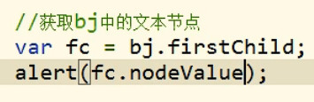 


###### 获取节点的父节点
```
node.parentNode
```


###### 获取节点的兄弟节点
```
node.prevoiusSibling		(含空格文本Text)	
node.nextSibling			(含空格文本Text)	
node.previousElementSibling (不含空格文本Text)	中用
node.nextElementSibling     (不含空格文本Text)	中用
```


###### 节点操作
```
创建
document.createElement("div")			:创建元素节点
document.createTextNode(string)			:创建文本节点
	
替换子节点
fatherNode.replaceChild(newChild,oldChild):

插入子节点
fatherNode.insertBefore(newChild,refChild) 
fatherNode.appendChild(newNode)			: 向父节点中添加子节点

删除子节点
fatherNode.removeChild(node) 			: 删除node子节点(直接子节点)

属性节点插入
document.createAttribute(string)		:创建属性节点   att.value = 123 设置属性值
someNode.setAttributeNode(attrNode)

节点属性值获取和设置
someNode.getAttribute("attrName")
someNode.setAttribute("attrName","attrValue")
```


###### 节点样式操作
```
元素.style.样式名 = 值      	// 读取和设置的都是内联样式

元素.currentStyle.样式名     // 读取当前元素显示的样式  IE独有

getComputedStyle(元素[,伪元素|null]) // 读取指定元素显示的样式
```


```js
if(window.getComputedStyle){
	getComputedStyle(obj,null)[name] ;
}else{
	obj.currrentStyle[name] ;
}
```

```js
修改box 的class属性
.b2{
	border:;
}
let box = document.querySelector(".box") ;
let btn = document.querySelector("input") ;
btn.addEventListener('click',function () {
    toggleClass(box,"b2")
}) ;

function toggleClass(elem,classAttr) {
    hasClass(elem,classAttr)?removeClass(elem,classAttr):addClass(elem,classAttr) ;
}
function addClass(elem,classAttr) {
    !hasClass(elem,classAttr)? elem.className +=" "+classAttr : null;
}
function removeClass(elem,classAttr) {
    hasClass(elem,classAttr)? elem.className = elem.className.replace(classAttr,"").trim(): null ;
}
function hasClass(elem,classAttr) {
    return  new RegExp(`\\b${classAttr}\\b`).test(elem.className) ;
}
```


###### 元素尺寸
```
elem.clienWidth
elem.clientHeigth 			// 元素的可见高，只含数字 ，含padding

elem.offsetHeight
elem.offsetWidth			// 元素的宽度，包border

elem.offsetParent			// 返回当前元素定位父元素
elem.offsetTop
elem.offsetLeft				//当前元素相对于定位元素的水平偏移

elem.scrollHeight		 	// 元素整体高度  【该值可能由子元素offsetHeight进行传递】
											【也可能是本身clientHeight】
elem.scrollWidth			// 元素整体宽度  【该值可能由子元素offsetWidth 进行传递】
											【也可能是本身clientWidth 】									
elem.scrollLeft				// 元素左边缘与视图之间的距离[overflow-x: auto;]
								水平滚动条移动距离
elem.scrollTop				// 元素上边缘与视图之间的距离[overflow-y: auto;]
```


```html
<div class="F">
    <div class="S">
    </div>
</div>
.F{
    width: 300px ;
    height: 400px;
    margin: 0 auto;
    border: 10px solid gold;
    background-color: #33ffee;
    overflow: hidden;
}
.S{
    width: 450px;
    height: 600px;
    border: 20px solid red;
}
f.scrollHeight
640
f.clientHeight
400
f.offsetHeight
420

s.scrollHeight
600
s.clientHeight
600
s.offsetHeight
640

f.scrollWidth
490
s.scrollWidth
450
s.offsetWidth
490
```


##### 事件对象
```js
事件对象做参数：
	当事件的响应函数被触发时，【浏览器】每次都会将一个事件对象作为实参传递进入响应函数。IE8- 不传
    
let f = document.querySelector(".F")
f.addEventListener("mousemove",(event)=>{
      console.log(event)
})

IE8- 处理
	它会将该事件绑定在window下
	window.event
判断：
	if(!event){
        event = window.event ;
    }
	event = event||window.event
```

```
event.clientX
event.clientY		:可见域偏移   可以配合元素的滚动条实现pageY效果  
event.pageX
event.pageY	    	：页面偏移

this
event.target 		:当前触发事件的元素
```


###### 事件冒泡


```
相同事件触发方向：
	默认：从子向父,由冒泡决定
	 
	
event.cancleBubble = true // 取消冒泡 
```

```
事件委派：
	指将事件统一绑定给元素的共同祖先，当后代元素上的事件触发时，会一致冒泡到祖先元素。
```


###### 事件绑定
```
元素.事件 = 函数    // 无法绑定多个事件

elem.addEventListener("事件名"，callback,boolean)
boolean:	是否在捕获阶段触发事件，一般为false，
							// this == elem 

elem.attachEvent("on事件名"，callback)			// IE8，后绑定先执行， this==window
```

```js
/*
       * 问题一：
       *    事件添加callback函数的兼容性
       * 问题二：
       *    事件添加callback函数的this 指向
       * 问题三：
       *    callback函数得event 参数兼容性
* */
function bind(elem,eventName,callback) {
    if(elem.addEventListener){
        elem.addEventListener(eventName,callback,false)
    }else{
        // IE8之下兼容方式
        elem.attachEvent("on"+eventName,function () {
            // 在匿名函数中调用callback
            callback.call(elem)  //显示绑定
        })
    }
}

bind(document.getElementsByTagName("div")[0],"click",function (event) {
    if(!event){
        event = window.event ;
    }
    event = event||window.event
    alert(this)
})
```


###### 事件传播
```
事件传播过程：
	1.捕获阶段
		由外向内进行捕获，向目标元素事件进行捕获
	2.目标阶段
		事件捕获到目标元素，捕获结束，开始在目标元素上触发事件		
	3.冒泡阶段
		由内向外依次冒泡,依次触发祖先元素上的事件
```

```
preventDefault方法的作用是：取消事件的默认行为。针对addEventListener绑定的事件，IE8不支持
stopPropagation方法的作用是：取消事件的进一步捕获或冒泡。
removeEventListener()

setCapture() 		//强行捕获   IE8
releaseCapture()    //关闭强行捕获 IE8
```


###### 滚轮事件
```
onmousewheel			火狐不支持
DOMMouseScroll			火狐提供的滚轮事件，配合addEventListener()
```

```js
<!DOCTYPE html>
<html>
<head>
    <meta charset="UTF-8">
    <title>滑轮事件</title>
    <style>
        *{margin:0px;padding: 0px}
        .box{
            width: 100px;
            height: 100px;
            background-color: #a18cd1;
        }
    </style>
</head>
<body>
    <div class="box">
    </div>
</body>
<script defer>
  var g = document.getElementsByTagName("div")[0];

  function whell_direct(value) {
      if(value>0){
        console.log("向上滚动") ;
        return 1 ;
      }else if (value<0){
        console.log("向下滚动") ;
        return -1 ;
      }else{ return  0 ;}
  }

  function handler(flag) {
       g.style.height = g.clientHeight - 10*flag + "px" ;
  }

  function whell(event) {
     // IE8- 兼容设置
     event = event || window.event ;
     // 火狐不支持的属性wheelDelta，火狐打印undefined
     // 火狐支持的属性detail , 其他浏览器打印 0
     var flag = whell_direct(event.wheelDelta)||whell_direct(-(event.detail)) ;
     handler(flag)

     // 取消事件默认行为
     event.preventDefault||event.preventDefault() //
     return false
  }

  // 兼容火狐滚动绑定事件
  function EventBind_mouseWheel(elem,func){
    // fireFox 滚轮绑定
    elem.addEventListener && elem.addEventListener("DOMMouseScroll",func,false) ;
    // Chrom   滚轮绑定
    elem.onmousewheel = func ;
  }

  EventBind_mouseWheel(g,whell) ;
</script>
</html>
```


###### 键盘事件
```
keydown   
keyup
keypress
```

```html
<!DOCTYPE html>
<html>
<head>
    <meta charset="UTF-8">
    <title>键盘事件</title>
    <style>
        *{margin:0px;padding: 0px}
        .box{
            width: 100px;
            height: 100px;
            background-color: #a18cd1;
            position: absolute;
        }
    </style>
</head>
<body>
    <div class="box"></div>
</body>

<script defer>

    var box = document.querySelector(".box") ;
    function handler(code){
        switch (code) {
          case 37 :
             box.style.left = (isNaN(parseInt(box.style.left))?0:parseInt(box.style.left)) - 10 + "px" ;
             break;
          case 38 :
            box.style.top = (isNaN(parseInt(box.style.top))?0:parseInt(box.style.top)) - 10 + "px" ;
            break;
          case 39 :
            box.style.left = (isNaN(parseInt(box.style.left))?0:parseInt(box.style.left)) + 10 +"px" ;
            break;
          case 40 :
            box.style.top = (isNaN(parseInt(box.style.top))?0:parseInt(box.style.top)) + 10 +"px" ;
            break;
        }
    }

    document.addEventListener("keydown",function (event) {
      event = event||window.event ;
      if(event.keyCode>=37 && event.keyCode<=40){
         
        handler(event.keyCode)
      }else{
        return false ;
      }
    })
</script>
</html>
```


#### BOM
```
window  	: 代表整个浏览器的窗口,也是网页的全局对象 
Navigator	：代表当前浏览器信息，用来识别不同的浏览器
		因为历史原因，已经不能帮助我们识别浏览器
		userAgent 属性
Location	: 代表当前地址栏信息
History		: 浏览器的历史记录
Screen		: 代表用户屏幕信息 
以上全部作为window 属性进行访问
```

##### Location

###### 属性
```
protocal		
	:协议，一般为http[s]
port			
	:端口，一般为8080
hostname		
	:域名，"www.baidu.com"
host			
	:域名+端口
pathname		
	:页面路径,就是根路径port以后的内容，第一个“/”以后的内容
hash 		
	:锚链，就是#xxx
search			
	:请求参数，就是?key1=value1&key2=value2
href			
	:完整路径，protocal:host：pathname：search/hash
```


###### 函数
```
assign(href)  	:页面重定向
replace(href)	:替换当前页面，不进入历史History
reload(boolean)	:重新加载==F5,如果参数为true则==Ctrl+F5强制刷新（清除缓存强制下载）
```


------


##### History

###### 方法
```
history.pushState({},'','/a')  				重复的压(栈)入历史路由
history.back()								重复的出栈历史路由
history.forward()
history.replaceState({},","home")  			替换当前栈顶路由值
history.go([index])							跳到指定位置
```


###### 实操
```js
init:
	[URL:https://www.baidu.com/]
opea: 
    history.pushState({},'','a')
    history.pushState({},'','b')
    history.pushState({},'','c')
    history.pushState({},'','d')
    history.pushState({},'','e')
resu:
	[URL:https://www.baidu.com/e]	
 
stack:
     [a,b,c,d,e]

opea:
    history.back()   // pop e
    history.back()	 // pop d
    history.back()   // pop c
    history.back()   // pop b
    history.back() 	 // pop a

resu:
	[URL:https://www.baidu.com]

opear:
    history.forward()	// push history a
    history.forward()   // push history b
    history.forward()   // push history c
    history.forward()	// push history d
    history.forward()	// push history e

resu:
	[URL:https://www.baidu.com/e]
 
opea:
	history.replaceState({},","home")

stack:
	[a,b,c,d,home]

resu:
	[URL:https://www.baidu.com/home]

opea:
    history.go(-1)	回退上一页  /d
    history.go(-2)	回退上上页  /b
    history.go(3)   前进3页	/home
```


##### 浏览器检查
```js
IE 识别
	if(”ActiveXObject" in window){code}
```


### webStorage

```
localStorage
sessionStorage
cookie
存储大小：
	5MB左右 
```

#### localStorage

```js

存：
    let info = {name:"DZQ",age:"18"}
    window.localStorage.setItem("msg",JSON.stringify(info))
取：
	let strobj = window.localStorage.getItem("msg")
删：
	window.localStorage.removeItem("msg")
清除：
	window.localStorage.clear()
```

#### sessionStorage

```
方法同上：
	window.sessionStorage
	
特点：
	浏览器关闭时，就会被清空
```

#### cookie

```
document.cookie = "name=dzq;expires="+"date.toUTCString()"+"" ;
```


### 定时器

#### 定义

```
tid = setTimeout()			【一次】 clearTimeout(tid)
iid = setInterval()			【周期】 clearInterval(iid)
参数：
	第一个参数是要执行的 callback 函数。传递函数的时候可以直接写函数，也可以引用一个命名函数
	第二个参数是`milliseconds`，这将是 JavaScript 在执行代码函数之前等待的时间。
			倘若该参数未添加，则要执行的代码会在程序空闲时调用，一般理解为最后调用
	其他参数传递给可以在 callback 函数内部使用
返回值：
	数值类型返回值
	
队列类型：
	回调-入->宏队列
```


#### 防抖节流

```js
防抖：
	在前端有一些事件，一旦被促发，就有一个短时高频率触发的特性。
    此时我们又有监视该类事件的需求，但是我只是希望监视它最后一次的事件。这时候就可以用防抖
    防抖指的是当事件停止触发一段时间后，如果没有在被触发才会最终执行对该事件的处理函数。
节流：
	当某个操作是连续性执行的时候，我们通过某种方式，降低该操作的执行频率，这就是节流。
	
function debounce(handler, delayTime) {
    let timer = null;
    return (...args) => {
        if (timer) {
            //如果timer有值
            clearTimeout(timer); //对其进行清除
            timer = setTimeout(() => {
                handler(...args);
            }, delayTime);
        } else {
            timer = setTimeout(() => {
                handler(...args);
            }, delayTime);
        }
    };
}

let freash = debounce(function(){console.log("hello");},200)
freash()
freash()
function throttle(handler,dalaytime) {
    let timer = null;
    return (...args)=>{
        if (timer) {
            return;
        }
        timer = setTimeout(() => {
            //执行操作(使用apply重新绑定this的指向)
            handler(...args)
            timer = null;
        },dalaytime)
    }
}

let thort = throttle(function(){log("hellow")},2000)
```


## JS特效

### 特效一

#### 轮播图一

```
修改 z-index 属性
```

```html
<!DOCTYPE html>
<html>
<head>
    <meta charset="UTF-8">
    <title>轮播图</title>
    <style>
        *{margin:0px;padding: 0px}
        body{
            height: 100vh;
            width: 100vw;
            display: flex;
            align-items: center;
        }
        .main{
            margin-left: auto;margin-right: auto;
            height: 450px;
            width: 800px;
            position: relative;
            overflow: hidden;
        }
        .imgs{
            position: absolute;
            height: 100%;
            width: 100%;
        }
        img{
            position: absolute;  /*为object-fit 提供基础，不能删除*/
            top: 0;
            left: 0;
            width: 100%;
            height: 100%;
            object-fit: cover;
            object-position: center;
        }


        img{	vertical-align:bottom ;}
    </style>
</head>
<body>
<div class="main">
    <div class="imgs"></div>
    <div class="imgs"></div>
    <div class="imgs"></div>
</div>
</body>
<script>
    window.onload = function (){
        let imgs = document.querySelectorAll(".imgs");
        var currentIndex = 2;
        function cF(){
            imgs[currentIndex].style.zIndex = 0;
            currentIndex  = (currentIndex+1)%3 ;
            imgs[currentIndex].style.zIndex = 6;
        }
        setInterval(cF,3000)
    }
</script>
</html>
```


### 二级菜单

```html
<!DOCTYPE html>
<html>
<head>
    <meta charset="UTF-8">
    <title>二级菜单</title>
    <style>
        *{margin:0px;padding: 0px}
        body{
            background-color: #8EC5FC;
            background-image: linear-gradient(62deg, #8EC5FC 0%, #E0C3FC 100%);
            height: 100vh;
        }
        .warpper{
            /*帮助做一个居中定位*/
            height: 400px;
            width: 400px;
            margin: 100px auto 0px;
        }
        .sdmenu{
            width: 140px;
            margin-left: auto;margin-right: auto;
            border-radius: 10px;
            overflow: hidden;
            background: darkgray;
        }
        .sdmenu > div *{
            user-select: none;
            display: block;
            line-height: 24px;
            padding-left: 5px;
        }
        .sdmenu > div{
            overflow: hidden;
        }
        .menuspan{
            background-color: darkslategray;
        }
        a{
            text-decoration-line: none;
            color:whitesmoke;
        }
        a:active{
            color: gray;
        }

        .collapsed {
            height: 24px;
            overflow: hidden;   
        }

    </style>
</head>
<body>
    <div class="warpper">

        <div id="menu" class = "sdmenu">
            <div>
                <span class="menuspan">在线工具</span>
                <a href="javascript:;">图像优化</a>
                <a href="javascript:;">收藏夹</a>
                <a href="javascript:;">邮件</a>
                <a href="javascript:;">htaccess密码</a>
                <a href="javascript:;">梯度图像</a>
                <a href="javascript:;">按钮生成器</a>
            </div>
            <div class="collapsed">
                <span class="menuspan">支持我们</span>
                <a href="javascript:;">推荐我们</a>
                <a href="javascript:;">连接我们</a>
                <a href="javascript:;">网络资源</a>
            </div>
            <div class="collapsed">
                <span class="menuspan">合作伙伴</span>
                <a href="javascript:;">js工具包</a>
                <a href="javascript:;">CSS驱动</a>
                <a href="javascript:;">CodingForums</a>
            </div>
        </div>
    </div>
</body>
<script defer>
   let menuspan = document.querySelectorAll(".menuspan") ;
   var currOpen = document.querySelectorAll(".menuspan")[0].parentNode ;
   menuspan.forEach((item)=>{
     item.addEventListener("click",function (event) {
        if(this.parentNode == currOpen){  // 关闭的是当前活动的窗口
          toggleClass(this.parentNode,"collapsed",10) ;
          currOpen = null ;
        }else{
          if(currOpen!=null){
            toggleClass(currOpen,"collapsed",10)
          }
            currOpen = this.parentNode ;
            toggleClass(this.parentNode,"collapsed",20)
        }
     })
   }) ;

    function toggleClass(elem,classAttr,speed) {
      let begin = elem.offsetHeight ;
      //伸缩核心
      hasClass(elem,classAttr)?removeClass(elem,classAttr):addClass(elem,classAttr) ;
      let end = elem.offsetHeight ;
      elem.style.height = begin+ "px"
      move(elem,"height",end,speed,()=> {elem.style.height = ""}) ;
    }
    // 延时动画
   function move(elem,attr,target,speed,callback) {
     let src = parseInt(elem.style[attr]) ;
     let add1 = parseInt( (target - src)/speed ) ;
     let add2 = (target -src)%speed ;

     for (let i = 0 ;i<speed;i++){
       setTimeout(()=>{
         elem.style[attr] = parseInt(elem.style[attr]) + add1 + "px" ;
       },i*30)
     }
     setTimeout(()=>{
       elem.style[attr] = parseInt(elem.style[attr]) + add2 + "px" ;
       callback()
     },speed*30)
   }
    function addClass(elem,classAttr) {
       !hasClass(elem,classAttr)? elem.className +=" "+classAttr : null;
    }
    function removeClass(elem,classAttr) {
        hasClass(elem,classAttr)? elem.className = elem.className.replace(classAttr,"").trim(): null ;
    }
    function hasClass(elem,classAttr) {
      return  new RegExp(`\\b${classAttr}\\b`).test(elem.className) ;
    }

</script>
</html>
```


​																											JS END

------


# 04 VUE

## 入门介绍


### Vue全家桶

```
Vue-cli : 脚手架
Vue-router:路由
Vue-x:集中式组件状态管理
Axios:是一个基于 promise 的 HTTP 库
UI框架:iview、vant、Element-ui
```


### 引入安装

```html
<script src="https://cdn.jsdelivr.net/npm/vue@2/dist/vue.js"></script>
```

### 生产提示

```js
Vue.config.productionTip = false ;   // [源码中起效]// 阻止Vue 在启动时产生信息提示
```

### Vue 实例

```
开发软件： visual Studio 
```

Vue 第一种实例：

```html
<body>
    <div id="app">
        {{ msg }}						 // 插值语法 {{ js表达式 }}				
    </div>
</body>
<script>
    Vue.config.productionTip = false ;   // [源码中起效]// 阻止Vue 在启动时产生信息提示
	var vm = new Vue({
		el:'#app' , 					 // element 代指待控制的元素
		data:{							 // Vue 数据池【必须是一个对象结构】
			msg:"nihao "
		}
	})
</script>
```

```
一个容器只能被一个 Vue 实例进行接管
```


### 挂载容器

```js
vm.$mount("#root")			// 重新设置容器，可以不再使用 el属性指定容器 
```

### data 数据

```js
data的两种形式:
	第一种： 对象形式
	第二种： 函数形式--组件式必用
    
第一种：对象形式
    data: {
        password:"",
    }
第二种：函数形式
    data:function(){
        return {
            password:"",
        }
    }
```


###  Object.defineProperty

```
作用：
	直接在一个对象上定义一个新的属性，或者修改一个已经存在的属性
参数：
	arg1:  	obj
	arg2: 	prop
	arg3:	desc
```

基础理解

```js
let  a = {}

Object.defineProperty(a,
    "age",
    {
        value:28,                // 属性值
        enumerable:true,  		 // 控制属性是否可以被枚举【默认false】  object.keys(obj)
        writable:true,           // 控制属性是否可以被修改【默认false】
        configurable:true    	 // 控制属性是否可以被删除【默认false】
    }
)

set和get属性
	:不允许使用writable和value
    作用:获取值\设置值

let  a = {}
let number = 19
Object.defineProperty(a,
   "age",
   {
      enumerable:true,   	// 控制属性是否可以被枚举【默认false】
      configurable:true,    // 控制属性是否可以被删除【默认false】
    
      get:function(){
            console.log("正在读取age属性");
            return number
      },
      set(value){
            console.log("正在设置age属性");
            number = value
      }
   }
)
```

#### 双向绑定原理

```html
<div id="app">
    <label for="password">用户名</label>
    <input type="password"  id = "password" v-model="password"> 
    <p id="showData"></p>
</div>
<script>
     window.data = {}
     var Oin = document.querySelector("#password");
     var Oout = document.querySelector("#showData")
     // Page 数据输入绑定
     Oin.addEventListener("input",function(e){
        window.data.value =e.target.value;   					// 该行文本会触发defineProperty 的set操作
     })
     Object.defineProperty(window.data,"value",{
         get(){
             return ""
         },
         set(v){
             Oout.innerHTML = v
         }
     })
</script>
```

```
Vue是如何做的？
	将data进行加工，实现每个属性的get/set方法。								实现响应
	
	通过Object.defineProperty() 把data对象的所有属性添加到VM上。			 数据代理
	为每一个添加到vm的属性，都指定一个get/set。
	在get/set内部进行操作data种对应的属性。								
```

#### 监测数据原理

（实现响应）data值一旦变换就需要重新进行模板渲染

```html
<script>
    data  = {
        address:"浙工大",
        name:"DZQ"
    }
    // 用于监测data中属性变化
    let obs = new Observer(data)

    let vm = {}
    vm._data = data = obs 

    function  Observer(obj){
        const keys = Object.keys(obj)
        keys.forEach((key)=>{
            Object.defineProperty(this,key,{
                get(){
                    return obj[key]
                },
                set(val){
                    console.log("进行解析模板，生成虚拟Dom，进行differ算法对比，模板渲染");
                    obj[key] = val
                }
            })
        })
    }
</script>
```


### Object.defineProperties

一次定义多个属性

```js
let  a = {}
let gender = "男"
Object.defineProperties(a,
    {
        "age":{value:12,writable:true},
        "name":{value:"小王",writable:true},
        sex:{    
            	get(){
                        return "男"
                    },
             	  set(v){
                        gender = v
                    }
             }
    }
)
```


### 第三方库

```
https://www.bootcdn.cn/		:提供第三方库的汇总
	
	moment.js		是一个 JavaScript 日期处理类库，用于解析、检验、操作、以及显示日期。
```


## 基础了解

### 指令语法

```
标签体：
	即非自闭和标签的开始和结束标签中间的位置【即文本节点】 : <a> 标签体 </a>
	插值语法{{  }}在这里起作用
```


#### v-bind 数据单向绑定

```
全写：
	v-bind:属性="js表达式"
简写：
	:属性="js表达式"
	
作用:
	管理标签属性，
方向：
	从实例到容器
```

作用1： 动态绑定属性

```html
<body>
    <div id="app">
        <a  v-bind:href="baiduUrl">TO BAIDU</a>						// 全写 v-bind:属性="js表达式"
        <button :disabled="isButtonDisabled">Button</button>		// 简写 :属性="js表达式"
    </div>
</body>
<script src="https://cdn.jsdelivr.net/npm/vue@2/dist/vue.js"></script>
<script>
 var vm = new Vue({
		el:'#app' , //element 代指待控制的元素
		data:{
			baiduUrl:"www.baidu.com ",
            isButtonDisabled:true ,
		}
	})
</script>
```


#### v-bind 的class绑定

- [x] 多class列表绑定

```html
<style>
    .basic{height: 100px;width: 100px;}
    .addBorder{border: 1px solid red;}
    .addBg{background-color: red;}
</style>
<div id="app">
    <!-- 引号重要 -->
    <div :class="['basic','addBorder','addBg']"></div>
</div>
<script>
    let vm = new Vue({
    })
    vm.$mount("#app")
</script>
```

- [x] 三元选择

```html
<style>
    .basic{height: 100px;width: 100px;}
    .addBorder{border: 1px solid red;}
    .addBg{background-color: rgb(1, 94, 29);}
</style>
<div id="app">
    <div v-bind:class="[flag?'addBg':'addBorder','basic']"></div>
</div>
<script>
    let vm = new Vue({
        data:{
            flag:true,
        }
    })
    vm.$mount("#app")
</script>
```

- [x] 多class对象绑定

```html
<style>
    .basic{height: 100px;width: 100px;}
    .addBorder{border: 1px solid red;}
    .addBg{background-color: rgb(1, 94, 29);}
</style>
<div id="app">
    <!-- 引号不重要 -->
    <div v-bind:class="{basic:flag,addBorder:flag,addBg:flag}"></div>
</div>
<script>
    let vm = new Vue({
        data:{
            flag:true,
        }
    })
    vm.$mount("#app")
</script>
```


#### v-bind的style绑定

- [x] style 的对象绑定

```html
<div id="app">
    <div :style="styleObj"></div>
</div>
<script>
    let vm = new Vue({
        data:{
            styleObj:{height:'40px',width:"40px","background-color":'red'}
        }
    })
    vm.$mount("#app")
</script>
```

```html
<div id="app">
     <div :style="{height:'40px',width:'40px',backgroundColor:'red'}"></div>
</div>
<script>
    let vm = new Vue({
    })
    vm.$mount("#app")
</script>
```

- [x] style 的列表绑定

```html
<div id="app">
    <div :style="[obj1,obj2]"></div>
</div>
<script>
    let vm = new Vue({
        data:{
            obj1:{height:'40px',width:'40px',backgroundColor:'red'},
            obj2:{border:"1px solid green"}
        }
    })
    vm.$mount("#app")
</script>
```

同样也支持三元选择


#### v-model 数据双向绑定

```
限制：
	v-model只能运用在表单元素中
	等同于<input type="text" v-bind:value="message" v-on:input="message = $event.target.value">
用法
 全写：
	v-model:attr="js表达式"
 简写：	
	v-model="js表达式"
	
🐅如何收集数据：
	type=text 	默认收集value值,用户输入的就是value
	type=radio 	收集value值，需要手动给标签配置value值
	type=checkbox
				若没有配置value,则收集checked
				若配置了value,且v-model的初始值是数组，则收集value组成的数组
				若配置了value,且v-model的初始值是对象，则收集checked(布尔)
```

文本输入框

```html
<div id="app">
    <label for="uname">用户名</label>
    <input type="text"  id = "uname" v-model="uname">
</div>
<script>
 var vm = new Vue({
		el:'#app' , //element 代指待控制的元素
		data:{
            uname:"DingZhiQiang" ,
		}
	})
</script>
```

```
注意在 <textarea> 中是不支持插值表达式的
```

单选框：收集value

```html
<div id="app">
    <label for="male">男</label>
    <input type="radio"  id = "male" v-model="gender" value="男" name="gender">
    <label for="male">女</label>
    <input type="radio"  id = "female" v-model="gender" value="女" name="gender">
</div>
<script>
 var vm = new Vue({
		el:'#app' , //element 代指待控制的元素
		data:{
            gender:"女" ,
		}
	})
</script>
```

复选框:收集checked

```html
<div id="app">
    <label   for="read"> 读书
        <input type="checkbox" id="read"  v-model="habbit['read']" />
    </label>
    <label   for="music"> 音乐
        <input type="checkbox" id="music"  v-model="habbit['music']" />
    </label>
    <label   for="games"> 游戏
        <input type="checkbox" id="games"  v-model="habbit['game']" />
    </label>
</div>
<script>
    Vue.config.productionTip = false ;
	var vm = new Vue({
		el: '#app', //element 代指待控制的元素
		data: {
			habbit:{"read":false,"music":false,"game":false},
		}
	})
</script>
```

#### 表单数据收集

```html
<div id="app">
    <form>
        <div>
            <label for="uaccount">账号</label>
            <input type="text" id="uaccount" v-model="account">				// v-model默认收集value值
        </div>
        
        <div>
            <label for="upassword">密码</label>
            <input type="password" id="upassword" v-model="password">		// v-model默认收集value值
        </div>
        
        <div>
            <label >性别:</label>
            <label for="male">男</label>						// 手动指定value值，由v-model自动进行收集
            <input type="radio" id="male"  name="gender"   value="male" v-model="gender">
            <label for="female">女</label>
            <input type="radio" id="female" name="gender"  value="female" v-model="gender">
        </div>
        
        <div>
            <label>爱好:</label>
            <template v-for="key in Object.keys(hobby)">
                <label :for="key">{{key}}</label>
                <input type="checkbox" name="hobby" v-model="hobby[key]" :id="key">	//收集checked
            </template>
            <label>爱好:</label>
                <label :for="sw">游泳</label>
                <input type="checkbox" name="hobbys" v-model="hobbys" value="A">	// 手动指定value值
                <label :for="re">阅读</label>
                <input type="checkbox" name="hobbys" v-model="hobbys" value="B">	// 手动指定value值
                <label :for="ga">游戏</label>
                <input type="checkbox" name="hobbys" v-model="hobbys" value="C">	// 手动指定value值
        </div>
        
        <div>
            <label for="area">校区:</label>
            <select name="area" size="1"  id="area" v-model="area">
                <option value="A" >   							// 手动指定value值
                    屏风
                </option>
                <option value="B">
                    朝晖
                </option>
                <option value="C">
                    小和山
                </option>
            </select>
        </div>
        
        <div>
            <br>
            <label for="info">其他信息</label>
            <textarea id="info" v-model="message">
            </textarea>
        </div>
        
        <div>
            <input type="checkbox" v-model="obey">
            <span> 阅读并接受过<a href="#">《用户协议》</a></span>
        </div>
        
        <div>
            <button>提交</button>
        </div>
    </form>
</div>

<script>
	let vm = new Vue({
        data:{
            account:"",
            password:"",
            gender:"female",
            hobby:{
                swimmimg:false,reading:false,gameing:false
            },
            hobbys:[],
            area:"B",
            obey:false,
            message:""
        }
    })
    vm.$mount("#app")
</script>
```

#### 表单修饰符

```
v-model的修饰符
	.number : 自动将字符串转换为数字
	.trim	: 自动将字符串的两侧空格去除
	.lazy	: 懒执行
```


#### v-for 循环指令

v-for  实现多选框

```html
<div id="app">
    <label   v-for="key in Object.keys(habbit)"  :for="key">{{key}}
        <input type="checkbox" :id="key"  v-model="habbit[key]" />
    </label>
</div>
<script>
    Vue.config.productionTip = false ;
	var vm = new Vue({
		el: '#app', //element 代指待控制的元素
		data: {
			habbit:{"read":false,"music":false,"game":false},
		}
	})
</script>
```

绑定key

```
作用：
	设置一个标识，用于准确的跟踪每一个for节点
原理：
	1. 原始数据生产虚拟Dom,虚拟Dom上携带着key属性
	2. 虚拟Dom转换从真实Dom
	3. 用户在真实Dom上进行操作
	4. data数据进行更新
	5. 生成新的虚拟Dom
	6. 将旧版本虚拟Dom与新的虚拟Dom根据key属性进行对比算法
	7. 将对应旧虚拟Dom值与新虚拟Dom进行比较，如果一样直接复用旧真实Dom
	8. 否则转换成真实Dom
	
小结：
	Vue种新旧虚拟Dom的differ比较算法要根据Key来确定相同，如果相同直接复用真实Dom
```


#### 列表过滤

```html
<div id="app">
    <input type="text" v-model="keyword" @keyup.enter="ufilter" placeholder="关键词查询">  
    <ul v-for="item in list" :key="item">
        <li>{{ item }}</li>
    </ul>
</div>
<script>
	var vm = new Vue({
		data: {
			keyword:"",
            persons:["马冬梅","梅长苏","苏门达拉","拉不拉多"],
            lists:[]
		},
        computed:{
            list:{
                get(){
                    if(this.lists.length==0){
                        return this.persons
                    }
                    return this.lists
                },
                set(value){
                    this.lists = value   
                }
            }
        },
        methods: {
            ufilter(){
                this.list = this.persons.filter((item)=>{
                    if(item.includes(this.keyword)){
                        return true
                    }
                })
            },
        },  
	})
    vm.$mount("#app")
</script>
```

#### 列表排序

```html
<div id="app">
    <input type="text" v-model="keyword" @keyup.enter="ufilter" placeholder="关键词查询"> 
    <button @click="ascending"> 升序</button>
    <button @click="decending"> 降序</button>
    <ul v-for="item in list" :key="item">
        <li>{{ item }}</li>
    </ul>
</div>
<script>
	var vm = new Vue({
		data: {
			keyword:"",
            persons:[["马冬梅","18"],["梅长苏","34"],["苏门达拉","16"],["拉不拉多","32"]],
            lists:[]
		},
        computed:{
            list:{
                get(){
                    if(this.lists.length==0){
                        return this.persons
                    }
                    return this.lists
                },
                set(value){
                    this.lists = value   
                }
            }
        },
        methods: {
            ufilter(){
                this.list = this.persons.filter((item)=>{ return item[0].includes(this.keyword)}) // 数组响应式
            },
            decending(){
                this.list = this.list.sort((a,b)=>{return b[1]-a[1]})    
            },
            ascending(){
                this.list = this.list.sort((a,b)=>{ return a[1]-b[1]}) 	
            } 
        },  
	})
    vm.$mount("#app")
</script>
```


#### v-on 事件绑定

```
语法：
	v-on:事件="函数名"					方法需要参数，而使用时未传参数Vue会默认将浏览器生产的event事件对象作为参数传入到方法
	v-on:事件="函数名($event,arg)"		需要event,也需要参数 ,   $event  作为参数传递即可

简写：
	@事件="函数名"
	@事件="函数名($event,arg)"
	
methods：
	将在methods对象中书写
	methods中的this 指向VM 或组件实例对象
	
事件：
	input
	click
	keyup
	keydown
	change 
	load 
	blur	:失去焦点
	...
```

```html
<div id="app">
    <input type="button" :value="value" v-on:click="press($event)">
</div>
<script>
     let vm= new Vue({
         el:"#app",
         data:{
            value:"按钮哦"
         },
         methods:{
              press (event){
                    console.log(event);
              }
         }
     })
</script>
```


#### 事件修饰符

```
.stop			事件将停止冒泡传递
.once			事件只触发—次
.capture		捕获阶段进行触发事件
.self			阻止自己被通过冒泡的方式触发事件，除非是自己本身触发
.prevent		阻止原事件的默认行为，比如a标签的默认跳转

.passive		原事件的默认行为需立即执行，无序等待回调函数执行完毕

.native  		【组件】上的原生事件本来是无效的，加上该修饰符会，就可以在组件上进行监听
				见组件访问通信
```


$\bf\textcolor{red}{stop:阻止继续向上冒泡泡}$

```html
<div id="app">
    <div @click="divClick">
        <!-- 事件修饰符 .stop阻止冒泡-->
        <button @click.stop="btnClick">按钮</button>
    </div>
</div>
<script>
        let vm = new Vue({
                methods: {
                        divClick(){
                                alert("DIV 点击")
                        },
                        btnClick(){
                                alert("btn 点击")
                        } 
                }
        })
        vm.$mount("#app")
</script>
```

$\bf\textcolor{red}{once:只支持一次触发}$

```html
<div id="app">
    <div @click="divClick">
        <!--使用.once只触发一次事件处理函数-->
        <button @click.once="btnClick">按钮</button>
    </div>
</div>
<script>
        let vm = new Vue({
                methods: {
                        divClick(){
                                alert("DIV 点击")
                        },
                        btnClick(){
                                alert("btn 点击")
                        } 
                }
        })
        vm.$mount("#app")
</script>
```

$\bf\textcolor{red}{capture:捕获阶段进行事件的触发}$

```html
顺序是： DIV out -> btn -> DIV in
<div id="app">
    <!-- 事件修饰符 .capture捕获阶段触发-->
    <div @click.capture="divClick">
        <div @click="divClick2">
            <button @click="btnClick">按钮</button>
        </div>
    </div>
</div>
<script>
        let vm = new Vue({
                methods: {
                        divClick(){
                                alert("DIV out 点击")
                        },
                        divClick2(){
                                alert("DIV in 点击")
                        },
                        btnClick(){
                                alert("btn 点击")
                        } 
                }
        })
        vm.$mount("#app")
</script>
```

$\bf\textcolor{red}{self:阻止自己被冒泡的方式触发函数}$

```html
<div id="app">
    <div @click.self="divClick">
        <button @click="btnClick">按钮</button>
    </div>
</div>
<script>
        let vm = new Vue({
                methods: {
                        divClick(){
                                alert("DIV out 点击")
                        },
                        btnClick(){
                                alert("btn 点击")
                        } 
                }
        })
        vm.$mount("#app")
</script>
```

$\bf\textcolor{red}{prevent:阻止原事件的默认行为}$

```html
<div id="app">
    <a href="http://www.baidu.com" @click.prevent="toURL">走，进屋</a>
</div>	
<script>
      let vm = new Vue({
            methods: {
                 toURL(){
                       alert("to baidu")
                 }
            }
      })
      vm.$mount("#app")
</script>
```


#### 按键修饰符

```
event.keyCode   :当前按键的字母编码
event.key		:当前按键的字母
```

```
按键修饰符:
	.enter			回车键
	.tab			必须配合KeyDown
	.delete		 	捕获“Delete”和“Backspace”两个按键
	.esc
	.space
	.up
	.down
	.exact			当且仅当
方向按键修饰符	
	.up
	.down
	.left
	.right
	.middle
系统按键修饰符	: 
	(1). keyUp: 按下该修饰键，在按下其他键，随后释放其他键，事件才被触发
	(2). keyDown:正常触发
	.ctrl
	.shift
	.alt
	.meta   		Mac 的command按键
	
全局按键修饰符：
	Vue.config.keyCodes.f2 = 113;  自定义按键修饰符
```

系统自带按键修饰符

```html
// 当触发按键回车键时keyup事件
<div id="app">
	<input type="text" @keyup.enter="showInfo" >
</div>
<script>
    let vm = new Vue({
        methods: {
            showInfo(e){
                console.log(e.target.value);
                console.log(e.keyCode);				//打印按键的字母编码
            }
        }
    })
    vm.$mount("#app")
</script>
```

全局按键修饰符定义

```html
//定义F2的按键修饰符
<div id="app">
    <input type="text" @keyup.f2="showInfo" >
</div>
<script>
    Vue.config.keyCodes.f2 = 113;   //定义F2的按键
    let vm = new Vue({
        methods: {
            showInfo(e){
                console.log(e.keyCode);
            }
        }
    })
    vm.$mount("#app")
</script>
```

组合按键

```html
<!-- Alt + Enter -->
<input @keyup.alt.enter="clear" />

<!-- Ctrl + 点击 -->
<div @click.ctrl="doSomething">Do something</div>
```


#### v-if 条件指令

```
全部指令:
	v-if、v-else-if、v-else 
特性：
	会真正的从dom中移除，源码不在
```

```html
<div id="app">
    <div v-if="type">登录页面</div>
    <div v-else>注册页面</div>
</div>
<script>
    let vm = new Vue({
        data:{
            type:true
        }
    })
    vm.$mount("#app")
</script>
```

```
注意：
	同时使用 v-if 和 v-for 是不推荐的，因为这样二者的优先级不明显
	当 v-if 和 v-for 同时存在于一个元素上的时候，v-if 会首先被执行
```


#### v-show 条件指令

```
本质:
	源码在
	display:none   //元素消失，不占位；
```

```html
<div id="app">
    <div v-show="type">登录页面</div>
    <div v-show="!type">注册页面</div>
</div>
<script>
    let vm = new Vue({
        data:{
            type:true
        }
    })
    vm.$mount("#app")
</script>
```


#### template 模板

```
被渲染后不占位置,和 v-if | slot具名插槽 配合
```

```html
 <div id="app">
     <template v-if="type">
         <p>template</p>
     </template>
</div>
```

```
vm 中的template会将app彻底替换掉
```

```html
<div id="app"></div>
<!-- <script src="./main.js"> -->
<script>
    let School = Vue.extend({
        template:"<div>school</div>",
    })
    const vm = new Vue({
        el:"#app",
        template:"<School></School>",
        components:{
            School,
        }
    })
</script>
```


#### v-text 内置文本 

```html
<div id="app">
    <div v-text="name"></div>
</div>
<script type="module">
	let vm = new Vue({
        data:{
            name:"DZQ"
        }
    })
    vm.$mount("#app")
</script>
```

#### v-html 内置节点

```
有安全性问题
```

```html
<div id="app">
    <div v-html="name"></div>
</div>
<script type="module">
	let vm = new Vue({
        data:{
            name:"<div>DZQ</div>"
        }
    })
    vm.$mount("#app")
</script>
```

####  v-cloak 隐藏

```
禁止未经渲染的模板进行展示 
```

```html
<style>
    [v-cloak]{
        display: none;
    }
</style>
<div id="app">
    <div v-cloak>{{name}}</div>
</div>
```

#### v-once 单次渲染

```
只渲染一次
```

```html
<div id="app">
    <div v-once>{{name}}</div>
    <div>{{name}}</div>
    <button @click="add">add</button>
</div>
<script type="module">
	let vm = new Vue({
        data:{
            name:1
        },methods: {
            add(){
                this.name++
            }
        },
    })
    vm.$mount("#app")
</script>
```

#### v-pre 不渲染

```
不进行编译，直接原样显示
```

```html
<div id="app">
    <div v-pre>{{name}}</div>
</div>
<script type="module">
	let vm = new Vue({
        data:{
            name:1
        }
    })
    vm.$mount("#app")
</script>
```


### 计算属性

```
用法：2种
    computed:{
        属性名(){
            return 返回值或者函数
        },                                                    用法 {{ 属性名 }}   简写形式，等价于get
        
        属性名:{
        	get(){
	 		    return 返回值或者函数
        	},												  用法 {{ 属性名 }}									
        	set(value){
        		...
        	}
        }														
    }
    
   
优势:
	计算属性值会基于【其响应式依赖】被【缓存】,这就意味着对应的数据不发生改变时，会直接返回先前的计算结果。
```

```html
<div id="app">
    <input type="text" v-model:value="LastName" placeholder="姓">
    <input type="text" v-model:value="FirstName" placeholder="名">
    <p v-text="">{{fullName2}} 姓名联动 </p>
</div>
<script>
    let vm = new Vue({
        data:{
            FirstName:"",LastName:""
        },
        computed:{
            fullName1(){
                 return function(){
                    return this.LastName+"-"+ this.FirstName;
                 }   
            },
            fullName2:{
                get(){
                    return this.LastName+"-"+ this.FirstName;
                }
            }
        }
    })
    vm.$mount("#app")
</script>
```


### 监视属性

```
作用：
	用来监听【属性/计算属性】的变化，当属性的值一旦发生变化，就会被监听属性检查到，并促发函数体内容

用法：2种
    watch:{
        监视属性(newValue, oldValue){  						 // 简写形式
            函数体
        },
        监视属性:{
            immediate : true,        						// 初始化时让Handler进行调用一次
            deep:ture,		     							// 深度监测
            handler(n,o){
            	函数体
            }
        }
    }

vm上的API属性监视
	vm.$watch("属性",{immediate,deep,handler函数}/handler匿名函数)
```

```html
<div id="app">
    <input type="number" v-model:value="tell" placeholder="数字">
    监视tell属性的变化
</div>
<script>
    let vm = new Vue({
        data:{
            tell:"",
        },
        watch:{
            tell(n,o){
                console.log(n);
                console.log(o);
            }
        }
    })
    vm.$mount("#app")
</script>
```


小结：

```
computed 和 watch 对比:
	computed 能够完成的，watch必然能完成，反之不一定。

this问题:
	1. 被Vue所管理的函数，最好写成普通函数
	2. 不被Vue管理的函数，最好写成箭头函数，如setTimeout\promise的回调函数
```


### data数据响应式

#### 对象的响应式

```
数据添加与更新：
	Vue.set(target,key,value)
    参数:
        target 	:目标对象，不得在data根对象上的数据  
        key		: 
        value	:

    作用：
        进行响应式向data中添加数据

    实例上的响应式添加数据
        vm.$set()
数据删除	
	Vue.delete(state,"age");
```

#### 数组的响应式

```
触发数组上的如下变更数组本身的方法：会触发响应式--重新解析模板
	push
	pop
	shift
	unshift
	splice
	sort
	reverse
	当遇到的是非变更方法时，我们需要将旧的数组替换为新
	
Vue实现数组的响应式是通过包装数组的常用方法达到重新解析模板

响应式添加数据
	Vue.set(target,loc,value)
	vm.$set(target,loc,value)
```


#### data监测数据

```
1. Vue 会监视Data中所有层次的数据

2. 如何监测对象中的数据？
	通过setter实现监视， 且要在 new Vue时就传入要检测的数据
	（1）. 对象中后追加的属性，Vue 默认不做响应式处理
	（2）. 使用Vue.set(target,属性名/index，value) 进行响应式处理
```


### 过滤器

```
全局过滤器:
	Vue.filter('过滤器名称'，过滤器函数)
私有过滤器:
    filters:{
        过滤器名称：过滤器函数
    }

简单的文本处理，遇到复杂的算法时，应该采用其他方式，比如计算属性等
```

时间戳过滤器

```html
<div id="app">
    {{new Date(Date.now())|formatDate('yyyy-mm-dd hh:MM:ss')}}  			// 时间戳转字符串
</div>
<script type="module">
    import  {formatDate} from '../js/format.js'   //导入 script type=module
	let vm = new Vue({
        filters:{
            formatDate					//使用封装的时间过滤器 formatDate:formatDate 的简写
        }
    })
    vm.$mount("#app")
</script>
```


#### 时间过滤器模块封装

```js
export function formatDate(date, fmt) {
  if (/(y+)/.test(fmt)) {
    fmt = fmt.replace(RegExp.$1, (date.getFullYear() + '').substr(4 - RegExp.$1.length));
  }
  let o = {
    'M+': date.getMonth() + 1,
    'd+': date.getDate(),
    'h+': date.getHours(),
    'm+': date.getMinutes(),
    's+': date.getSeconds()
  };
  for (let k in o) {
    if (new RegExp(`(${k})`).test(fmt)) {
      let str = o[k] + '';
      fmt = fmt.replace(R egExp.$1, (RegExp.$1.length === 1) ? str : padLeftZero(str));
    }
  }
  return fmt;
};
function padLeftZero (str) {
  return ('00' + str).substr(str.length);
};
```

```js
formatDate(date, 'yyyy-MM-dd');

我们有大量的第三方库文件没有必要自己进行书写
比如moment.js
```


### 自定义指令

```
需求：定义一个v-big指令，和v-text功能类似，但会把绑定的值放大10倍
需求：定义一个v-fbind指令，和v-bind功能类似，但可以让其所绑定的input元素默认获取焦点。
```

#### 函数式

```
directives:{
	name(element,binding){
		函数体-- this 指向window
	}
}

name指令何时会被调用？
	1. 指令与元素成功绑定时会被调用。
	2. 指令所在的模板被重新解析时会被调用

this指向：
	window
```

```html
<div id="app">
    <div v-big="n"></div>
</div>
<script type="module">
	let vm = new Vue({ 
        data:{n:2},
        directives:{
            big(v1,v2){
                console.log(v1);
                console.log(v2);
                let newvule =  v2.value*10 ;
                v1.innerText = newvule
            }
        }
    })
    vm.$mount("#app")
</script>
```

#### 对象式

```js
directives:{
    name:{
        // 指令与元素绑定时进行调用
        bind(e,b){},
        // 指令所在元素被插入页面时调用
        inserted(e,b){},
        // 指令所在的模板被重新解析时调用
        update(e,b){}
    }
}

this指向：
	window
```

```html
<div id="app">
    <button @click="n++">add</button>
    <input type="text" v-fbind="n">
</div>
<script type="module">
	let vm = new Vue({ 
        data:{n:2},
        directives:{
            fbind:{
                // 指令与元素绑定时进行调用
                bind(e,b){e.value = b.value},
                // 指令所在元素被插入页面时调用
                inserted(e,b){e.focus()},
                // 指令所在的模板被重新解析时调用
                update(e,b){e.value = b.value;e.focus();}
            }
        }
    })
    vm.$mount("#app")
</script>
```

#### 指令名规则

```
aaBbCc		 : v-aa-bb-cc   
"aa-bb-cc"	 : v-aa-bb-cc 		vue推荐使用
```

#### 全局指令

```
Vue.directive("指令名",对象式/function ()函数式)
```

```js
Vue.directive(
    "aa-bb-cc",{
        // 指令与元素绑定时进行调用
        bind(e,b){console.log("b");},
        // 指令所在元素被插入页面时调用
        inserted(e,b){console.log("i");},
        // 指令所在的模板被重新解析时调用
        update(e,b){console.log("u");}
    }
)
Vue.directive(
    "aaDdCc",function(e,b){
        console.log(b)
    }
)
```

### 模块化

#### ES6 模块化

```
function sum(a,b){
    return a+b
}
```

导出

```
方式一:分别暴露
    export 函数
    export 变量
方式二：统一暴露
    export {函数,变量}
方式三：默认暴露
    export default {}
```

引入

```
引入分别暴露：
	import {函数，变量} from "path"
引入统一暴露：
	import {函数，变量} from "path"
	import {函数，变量 as 别名} from "path"
引入默认暴露：
	import {default as 别名 } from "path"
	import 变量名 from "path"  【简写形式】
```

##### 分别暴露

```js
导出
export const PI = 3.14 ;
export function mySum(){ console.log("sum");}
导入
import { PI,mySum } from "path" ;
```

##### 统一暴露

```js
导出
function sum(){console.log("sum");}
let PI = 3.14
export {PI ,sum}
导入
import { PI,mySum } from "path" ;
import { PI as pi ,sum} from "path" ;			【别名】
import { PI as pi ,sum as add} from "path" ;    【别名】
```

##### 默认暴露

```js
导出
function sum(){console.log("sum");}
let PI = 3.14
export default {PI ,sum}
导入
import res from "path" ; // 或者
import {default as res} from "./temp.js" ;
console.log(res.PI);
```


### webStorage

```
localStorage
sessionStorage
非Vue中的内存，应该属于JS的内容
存储大小：
	5MB左右 
```

#### localStorage

```js
存：
    let info = {name:"DZQ",age:"18"}
    window.localStorage.setItem("msg",JSON.stringify(info))
取：
	let strobj = window.localStorage.getItem("msg")
删：
	window.localStorage.removeItem("msg")
清除：
	window.localStorage.clear()
```

#### sessionStorage

```
方法同上：
	window.sessionStorage
	
特点：
	浏览器关闭时，就会被清空
```


## 学习提升

### 生命周期

 

组件生命周期状态及钩子

```
流程
	🦋1 状态：
        init Event&Lifecycle：
            初始化：生命周期、事件、但数据的代理还未开始。
     beforeCreate(){},
        此时无法通过 vm 访问到 data 中的数据和 methods 中的方法。

    🦋2 状态：
        init injections& reactivity:
            监测数据、数据代理
     created(){},
        此时可以访问data和methods
	
	🦋3 状态：
		has判断：
		（1）has 'el' option ?
			no  -->  当使用 vm.$mount(el) 进入 （2）
			yes  --> 进入（2）
		（2）has 'template option ?
			no  --> 编译el的outHtml作为模板
			yes --> 编译template注射到渲染函数
	  	此阶段Vue开始解析模板，生产虚拟Dom。 
	 beforeMount(){},
	 	此时页面呈现的是未经编译的Dom,且对Dom的操作时无效的
	
	🦋4 状态：	
		Creat vm.$el and replace "el" with it:
			Vue 完成模板的解析,将虚拟Dom转为真实Dom ,并把初始的真实的Dom元素放入页面后调用mounted。
		mounted(){},
			页面呈现的是经过Vue编译的Dom,对Dom的操作均有效。
            一般在此时进行开启定时器、发生网络请求、订阅消息、绑定事件等
	 
	 🦋5 状态：
	 	Mounted
	 		当数据发生改变时,进入下面的钩子
	 	beforeUpdate(){},
	 		在更新之前执行，之后转入状态6
	 🦋6 状态：
		re-render and patch
	 		进行比较并重新渲染，然后进入下面的钩子
	 	updated(){},
	 		更新完毕后，再次进入状态5

	 🦋7 状态：this.$destory()
	 	当组件被卸载后
	 	beforeUnmount(){},	这两个是不同版本的命名
	 	beforeDestroy(){},
	 		vm中的data,methos,指令等等都处于可用状态。
	 		一般在此阶段完成关闭定时器、取消订阅、【解绑事件】等
	
	 🦋8 状态：
	 	Unmounted:
	 		
	 	unmounted(){},这两个是不同版本的命名
	 	destoryed(){},
	 	
Vue 销毁细节：
	1. 销毁后自定义事件会失效，但原生Dom事件依然有效
	2. 不要再beforeDestory进行操作数据，因为不会更新数据了
```

#### beforeMount验证

```html
<div id="app">
    {{name}}
</div>
<script>
    let vm = new Vue({
        data:{name:1},
        beforeMount() {
            debugger ;
        },
    })
    vm.$mount("#app")
</script>
```

#### $nextTick

```js
因为DOM的渲染并不是与Vue组件中代码同步的，这就会导致Vue中某些代码，因为DOM渲染不够及时而产生的无效执行。

作用：
	在下一次Dom更新结束后，执行其指定的回调函数
    
使用条件：
	当数据发生改变后、要基于【更新后的Dom】进行某些操作时，要在nextTick指定的回调函数中执行

例子：
	在Dom挂载前设置Input输入框自动获取焦点
         beforeMount(){
             this.$nextTick(function(){
                 this.$refs.box.focus()
             })
         }
```


### 组件化

```
分类：
	非单文件组件
	单文件组件		【.vue】
```

```
全局组件
	1. 组件的创建
	2. 组件的全局注册
	3. 组件的使用
	
私有组件
	两种方式

所有的组件支持嵌套

作用：
	实现代码资源的集合
```


#### 模板分离语法

```
1. template
2. script
```

```html
<template id="ZuJian">
    <div >
        <p>{{msg}}</p>
    </div >
</template>
---------------------------------------------------------------------------------------------------------
<script type="text/x-template" id="ZuJian">
	<div >
		<p>{{msg}}</p>
	</div>
</script>
```


#### 全局组件

```html
流程：	
	1. 创建组件： Vue.extend({})
        <template id="ZuJian">			   			// 只能有一个直接子元素
            <div >
                <p>{{msg}}</p>
            </div >
        </template>
        var school = Vue.extend({
            template:"#ZuJian",						// 用于定位template
            data:function(){
                return {msg:"你好呀！"}
            },
			methods等
        })
	2. 注册组件：Vue.component(组件名,组件变量)
		Vue.component('myCom',com)					// 命名使用小驼峰

	3. 使用组件
		<div id="app"> 
			<my-com></my-com>						// 组件的使用
		</div>
```


#### 私有组件

```
可以将全局创建的组件在私有组件中进行注册
    简写方式：
        const 组件1 = Vue.extend(options) 全写
        const 组件1 = options				简写
    components:{
		组件1,
		组件2,
    }
或者直接  
    components:{
		组件名:{
			template:"css定位",
			函数式data,
			method等,
		}
	}
```

#### 组件命名

```
注册							标签								VueTool							备注

School/school		--> 	<School></School>				VueTool显示	<School>
"my-school" 		--> 	<my-school></my-school>			VueTool显示	<MySchool>			vue推荐
"mySchool"			-->		<my-school></my-school> 		VueTool显示	<MySchool>
"MySchool"			-->  	<MySchool></MySchool>			脚手架中使用						  个人主推
```

#### 修改开发者工具命名

```js
var school = Vue.extend({
    template:"#ZuJian",			// 用于定位template
	name:"在开发者工具中展示 的名称"
})
```


#### 组件的本质

```
let school = Vue.extend(option)

1.本质：
	school是一个名为VueComponent的构造函数，且不是程序员定义的，是Vue.extend生成的。

2.我们只需要写<组件名></组件名>，vue在解析时会为我们创建该组件的实例对象,即执行 new VueComponent(option)

3.每次调用Vue.extend(),都会返回一个全新的VueComponent。

4.this指向
	（1）组件的配置中：
		data、methods,watch,computed 中的this均指向【VueComponent实例对象】
	（2）new Vue()配置中：
		data、methods,watch,computed 中的this均指向【vm实例对象】

5. VueComponent 的实例对象，以后简称vc【组件实例对象】
   Vue实例对象，简称vm	
```

#### Vm 与 Vc

```html
<div id="app"> 
    <school></school>
</div>
<template id="ZuJian">
    <div >
        <p>{{msg}}</p>
    </div >
</template>
<script>
	//1. 创建组件
	var school = {
		template:"#ZuJian",
        name:"hello",
		data:function(){
			return {msg:"26"}
		}
	}
	var vm = new Vue({
		el: '#app', 
        components:{
            school,
        }
	})
</script>
```

```
1. 利用 vm.$children　可以查看到所管理的子组件。

2. VueComponent 的原型对象 的原型对象 指向 Vue 的原型对象
	VueComponent.prototype.__proto__ === Vue.prototype
	目的：属性查找兜底【组件的vc都可以访问Vue原型上的方法和属性】
```


#### 单文件组件

```
文件命名规则
	(1) 一个单词
		School.vue			【习惯】
		school.vue			
	(2)多个单词
		my-school.vue
		MySchool.vue  		【习惯】
```

```html
结构:三部分【模板、脚本、样式】
    <template>
    <div class="demo">
        {{schoolName}}
        {{address}}
    </div>
    </template>

    <script>
    export default {
        name :"School",
        data(){
            return { schoolName:"浙工大",address:"屏峰"}
        }
    }
    </script>
    <style >
        .demo{
            background-color: rebeccapurple;
        }
    </style>	
```

```
插件	
	vetur
	
模板快捷键
	<v
```


#### scoped

```css
问题：
	当模块中样式出现定位相同时，会因为模块的引入的先后顺序导致后引入覆盖先引入的样式
	
解决方式：
	引入scoped
	<style scoped lang="css/less">
        .demo{
            background-color: grey;
        }
	</style>

作用：
	让样式在局部生效、防止冲突。
```


#### Vue上手

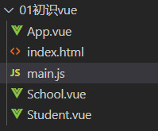 

```
School 和 Student 是两个组件
App 是一个汇总组件
main.js 是一个入口文件
index.html 是一个容器文件
```

main.js

```
实现将template渲染到index.html中
```

```js
import App from "./App.vue"
const vm = new Vue({
    el:"app",
    components:{
        App,
    },
    template:"<App></App>"
})
export default vm ;
```

index.html

```html
<body>
    <!-- 容器 -->
	<div id="app"> </div>
</body>
<script src="./main.js"></script>
```

```
当前只缺脚手架,利用脚手架进行导入解析和.vue文件解析
```


### 脚手架

```
修改镜像
 	npm config set registry https://registry.npm.taobao.org
安装脚手架：
	npm install -g @vue/cli
查看当前vue版本
	npm list vue
```

#### 创建项目

```
插件介绍：
	babel:	 ES6语法转换到ES5
	eslint:	 语法检查
```

```
1. 进入要创建项目的目录
2. vue create xxx 
3. cd xxx  
4. 启动项目 npm run serve
```

```
1. npm install
2. npm run serve
```


##### Vue2版本文件详情

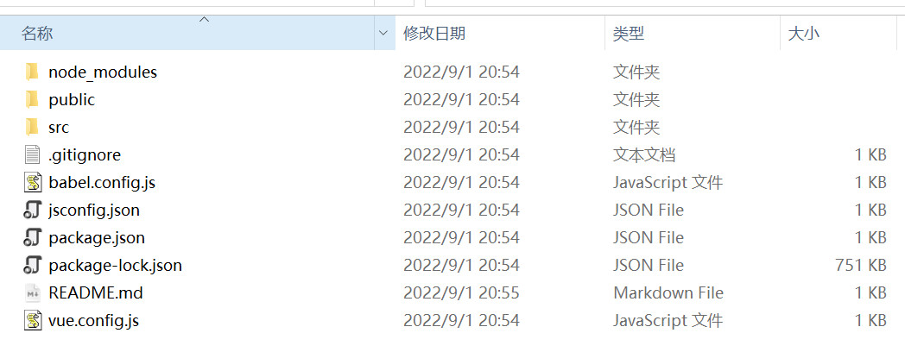

#### 结构分析

```
##脚手架文件结构:
|---node_modules
|---public
|	|——favicon.ico:页签图标
|	|——index.html:主页面
|———src
|	|——assets	: 存放静态资源
|	|  |——logo.png
|	|——component:存放组件
|	|  |--Helloworld.vue
|	|--App.vue	:汇总所有组件
|	|-—main.js	:入口文件
|---.gitignore			: git版本管制忽咯的配置
|---babel.config.js		:babel的配置文件
|---package.json		:应用包配置文件
|---README.md			:应用描述文件
|---package-lock.json	:包版本控制文件
|---vue.config.js		:脚手架个性化定制配置
```


#### vue 精简版

```
Vue.js 含模板解析器和核心功能
Vue.runtime.js 只含核心功能，所以不能使用template配置项，只能使用render函数
```


#### 脚手架默认配置

```
vue inspect > output.js   		 //查看配置文件详细信息

默认情况下不能修改的文件
	public/favicon.ico	
	public/index.html
	src/main.js
```

#### vue.config.js

##### main.js 入口修改

```js
const { defineConfig } = require('@vue/cli-service')
module.exports = defineConfig({
    transpileDependencies: true,
    lintOnSave: false, // 关闭语法检查
    pages: {
        index: {
            entry: 'src/enter.js', // page 的入口 ,原main.js
        }
    }
})
```


##### 路径解析别名

```js
const { defineConfig } = require('@vue/cli-service')
module.exports = defineConfig({
    transpileDependencies: true,
    lintOnSave: false, // 关闭语法检查
    configureWebpack: {
        resolve: {
            extensions: ['.js', '.vue', '.json'],
          alias: {
            'assets': '@/assets',
            'common': '@/common',
            'components': '@/components',
            'network': '@/network',
            'views': '@/views',
            'pages':'@/pages'
          }
        }
     },
})
```

```js
组件导入：  
	import MessageDetail from "pages/MessageDetail"     //路由组件导入

```


### 组件访问通信

#### 父组件访问子组件

```
共有两种方式：
	1. $refs配合ref属性
	2. $children 
```

##### $refs 访问子组件

```
父组件中重复使用了3次School组件，并访问子组件 vc 。
```

```html
<template>
    <div id="app" class="athere">
        <School ref="Sc01"></School> 
        <School ref="Sc02"></School>
        <School ref="Sc03"></School>
        <Student ref="St01"></Student>
        <button @click="show">button</button>
    </div>
</template>
<script>
import School from "./components/School.vue";
import Student from "./components/Student.vue";
export default {
    name: "App",
    components: {
        School,
        Student,
    }, 
    methods:{
        show(){
            console.log(this.$refs.Sc01);
            console.log(this.$refs.St01);
            console.log(this.$refs.Sc01.$el);			//获取dom
        }
    }
};
</script>
```

##### $children 

```
返回一个顺序数组
```

```html
<template>
    <div id="app" class="athere">
        <School ref="Sc01"></School>
        <School ref="Sc02"></School>
        <School ref="Sc03"></School>
        <Student ref="St01"></Student>
        <button @click="show">button</button>
    </div>
</template>
    
<script>
import School from "./components/School.vue";
import Student from "./components/Student.vue";
export default {
    name: "App",
    components: {
        School,
        Student,
    }, 
    methods:{
        show(){
            console.log(this.$children);
        }
    }
};
</script>
```


#### 子组件访问父组件

```
共有两种方式：
	1. $parent
	2. $root			$root访问根组件<root>
```

##### $parent访问父组件

```
Student组件是位于App的子组件
```

```html
<template>
    <div class="demo">
        {{name}}<br>
        <button @click="show">button</button>
    </div>
</template>
<script>
export default {
    name:"Student",
    data(){
        return {name:"DZQ"}
    },methods:{
        show(){
            console.log(this.$parent);
            console.log(this.$root.$children);
        }
    }
}
</script>
```

##### $root访问root组件

```
见上
指的是App组件
```


#### 父组件传数据向子组件

```
引用了子组件的父组件，可以通过属性绑定的（v-bind),把需要传递给子组件的数据，以属性绑定的方式，传递给子组件。
```

##### props 自定义数据验证

```js
全写:   
	props:{'属性名':{
        type:[Array,String],				//定义属性类型
        default:function(){return []},		//默认值， or default:99
        required:false,						//是否是必须
        validator:function(value){			//传入时要经过的数据验证
            return (value instanceof Array )		
        },
    }},

精简版:
	props:["属性名"]			// 只规定属性名
	props:{属性名:Array}		// 规定类型

特性：
	props 中的数据，都是【只读】的，无法重新赋值
    props 中的数据是优先被接受的，可以为data中的数据进行赋值
    
```

- [x] 栗子

```html
// APP组件 
<template>
    <div id="app" class="athere">
        <School v-bind:to-school="schoolMsg"></School>   // 将schoolMsg 单向绑定到 to-school上
        <Student></Student>
    </div>
</template>
  
<script>
import School from "./components/School.vue";
import Student from "./components/Student.vue";
export default {
    name: "App",
    components: {
        School,
        Student,
    },data(){
        return {schoolMsg:"荣升为985高校"}
    }
};
</script>
```

```html
// school组件
<template>
    <div class="demo">
        {{toSchool}}						 // 使用了 
    </div>
</template>
<script>
export default {
    name :"School",
    props:{										// props 进行数据验证和定义
        "toSchool":String,
    }
}
</script>
```

##### 命名规范

```
v-bind中不完全支持小驼峰，故使用：
	came-case
对应的props必须使用小驼峰
	cameCase
```

##### v-bind参数类型

```
当子组件需要Number;Boolean：String等各种类型的数据时，父组件有义务传递对应的类型。

使用data实现方式：
	1. 字符串
		v-bind:to-school="schoolArea"
		schoolArea:"荣升985"
		props:{
        	"toSchool":String,
    	}
		将字符串传递给子组件
		
	2. number
		:to-school="schoolInfo"
		schoolInfo:985
		props:{
        	"toSchool":Number,
    	},
    	将数字传递给子组件

	3. 同理可以传递其他类型数据
	
不使用data实现方式
    prop-name="1"
        子组件收到的字符串1，
    :prop-name="1"
        子组件收到的会是Number数据1 ,同时可以是实现传递其他类型 boolean,array等
```


#### 子组件传数据向父组件

```html
两种方法：
	props
	自定义事件
		组件@事件监听
		$on/$once事件监听

props:
	本质: 
		子组件props 接受函数
	流程：
		1. <School v-bind:getSchhoName="getSchhoName"/>   
				// 将getSchhoName函数绑定到getSchhoName属性上

		2. 在School组件中，在是适当的时候进行调用这个函数，并传递某些信息即可	

组件@事件监听：
    本质：
        【组件自定义事件】
    原理：
        子组件利用$emit进行事件发送，父组件中子组件位置进行监听该事件

    代码：
        子组件 this.$emit("cameCase",msg)事件冒泡
		父组件中子组件位置事件绑定 v-on:came-case="父组件事件监听处理函数"
			【给子组件的实例对象vc绑定了一个事件对象】
    注意事项：
		父组件中子组件引用原生事件,如click
			【v-on:click.native】

$on 事件监听:
	本质:
		【组件自定义事件】
	见下源码
```

- [x] $on

```html
// App.vue
<template>
    <div id="app" class="athere">
       <School ref="Sc01"/>
    </div>
</template>
<script>
import School from "./components/School.vue"
export default {
    name: "App",
    methods:{
        getSchhoName(msg){
            console.log("APP");
            console.log(msg);
        }
    },mounted(){
        this.$refs.Sc01.$on("getSchhoName",this.getSchhoName)      			// School组件事件监听
    },
    components: {
       Student
    }
};
</script>
<style></style>
```

```html
// School.vue
<template>
    <div class="demo">
        <button @click="send">传递APP</button>
    </div>
</template>
<script>
export default {
    name :"School",data() {
         return { schoolName: "浙工大"} 
    },
    methods:{
        send(){
            this.$emit("getSchhoName",this.schoolName)			/// School组件发出一个事件
        }
    }
}
</script>
<style ></style>
```


### 组件案例

```
组件化编码流程(通用)：
 	1. 实现静态组件： 抽取组件、使用组件实现静态页面效果 
 	2. 展示动态数据：
 		2.1 数据的类型、名称
 		2.2 数据保存在哪个组件-【单个组件使用\多个组件使用（考虑状态提升）】
 	3. 交互-从绑定事件监听开始
```

#### 第三方库

```
uuid:	
	生成唯一的字符串id
nanoid: npm i nanoid
	生成唯一的字符串id
```


#### 待办事项

todolist

```
源码见“F:\前端\组件\待做列表组件”
```


### 消息机制

```
组件自定义事件
全局事件总线
消息订阅与发布
```

#### 组件自定义事件

```
事件监听:
	Vc.$on("监听指定事件的事件名",处理函数)				
		1. Vc的获取【常见使用$refs进行获取】
		2. 一般在mounted\created构造中进行设置
		3.【一直进行监听】
		4.【处理函数如果使用function 时，那么里面的this是子组件本身，可以使用箭头函数解决】
		
	Vc.$once("监听指定事件的事件名",处理函数)				
		1.【只监听一次】
监听取消:
	Vc.$off("取消指定的事件监听")
		1. 可以同时取消多个事件的监听，使用数组传递
		2. 不传递参数时，默认解绑全部事件的监听
		3. 当组件被销毁时，会将所有的监视事件进行解绑
		
练习：
	见组件访问通信
```

#### 全局事件总线

```
bus绑定
	Vue.prototype.$bus = new Vue()
事件弹出
	this.$bus.$emit("Event-Name"，args)
事件监听
	this.$bus.$on("Event-Name",Event-Name_func)
监听取消
	this.$bus.$off("Event-Name")
```

#### 消息订阅与发布

```html
第三方库文件
	pubsub-js 
安装：
	npm i pubsub-js
	
导入：
	import pubsub from "pubsub-js"

消息发布：
	let pid = pubsub.publish("消息名",消息参数)
	
消息订阅：
	pubsub.subscribe("消息名",function(消息名,消息参数){})
		1. function 中的this 为 undefined ,故改为箭头函数或者methods中函数
		
取消订阅
	pubsub.unsubscribe(pi d)
```


#### Vue-x

```
见 Vue 全家桶
```


### 混入与插件

#### mixins 混入

```
功能：
	混入 (mixins) 是一种分发Vue【组件中可复用功能】的非常灵活的方式。
	即当多个组件有共同的功能或者完全一样的代码。这时可以将共同的代码进行取缔改成配置，利用minxin汇入

细节：
	mixin 拥有vc 全套内容

选项合并
	当组件和混入对象含有同名选项时，这些选项将以恰当的方式混合。
	1. 数据对象在内部会进行浅合并 (一层属性深度)，在和组件的数据发生冲突时以组件数据优先。
	2. 同名钩子函数将混合为一个数组，因此都将被调用。且混入对象的钩子将在组件自身钩子之前调用。
	3. 值为对象的选项，例如 methods, components 和 directives，将被混合为同一个对象。两个对象键名冲突时，组件对象的键值对优先。
	
全局混入
	Vue.mixin(arg)
```

mixin.js

```js
const mixin = {
    data() {
         return { schoolName: "浙工大minin", address: "屏峰minxin" } 
    },
    methods: {
        show(){
            console.log("mixin_show")
        }
    },mounted(){
        console.log("mixin_mounted")
        this.show()
    }
}
export default mixin;
```

school.vue

```html
<script>
import mixin from "./minxin.js"							// 导入
export default {
    name :"School",
    mixins:[mixin],										// 混入
    methods:{
        show(){											
            console.log("school_show")
        }
    },mounted(){										// 验证 2
        console.log("school_mounted")					// 验证 3
        this.show()
    }
}
</script>
```


#### 插件

```
功能：
	用于增强Vue
本质：
	包含install方法的一个对象，install第一个参数是Vue,第二个参数是插件使用者传递的参数
```

定义与安装

```js
1. 书写插件JS代码：	
    export const plug  = {
        install(Vue,options){
            console.log("install",Vue);
        }
    }
2. 引入插件
	在main.js 中使用import引入： import {plug} from "path"
3. 安装插件：
	Vue.use(插件名plug,插件install参数options)
```

功能

```
定义【全局过滤器】 	  	
	Vue.filter('过滤器名称'，过滤器函数)

定义【全局指令】	   	
	Vue.directive("指令名",对象式/function ()函数式)

定义【混入】		    	
	Vue.mixin(arg) 

创建安装【全局组件】    	
	Vue.extend({}) \ Vue.component('myCom',com)

添加【Vue原型方法】   	
	Vue.prototype.fun = 函数
	比如事件总线：Vue.prototype.$bus = new Vue()
```


### 过渡与动画

#### transition

```
单标签动画
```

##### 方式一:keyframes

```
实现流程：
    1. css动画定义
    2.  .v-enter-active 进场动画 
    	.v-leave-active 离场动画
    3. transition标签包裹
    
transition
	1.【可定义命名动画标签】
		name = "myname"
	2.【进场显示】
		:appear = "true"  
         appear
```

```html
<template>
    <div>
        <button v-on:click="handler">显示\隐藏</button>
        <transition name="hello" apper="true">
            <h1  v-show="isShow">你好啊</h1>
        </transition>
    </div>
</template>
<script>
export default {
    name: "Test",
    data() { return {isShow: true,};},
    methods: {handler() {this.isShow = !this.isShow;},},
};
</script>
<style scoped>
// 进场动画
.hello-enter-active {
    animation: dzq 1s;
}// 离场动画
.hello-leave-active {
    animation: dzqr 1s;
}
@keyframes dzq {
    from {
        transform: translateX(-300px);
    }
    to {
        transform: translateX(0px);
    }
}
@keyframes dzqr {
    from {
        transform: translateX(0px);
    }
    to {
        transform: translateX(-300px);
    }
}
</style>
```

##### 方式二：enter/leave

```
其他的场景
    .v-enter 	进入的起点  v=leave    离开的起点
    .v-enter-to 进入的终点  v-leave-to 离开的终点
```

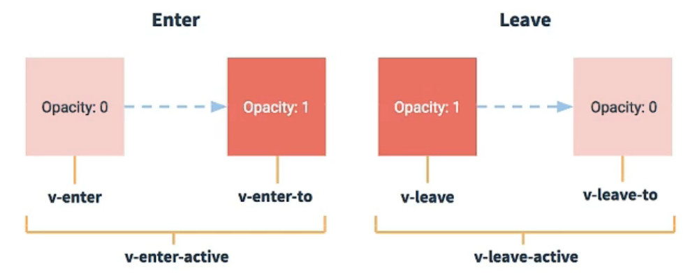


```
流程：
	1. v-enter  v-leave
	   v-enter-to v-leave-to中利用transform等  进行变化
	2. 在对应的选择器中设置动画时间(利用transiton)
	   或者
	   在v-enter-active v-leave-active 设置动画时间
	3. transition标签包裹
```

```html
<template>
    <div>
        <button v-on:click="handler">显示\隐藏</button>
        <transition name="hello" :appear="true">
            <h1  v-show="isShow">你好啊</h1>
        </transition>
    </div>
</template>
<script>
export default {
    name: "Test",
    data() { return {isShow: true,};},
    methods: {handler() {this.isShow = !this.isShow;},},
};
</script>
<style scoped>
h1 {
    transition: transform 1s  ;
}
.hello-enter,.hello-leave-to{
    transform:  translateX(-300px);
}
.hello-enter-to , .hello-leave{
    transform: translateX(0px);
}
</style>
```


#### transition-group

```html
用来设置多标签动画
	每个标签需要唯一的key值
    <transition-group name="hello" :appear="true" >
        <h1  v-show="isShow" key="1">你好啊</h1>
        <h1  v-show="isShow" key="2">你好啊</h1>
    </transition-group>
```

#### 第三方库

```html
网址：
	https://animate.style/
	
安装
	npm install 
引入
	import "animate.css"

使用
    <transition-group  :appear="true" 
             name="animate__animated animate__bounce"
             enter-active-class="animate__flip"
             leave-active-class="animate__fadeOutRight">
        <h1   v-show="isShow" key="1">你好啊</h1>
        <h1   v-show="!isShow" key="2">enne</h1>
    </transition-group>
```


### slot插槽

```
原因:
	不是所有的组件都用来展示最终效果的。
	比如一个分类问题，有游戏分类、美食分类、音乐分类等。
	作为一个分类组件展示的内容有相同的地方，但又有不同的地方。
	倘若一个分类创建一个单文件组件则是非常不必要的。这样没有对其相同的地方进行抽取。
	那么当这个分类组件提供一个插槽，允许我们将不同的内容通过父组件传递进入
	这时当我们多次使用这个分类组件时，将不同的内容传递进入时，子组件对其进行渲染。
	这就做到了抽取共性，保留不同。

作用:
	提高扩展性，就像USB插槽

场景:
	在耦合度较高的地方使用插槽：抽取共性、保留不同
```

#### 默认插槽

```
单插槽
```

```html
// 分类组件
<template>
    <div class="category"> 
        <h3>{{title}}分类</h3>
        <slot>
            <!--具有共性的地方，设置为插槽的默认值-->
            <ul>
                <li>slot 的默认内容</li>
                <li>slot 的默认内容</li>
            </ul>
        </slot>
    </div>
</template>
```

```html
// 分类父组件进行使用插槽
<Category title="音乐">			    // 组件通信
      // 父组件传入
</Category>
```


#### 具名插槽

```
本质：
	多插槽
理解：
	给当年挖的坑起个名字
```

```html
// 分类组件
<template>
    <div class="category"> 
        <h3>{{title}}分类</h3>
        <slot name="s1">
            插槽一
        </slot>
        <slot>
            插槽二
        </slot>
    </div>
</template>
```

##### 单标签使用具名插槽

分类父组件进行使用具名插槽1

```html
// 分类父组件进行使用具名插槽
<Category title="烧烤">
         // 使用具名插槽
</Category>
```


##### template包裹使用具名插槽

分类父组件进行使用具名插槽2

```
共三种写法
	【v-slot:slotName"】  vue 2.6.0
	#slotName
	slot="slotName"
```

```html
 <Category title="烧烤">
     <template v-slot:'s1'  或者 #s1>
         
         <span > 好好吃哦 </span>
     </template>
</Category> 
//另一种写法
<Category title="烧烤">
     <template slot="s1" >
         
         <span> 好好吃哦 </span>
     </template>
</Category>
```

#### 编译作用域

过渡知识点

```html
<Category v-show="flagApp">      // 该flagApp 是在使用当前父组件的值 ，
    <span >你好啊</span>		   // 且无法使用Category提供的flagCate属性,哪怕组件的<span> 中
</Category>
```


#### v-slot

```
作用：
	1. 告诉Vue将内容填入到哪一个【具名插槽】
	2. 告诉Vue如何接受具名插槽传递来的数据

用法：
	v-slot:具名插槽="作用域名称"
	不写具名插槽就是默认插槽
版本:
	Vue 2.6.0 出现

历史:	
	用来取代slot、slot-scope、scope
```


#### 作用域插槽

```
之前情景：
	App 组件使用 Category 组件，且渲染的数据在APP中。
现在场景：
	App 组件使用 Category 组件，但渲染的数据在Category中。
	遇到这样的问题目前通过编译作用域是无法解决的，这就需要作用域插槽
	
作用域插槽：
	将Category中的数据，在App组件的Category作用域中使用。

总结:
	父组件替换插槽的标签，但是内容由子组件进行提供
```

##### 情景一

```
使用scope或者slot-scope进行【默认插槽传值】

	1. Category组件将数据绑定在slot标签属性上
	2. App组件利用scope\slot-scope进行获取datas1
```

```html
//分类组件信息
<template>
    <div class="category">
        <h3>游戏分类</h3>
        <slot :datas1="lists">   				// slot数据绑定	 
            <div>默认插槽</div>
             <div v-for="item in lists" :key="item" class="items">
                <div>{{ item }}</div>
            </div>
        </slot>
    </div>
</template>

<script>
export default {
    name: "Category",
    data() {
        return { lists: ["游戏3", "游戏1", "游戏2"]};
    },
};
</script>
```

```html
<Category>
    <template slot-scope="{datas}" 或 scope="{datas}">						// ES6对象解构,接受默认插槽传值
        <div v-for="item in datas"> {{ item }} ~</div>
    </template>
</Category>
```

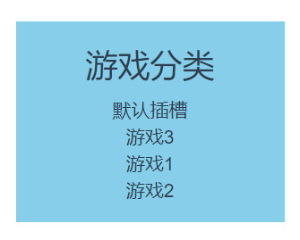 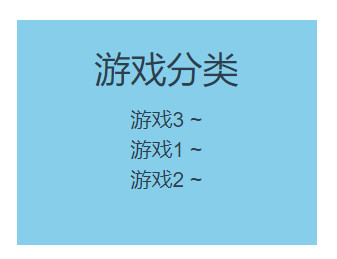

​                            默认插槽														作用域插槽


##### 情景二

```
使用v-slot进行【默认插槽传值】
	1. 同上
	2. v-slot="数据对象"
```

```html
<Category>
    <template v-slot="{datas}">
        <div v-for="item in datas"> {{ item }} ~</div>
    </template>
</Category>
```

​		     效果同上


##### 情景三

```
使用v-slot进行【具名插槽传值】
	1. 同上
	2. v-slot:具名插槽="数据对象"
```

```html
//分类组件信息
<template>
    <div class="category">
        <h3>游戏分类</h3>
        <slot :datas="lists"  name="slt">
            <div>具名插槽</div>
            <div v-for="item in lists" :key="item" class="items">
                <div>{{ item }}</div>
            </div>
        </slot>
    </div>
</template>
<script>
export default {
    name: "Category",
    data() {
        return { lists: ["游戏6", "游戏7", "游戏8"]};
    },
};
</script>
```

```html
<Category>
    <template v-slot:slt="{datas}">							// 获取具名插槽数据
        <div v-for="item in datas"> {{ item }} ~</div>
    </template>
</Category>
```

  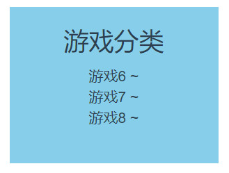

​                           具名插槽 													作用域插槽


​																								VUE END

------


# 05 Vue-Router

## 基础

```
*path 		路径匹配的		
*component 	渲染组件的
*components 渲染组件的	 命名router-view
*name		路由重命名的   params必须配合它
*props		路由传参的
*children	路由嵌套的
beforeEnter	路由独享守卫的
meta		路由元信息
```


### 拓展知识

#### 路由分类

```
前端路由：
	监测浏览器的路径
	
后端路由：
	服务器收到了请求路径
```

#### SPA

```
单页面富应用：
	整个应用只有一个HTML网页 http://ip:port/#/xxx
	页面不会进行刷新
实现方式：
	进行充分利用location.hash，锚链
```


### 安装导入

#### 版本兼容

```
时间：
	2022/2/7，vue-route的默认版本为4
	
vue-route4 匹配 vue3
vue-route3 匹配 vue2
```

#### 安装导入

```js
下载插件
	npm install vue-router@3
	
导入代码
	import VueRouter from "vue-router" // 导入路由插件
	Vue.use(VueRouter)				   // 安装插件
```


### 基本使用

- [x] 流程

```
1.  安装vue-router[ 如果已经安装，则跳过 ]
2.  通过plugin方式安装vue-router
3.	建立路由文件夹[见上面的结构]
4. 	router.js文件中进行【路由实例创建】,并导出路由实例
5. 	main.js将plugin插件进行安装
6.	main.js中将路由实例导入，并渲染
7.	组件中利用<router-link>实现路由的跳转
8.  组件中利用<router-view>实现跳转路由的对应显示
```

- [x] 注意事项

```
1. 路由组件通常放在pages文件夹，一般组件通常放在components文件夹
2. 通过路由的切换,被切换的组件默认是被销毁的，切换的组件默认是被重新创建的
3. 每个组件都有自己的$route属性，里面藏着自己的路由信息
4. 整个应用只有一个router,可以通过$router属性进行获取
```

- [x] start

```js
// 安装         ----第【1】步
// 详细内容见安装导入
```

```js
// plugin.js   ----第【2】步
import VueRoute from "vue-router"
export const plug  = {
    install(Vue,options){
        //安装vue-router插件
        console.log("正在使用插件进行vue-router导入");
        Vue.use(VueRoute)
    }
}
```

```js
// 创建路由文件  ----第【3】步
// 结构如下
|----src
|	|----router
|	|	 |----router.js
```

```js
//路由实例创建与导出 	----第【4】步
import router from "vue-router"
// 引入位于pages文件下的路由组件
import About from "../pages/About.vue";
import Home from "../pages/Home.vue";
//创建配置对象
const options={
    routes:[
        {
            path:"/home",	  // 切换路由的目标
            component:Home,	  // 对应目标的展示组件
        },
        {
            path:"/about",
            component:About,
        }
    ],
    mode:"history", //修改为history模式  消除井号#
}
const routerobj = new router(options)	// 路由实例创建
export default routerobj				// 路由实例的默认导出
```

```js
//plugin插件安装		----第【5】步
import {plug} from "./components/plugin.js"
Vue.use(plug)  
//路由实例导入，并渲染	----第【6】步
import router from "./router/router"
new Vue({
  render: h => h(App),
  router
}).$mount('#app')
```

```html
<!--router-link 切换路由	----第【7】步-->	
<!--router-link 路由展示	----第【8】步-->
<template>
    <div class="root">
        <div>
            <router-link to="/home" active-class="active">Home</router-link>
        </div>
        <div>
            <router-link to="/about" active-class="active">about</router-link>
        </div>
        <div>
            <router-view ></router-view>
        </div>
    </div>
</template>
<script>
export default {
    name: "Guid",
};
</script>
```


### router-link 属性

#### router-link管辖

```
router-link 默认被渲染为a标签
attrs:
	1. tag="span"	 			指定渲染标签
	2. replace  				不会留下历史记录
	3. active-class  			修改默认class名为router-link-active 
	4. exact-active-class	 	修改默认class名router-link-exact-active 为指定内容
```

- [x] 属性添加：active-class

```html
<router-link to="/home" active-class="active" tag="span">Home</router-link>
```

​	渲染源码

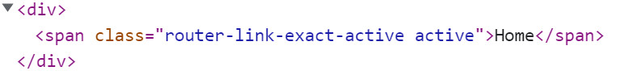 


 

- [x] 属性添加:exact-active-class

```html
<router-link to="/home" active-class="active" tag="span" exact-active-class="eca">Home</router-link>
```

​	渲染源码

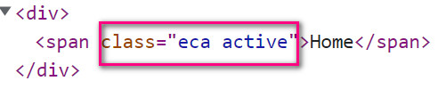  


#### 路由进行管辖

- [x] 路由统一配置属性:linkActiveClass

```js
//router.js 
const options={
    routes:[
        //5.配置映射关系
        {
            path:"/home",
            component:Home,
        }
    ],
    linkActiveClass:"active"
}
```

源码

```html
<div>
    <router-link to="/home"  tag="span" >Home</router-link>   // 不指定exact-active-class
</div>
```

​	渲染源码

 


- [x] 路由统一配置属性:linkExactActiveClass

```js
//router.js 
const options={
    routes:[
        {
            path:"/home",
            component:Home,
        },
    ],
    linkActiveClass:"active",
    linkExactActiveClass:"eca"			// 重新指定
}
```

源码

```html
<div>
    <router-link to="/home"  tag="span" >Home</router-link>   // 不指定exact-active-class
</div>
```

​	渲染源码

   


#### 优先级

```
router-link  > 路由管辖
```


### 命名视图

router-view

```vue
APP.vue
<router-view></router-view>
<router-view name="body"></router-view>
<router-view name="footer"></router-view>
```

```js
// rouer.js
const options={
    routes:[
        //5.配置映射关系
        {
            path:"/home",
            components:
            {	//多router-view
            	default:Home,
                body:body,
                footer:footer
            }
        }
    ],
}
```


### 嵌套路由

#### children属性

```
我们分析一个图的路由结构:
	左侧导航栏的点击负责右边的展示内容
	右侧的内容也有一个导航栏来确定显示的内容
	很明显目前这是一个二级导航栏：
		点击左侧Home 将显示Home组件在右侧
		基于Home组件的展示，右侧的导航栏将进行显示
		然后根据导航显示最终的内容
```

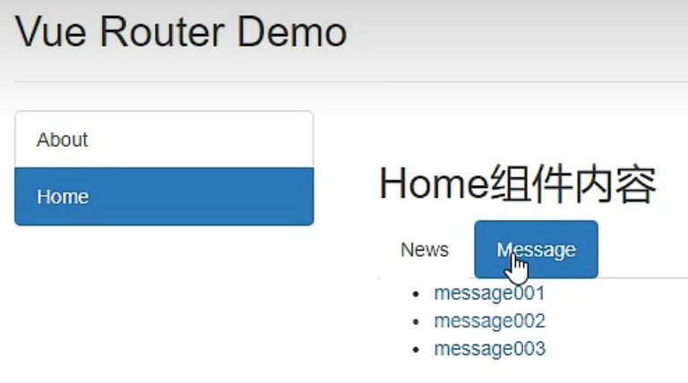    

看一下router.js

```js
const options={
    routes:[
        {
            // 当/home 匹配成功时
            // Home 组件将被渲染到 Home 父级组件中的 <router-view>
            path:"/home",
            component:Home,
            children: [
                {
                // 当 /Home/homemessage 匹配成功时
		        // HomeMessage 将被渲染到 Home组件 的 <router-view>
                  path: 'homemessage',
                  component: HomeMessage,
                },
                {
                  path: 'homenews',
                  component: HomeNews,
                },
              ],
        },
        {
            path:"/about",
            component:About,
        }
    ],
}
```


#### 路由的默认嵌套匹配

```js
const options = {
    routes: [
        {
            path: "/home",
            component: Home,
            children: [
                {
                    // 当 /home 匹配成功
 			        // HomeMessage 将被渲染到 Home组件 的 <router-view> 
                    path: '',		// 使用空串
                    component: HomeMessage,
                },
            ],
        },
    ],
}
```


### 命名路由

```
操作：
	再router.js 利用name属性给指定路经命名
```

```js
const options = {
    routes: [
        {   path: "/home",
            component: Home,
            children: [
                {
                    path: 'homemessage',
                    component: HomeMessage,
                    children: [
                        {
                            path: "detail",
                            name:"xijie",				 // detail 的路由 改为中文拼音【命名路由】
                            component: MessageDetail,
                        },
                    ]
                },
            ],
        },
    ],
}
```

- [x] detail 命名路由的使用

```html
<router-link :to="{ name : 'xijie' }">    <!-- 使用name,即命名路由，而非path-->
    message2
</router-link>
```


### 动态路由

#### query传参

```
优势：
	不影响router.js 配置，即不需要再router.js 进行任何配置

```

```html
query传参：	
<!-- 跳转路由并携带 query 参数-->
	<router-link to="/home/homemessage/detail?id=13&content=俄国" >message3</router-link>
<!-- 跳转路由并携带 query 参数 to 模板字符串写法-->
	<router-link :to="`/home/homemessage/detail?id=${13}&content=${俄国}`" >query路由传参</router-link>
<!-- 跳转路由并携带 query 参数 to 对象写法-->
	<router-link :to="{
			path : '/home/homemessage/detail',
			query: {
                  id:12,
                  content:'美国' 
            }}">
           message2
     </router-link>

this.$route查看
```

​				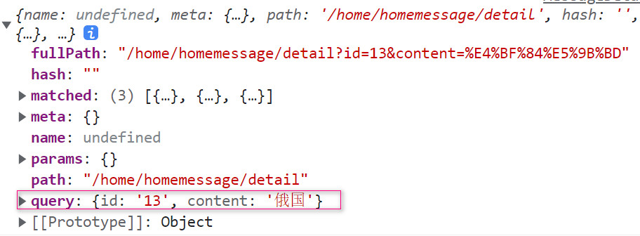


#### params传参

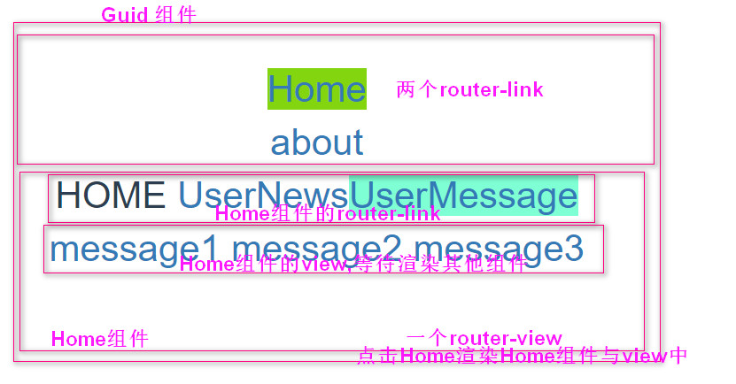 


看看router.js 的配置

```js
const options = {
    routes: [
        {
           path: "/home",
            component: Home,
            children: [
                {
                    path: 'homemessage',
                    component: HomeMessage,
                    children: [
                        {
                            path: "detail/:id/:content",			// 点击messages1时会将多余的内容放入params中
                            name:"xijie",
                            component: MessageDetail,
                        },
                    ]
                },
            ],
        },
    ],
}
```


```html
params传参：
<!-- 跳转路由并携带 params 参数 to 模板字符串传参 -->
    <router-link :to="`/home/homemessage/detail/11/中国`" >message1</router-link>
<!-- 跳转路由并携带 params 参数 to 对象传参 -->
	<router-link :to="{
         name : 'xijie',								// 只能使用 name 
         params: {
               id:12,
               content:'美国' 
          }}">
        message2
     </router-link>

this$route查看
```

​                  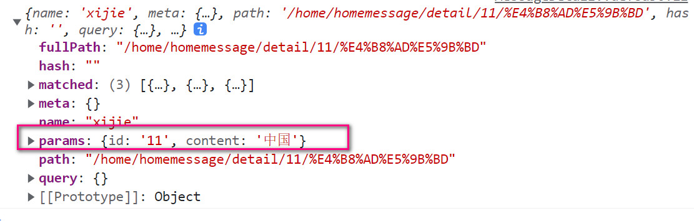

#### 对比

```
不同：
	query 方式不需要配置路由
	params 方式需要配置路由, 且必须使用命名路由name
相同：
	两者都要使用$route进行取值，
```


#### 路由的组件传参props配置

- [x] 前两种配置

```js
{
    path: "detail/:id/:content",   // 只能使用 params传值
    name:"xijie",
    component: MessageDetail,
    //  第一种写法，值为对象，该对象的key-value都会以props的形式传递给MessageDetail组件
    // props  :{a:1},
    //  第二种写法，值为布尔，为真，就会把该路由收到的所有【params】参数传递给组件
    // props:true
}
```

```html
// HomeMessageDetail 租价
<template>
    <div>
        ID{{this.$route.params.id}}-内容 {{this.$route.params.content}}
        <!-- a:{{a}} -->
        id{{id}}-content{{content}}
    </div>
</template>
<script>
export default {
    name:"MessageDetail",
    // props:["a"]
    // props:['id','content']
}
</script>
```

- [x] 第三种配置

```js
{
   path: "detail",     // 只能使用query传值
   name:"xijie",
   component: MessageDetail,
   //  第三种写法, 值为函数,该函数的返回值对象种的每一组key-value会以props的方式传递到MessageDetail组件
   props($route | 或者 {qyery:{id,content}} 【连续解构赋值】){  
      return {id:$route.query.id , content:$route.query.content}
   }
},
```


### 编程式路由导航

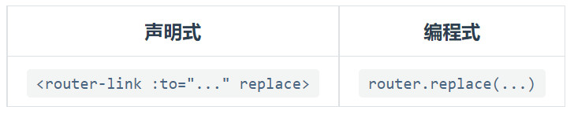 

```js
	this.$router.push('VarPath')     		==  history.pushState({},","VarPath") 

	this.$router.replace('VarPath') 		==  history.replaceState({},","VarPath") 
	
	this.$router.push({key1:"/xxx/xxx",key2:{id=1}})
        key1:
            name:必须时路由中配置的name
            path:首先匹配path,基于path有误的情况下才匹配name  
        key2:
            query :类型get ,使用$router.query
            params:类似post,使用$router.params ,只能与 name命名路由配合 配合 。 
	
	this.$router.back()      				==		history.back()
	this.$router.go(n)						==      history.go(n)
```

编程式路由导航

```html
<span  @click="demo">  
    message4
</span>
<script>
export default {
    name: "HomeMessage",
    methods:{
        demo(){
            this.$router.push({name:"xijie",params:{id:13,content:"伊朗"}})
        }
    }
};
</script>
```

```js
// params 需要路由配置：name +　props 
{
    path: "detail/:id/:content",   //   
    name:"xijie",
    component: MessageDetail,
},
```


### 路由组件缓存

#### keep-alive

```
作用：
	让不展示的路由组件继续保持挂在，不被销毁
	
配置：
	1. 包裹router-view
	2. 通过配置include、exclude属性确定类缓存的组件
	
属性：
	include  字符串或者正则 ，包含组件的被缓存
	exclude  字符串或者正则，包含的组件不会被缓存
		该组件名是由组件中 export default {name:"组件名“} 定义的

多组件缓存:
	:include="[组件1，组件2，...]"  // 绑定机制
```

```html
<keep-alive exclude="组件名1"> 		// 组件名即组件中的name定义的名字
        <router-view>该位置由路由监控，并自动填入对应的组件</router-view>
</keep-alive>   
```


#### 组件活跃钩子函数

```
钩子函数
	activated    再次活跃钩子函数
	deactivated  失活钩子函数
位置：
	组件内使用，它的产生是因为vue-router插件的使用
	
使用条件：
	1. 当组件被缓存，即由keep-alive包裹时，才会发生作用
```

```js
// 缓存的组件被激活会调用的钩子函数【创建本身也是激活，先创建后激活】
activated(){
	...
},
// 缓存的组件失活时会调用的钩子函数
deactivated(){
	...
}
```


## 进阶

### 路由懒加载

```js
原理：
   将路由对应的组件打包成一个个的js代码块.只有在这个路由被访问到的时候,才加载对应的组件

效果：
	解决Vue 页面首次加载的压力，减少页面白屏时间

component:()=>import("../components/Jumu"),
```


### 路由守卫

#### 全局守卫

##### 全局前置守卫[前置钩子]

```
钩子函数：
	beforeEach((to,from,next)=>{
		...
		next() ;
	})
	
	
过程：
	对每一次的路由【切换之前】【初始化】进行监听
    from 和 to 均为 $route, 可以用来获取路由前后的配置信息和携带的params及query	
    next() 必须被调用，然后接下来的跳转才可以完成。可传参数。
    
功能：
	1. 利用本地存储获取信息，然后进行判断，决定是否跳转
	2. 利用meta的属性进行属性添加 meta:{ isAuth:false}
	3. 权限控制
```


##### 全局后置守卫[后置钩子]

```
钩子函数：
	afterEach((to,from,failure)=>{
				...
	})

作用：
	修改页面的某些信息，【title】
```

##### 全局解析守卫

```
钩子：
	beforeResolve((to,from,next) => {
    	...
    })

发生时间：
	再独享钩子、组件钩子成功调用之后进行调用
```


#### 独享守卫

##### 路由独享守卫

```
钩子函数：
	 beforeEnter: (to, from, next) => {
        // ...
      }
     或者
     beforeEnter:[ 多个函数 ]

用法：	
	const router = new VueRouter({
    routes: [
        {
          path: '/home',
          component: Home ,
          beforeEnter: (to, from, next) => {
             ...
          }
        }
      ]
    })
```


#### 组件内路由守卫

```js
三个钩子函数：

	通过路由规则，进入该组件时被调用
	beforeRouteEnter(to,from,next)
        // 在渲染该组件的对应路由被验证前调用
        // 不能获取组件实例 `this` ！
        // 因为当守卫执行时，组件实例还没被创建

	beforeRouteLeave(to,from,next)
        // 在导航离开渲染该组件的对应路由时调用
        // 可以访问组件实例 `this`、

    beforeRouteUpdate(to,from,next)
	    // 在当前路由改变，但是该组件被复用时调用
```


#### 路由进出过程时间线

```
1. 全局前置守卫beforeEach
2. 独享守卫 beforeEnter
3. 组件beforeRouteEnter
4. 全局解析守卫beforeResolve
5. 全局后置守卫afterEach
6. 组件离开beforeRouteLeave
```


### 历史记录模式

#### hash 模式

```
#后面的参数不会发给服务器,兼容性强
```

#### history 模式

```
mode:"history", //修改为history模式  消除井号#

解决刷新404问题
	nodejs 中间件 “connect-history-api-fallback” 
```

```js
// 微型服务器
const express = require('express')
const history = require('connect-history-api-fallback');

const app = express()
app.use(history())
app.use(express.static(__dirname+'/static'))

app.listen(5005,(err)=>{
	if(!err) console.log('服务器启动成功了！')
})

// 执行代码 node server
```


# 06 Vuex

## 基础知识

### 产生原因

```
产生原因：
	Vuex之前
        组件间共享数据的方式：
            props(父传子)、自定义事件(子传父)，公共事件总线（组件间传递信息）,消息订阅（组件间传递信息）
        存在的问题：
        	只适应于小范围内数据共享，对于大型项目则存在着开发困难和维护困难的问题。
        结构：
        	如下图，消息繁杂，结构复杂，无法维护。
```

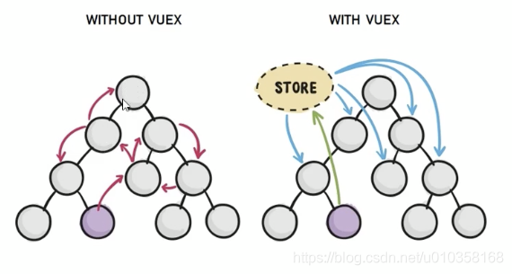 

```
Vuex本质：
	是实现组件全局状态（数据）管理的一种机制，可以方便的实现组件间的数据共享。
	雅称【集中式组件状态存储管理】
	
Vuex优势：
	1. 共享数据被集中进行了管理，易于开发与维护
	2. Vuex共享数据是响应式的，能够实时保持数据与页面的同步
	3. 能够高效的实现组件之间的数据共享
	
使用场景：
	大中型的单页应用，小型应用不推荐使用
```


### Vuex结构

```
1. state单一状态树
		存储的就是组件间的共享数据，它就是Vue的核心，核心就是store(仓库)
		
2. mutations同步函数
		(中文：突变)
		Vuex中state状态更新的唯一方式：进行提交mutations
		
3. actions异步处理函数
		mutations中所有的代码必须为同步代码,否则会使得devtools无法正确跟踪数据变化
		而如果通过异步操作变更数据，必须通过actions。actions中可以任意包含异步代码，比如网络请求
		但即使actions中改变数据也是通过操作mutation进行更改
		
4. modules
		通过分割的方式解决state臃肿，可以拥有state\matations\actions\gettters
		
5. getters计算属性
		用于对Store中的数据进行加工处理形成新的数据，类似于Vue中的计算属性
		Store中数据发生变化，Getters的数据也会跟随变化
```


### 数据持久

```
问题：
	网页刷新会使得store存储消失

解决方法：
	方法一：
		1. 使用webStorage 进行持久化
		2. 在App.vue根组件created里面进行丢失去判断
	方法二：
		第三方插件
			vuex-persistedstate
```


### 项目结构

```
src
|----store
|	 |----index.js
|	 |----actions.js
|	 |----mutations.js
|	 |----getters.js
|	 |----modules
|	 |	  |----car.js
|	 |	  |----products.js
```


------


# 07 axios

$\bf\textcolor{red}{第三方框架必须进行单独封装}$

```
安装
	npm install axios
	
引入
	import axios from "axios"

本质：
	是一个基于 promise 的 XMLHttpResponse 的第三方封装库
	
Vue-resource
	Vue1.0版本主推,现在推荐使用axios
```

## CROS跨站

### 同源策略

``` 
1. 协议名
2. 主机名
3. 端口号
```


 

### 脚手架协助开启代理服务器1

```js
//devServer
// vue.config.js
const { defineConfig } = require('@vue/cli-service')
module.exports = defineConfig({
    transpileDependencies: true,
    lintOnSave: false, // 关闭语法检查
    pages: {
        index: {
            entry: 'src/enter.js', // page 的入口 ,原main.js
        }
    },
    //开启开发代理服务器
    devServer:{
        proxy:'http://localhost:5000'  , //转发的目标
    }
})
```

```js
// 组件内容代码
let res = axios.get('http://localhost:8080/students')		// 请求方向更改
res.then((response)=>{
    console.log(response);
},(err)=>{
    console.log(err)
})
```

```
当前存在两个问题
		1. 不能进行多个代理
		2. 当访问的链接，8080服务器本身存在时，代理服务器不会执行2，3步骤
```


### 脚手架协助开启代理服务器2

```js
 devServer: {
    //配置主机名
    host: "127.0.0.1",
    // 配置端口号
    port: "8080",
    // 配置多个代理服务器地址
    proxy: {
        // 请求前缀
        '/cros': {
                // 转发的地址
                target: 'http://localhost:5000',
                // 路径重写，因为向真实的后台发送请求时，不需要加前缀
                pathRewrite:{ 
                    '^/cros':"",
                },
                // 代理服务器与跨站通信时是否说自己时代理器:
                //    true-代理器不承认自己是代理器
                //    false-代理器承认自己是代理器
                // 本身就是请求Host字段的伪造
                changeOrigin: true,
                // 用于支持webSocket
                ws:true
        },
        '/car': {
                 target: "http://localhost:5001"
        },  
    }
}
```

```js
// 请求
	let res = axios.get('http://localhost:8080/cros/students')
	let res = axios.get('http://localhost:8080/cars')
```


 


# 08 Vue UI 组件库

```
移动端常用 UI 组件库
	Vant
	Cube UI
	Mint UI
	
PC端常用 UI 组件库
	Element UI
	IView UI
```


# 09 XMLHttpRequest

## 补充知识

### HTTP

```
HTTP 报文结构：
	1 报文首部
	2 空行【回车+换行】
	3 报文主体

报文首部结构:
	请求报文:
		1. 请求行
		2. 请求头
	响应报文:
		1. 状态行
		2. 响应头
```

### 简单请求

```
条件
	请求方法为一下三种之一:
		HEAD
		GET
		POST

	HTTP头信息不得超出以下字段:
		Accept
		Accept-Language
		Content-Language
		Content-Type
		DPR
		Downlink
		Save-Data
		Viewport-Width
		Width
	Content-Type类型限制:
		text/plain
		multipart/form-data
		application/x-www-form-urlencoded
```

### 复杂请求

```
定义
	非简单请求即为复杂请求

复杂请求的两步:
	复杂请求我们也可以称之为在实际进行请求之前，需要发起预检请求的请求。
	
小结：
	只要是带自定义header的跨域请求，在发送真实请求前都会先发送OPTIONS请求
```

## 主要属性

### readyState

```
readyState:
	1. 表示当前实例对象的状态
	2. readonly

五种状态值:
	0  表示XMLHttpRequest实例已经生成
	   【执行了】xhr = new XMLHttpRequest，【尚未执行】xhr.open()
	1  表示xhr的open方法已经调用，但send方法尚未调用
	2  表示xhr的send方法已经调用，并且服务器返回的头信息和状态码已经收到
	3  表示正在接收服务器传来的数据体body部分
	4  表示服务器返回的数据已经完全接受，或者本次接受失败
	
状态值变化:
	每当实例对象发送状态变化，它的readyState属性就会改变，
	同时每一次改变都会触发readystatechangee事件
	onreadystatechange 2,3,4,都会调用它

```

### status

```
服务器返回的状态码
```

### statusText

```
服务器返回的状态文本
```

### responseText

```
服务器返回的文本数据
```


## open 方法

```
作用：
	创建一个新的http请求，并指定此请求的方法、URL以及验证信息
语法：
	xmrObj.open(bstrMethod, bstrUrl, varAsync, bstrUser, bstrPassword);
参数：
	bstrMethod：
		请求方法
			POST|GET|PUT|等 （大小写不敏感）
	bstrUrl	：
		请求的URL地址
	varAsync[可选]
		指定此请求是否为异步方式
			默认为true ,如果为真，当状态改变时会调用onreadystatechange属性指定的回调函数。
	bstrUser[可选]
		如果服务器需要验证，此处指定用户名，如果未指定，当服务器需要验证时，会弹出验证窗口。
	bstrPassword[可选]
		验证信息中的密码部分，如果用户名为空，则此值将被忽略。
```

### GET 传参

```js
GET方式创建链接，可以直接将参数放置在url中，通常底层TCP只会发送一个数据包

1.GET-query传参
    前端open
        xhr.open("GET", "http://localhost:8080/cros/students?id=1&p=2");
    后端获取query参数
		app.get('/students/:id/:p',(request,response)=>{
            console.log(request.query)
        })
2.GET-params传参
	前端open
        xhr.open("GET", "http://localhost:8080/cros/students/1/2");
    后端获取query参数
        app.get('/students/:id/:p',(request,response)=>{
			console.log(request.params)
        })

效果：
	后台获取的参数
		{ id: '1', p: '2' }
```

### POST 传参

```
表单enctype属性
	1. 【默认】application/x-www-form-urlencoded 
		
	2.  text/plain
			不对特殊字符编码，空格转换为+号，发送纯文本，email
	3.	multipart/form-data
			不编码，二进制，发送文件
	
四种POST参数请求方式	
	1. 	application/x-www-form-urlencoded 
			编码方式 key1=val1&key2=val2   【浏览器原生支持】
	2.	multipart/form-data
			上传文件，					【浏览器原生支持】
	3.	application/json
	
	4.	text/xml
```

```js
细节:
	POST 方式创建链接，需要设置请求头，将参数放置在请求头,通常底层TCP发送2个数据包
	第一个请求为option请求，即预检请求
	第二个请求为post请求
    
1. FormData 传参  
	介绍：
    	FormData 接口提供了一种表示表单数据的键值对 key/value 的构造方式，
		并且可以轻松的将数据通过XMLHttpRequest.send() 方法发送出去

2. JSON 传参 【常用】
```

- [x] FormData

```js
xhr.setRequestHeader ('Content-type', 'application/x-www-form-urlencoded');
let fm = new FormData();
fm.append("username", "dzq");
fm.append("password", "614856415");
xhr.send(fm);
```

- [x] JSON【常用】

```js
xhr.setRequestHeader ('Content-type', 'application/json');
let data = {u:1,p:2};
xhr.send(JSON.stringify(data));
```

- [x] 后端接收

```js
const express = require('express')
var bodyParser = require('body-parser')  
const app = express()
// parse application/x-www-form-urlencoded   // 协助解析ata数据
app.use(bodyParser.urlencoded({ extended: false }))  
// parse application/json					 //  协助解析json数据
app.use(bodyParser.json())  

app.use((request,response,next)=>{
	console.log('有人请求服务器1了');
	console.log('请求来自于',request.get('Host'));
	console.log('请求的地址',request.url);
	next()
})

app.post('/students',(request,response)=>{
	console.log(request.body)
	const content =request.body
	response.send(content)
})

app.listen(5000,(err)=>{
	if(!err) console.log('服务器1启动成功了,请求学生信息地址为：http://localhost:5000/students');
})

```


## 文件上传

### File 对象直接上传

```
文件来源：
	input[type=file]
	
原理:
	1. 获取input的files
	2. 将files分别放入formData
	3. 使用xhr进行发送即可
```

```js
前端代码：
	// 定位input标签
    let input = document.querySelector("#file");
    //  获得第一个文件
	let file = input.files[0];
	//  创建xhr实例对象
    this.xhr = new XMLHttpRequest();
    this.xhr.open("POST", "http://localhost:8080/cros/students");
	// 创建formData实例对象
    let fm = new FormData()
    // 分词放入两个文件
    fm.append("file", file);
    fm.append("file2", file);
	// 进行发送
    this.xhr.send(fm);
    this.xhr.onreadystatechange = this.xhrstatechange;

```

```js
后端代码:
    const express = require('express')
    const fs = require('fs')
    const multiparty = require('multiparty')
    const app = express()
    
    app.post('/students', (req, res) => {
        // 核心代码
        // 创建form对象
        let form = new multiparty.Form();
        // form解析
        form.parse(req, function (err, fields, files) {
            try {
                console.log(files);
                let inputFile = files.file[0];
                let newPath = "C:/Users/DingZhiQiang/Desktop" + "/" + inputFile.originalFilename;
                // 保存文件到服务器指定位置
                fs.renameSync(inputFile.path, newPath);
                res.send({ data: "上传成功！" });
            } catch (err) {
                console.log(err);
                res.send({ err: "上传失败！" });
            };
        })
    })
    app.listen(5000, (err) => {
        if (!err) console.log('服务器1启动成功了,请求学生信息地址为：http://localhost:5000/students');
    })
```


### Blob对象

```js
本质:
	Blob 对象表示一个不可变、原始数据的类文件对象
	
构造函数:
	Blob(array[, options])
	参数:
		array 它将会被放进 Blob
		options对象
			属性一: type 默认值为 “”，它代表了将会被放入到blob中的数组内容的MIME类型。
			属性二: endings

例子:
	一张图片的Blob
		return new Blob([ab], {type:"image/jpeg",});  
			// 其中ab是图片的base64解码数据【即binary】 
			//		: window.atob(dataURI.split(",")[1])
			// type是该图片的MIME编码类型   
			//		: "image/jpeg"
```


### File对象

```js
联系:
	File 对象继承自 Blob 对象
	
构造函数:
	File(bits, name[, options])
	参数:
		bits: 可以是Blob、 Array[string] 等
		name: 文件名|文件的路径
		options:
			属性一: type 将要放到文件中的内容的MIME类型。默认值为 "" 
			属性二: lastModified 默认值为 Date.now()
示例:
	图片
		var file2 = new File([blob], 'test.png', {type: 'image/png'});
	文档
		var file1 = new File(['text1', 'text2'], 'test.txt', {type: 'text/plain'});
```


### FileReader对象

```
FileReader 对象允许 Web 应用程序异步读取存储在用户计算机上的文件的内容
```

#### 浏览器支持判断

```js
if(window.FileReader) {//检测浏览器是否支持FileReader
    var fr = new FileReader();
    // add your code here
}
else {
    alert("Not supported by your browser!");
}
```


#### FileReader拥有四个方法

```
1. readAsDataURL
	参数：file
	描述：
		一旦完成，result 属性中将包含一个data:URL格式的 Base64 字符串以表示所读取文件的内容。 

2. readAsBinaryString 
	参数：file
    描述:
    	一旦完成，result 属性中将包含所读取文件的原始二进制数据。                                   

3. readAsText
	参数:file,[encoding] 
	描述：
		一旦完成，result 属性中将包含一个字符串以表示所读取的文件内容。        
4. abort 	
	中止读取操作。在返回时，readyState 属性为 DONE
```


#### FileReader处理事件

```
| 事件         | 描述                         
|-------------| -----------------------
| onabort     | 中断时触发                   
| onerror     | 出错时触发                   
| onload      | 文件读取成功完成时触发         
| onloadend   | 读取完成触发，无论成功或失败    
| onloadstart | 读取开始时触发                
| onprogress  | 读取中                       
```

```
fr.onload = function(){
	var dataURL = fr.result;// 读取结果
}
```


### 三个示例

#### 示例一

```
使用FileReader获取dataURL[base64]编码的文件
```

```js
let fr = new FileReader();
fr.readAsDataURL(file);
new Promise((reslove, reject) => {
    fr.onload = function () {
        reslove(fr.result);
    };
}).then((data) => {
    // data 本身就是base64编码的文件
});
```

#### 示例二

```
base64[dataURL]转Blob
```

```js
dataURItoBlob(dataURI) {
     // base64 解码
     let byteString = window.atob(dataURI.split(",")[1]);
 	 // 创建空间
     let ab = new ArrayBuffer(byteString.length);
	 // MIME类型
     let mimeString = dataURI.split(",")[0].split(":")[1].split(";")[0];
     let ia = new Uint8Array(ab);
     for (let i = 0; i < byteString.length; i++) {
         ia[i] = byteString.charCodeAt(i); //指定位置的Unicode字符编码
     }
     // 返回Blob实例
     return new Blob([ab], {
         type: mimeString,
     });
 },
```

#### 示例三

```
Blob 转 File
```

```js
// 使用input 将本地Blob上传
let input = document.querySelector("#blob");
let bolb = input.files[0];
// Blob作为参数传给File构造函数即可
var file = new File([bolb], "tupian.img", {
    type: "image/jpeg",
    lastModified: Date.now(),
});
```

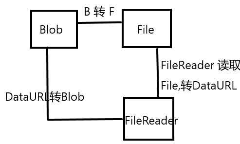 


# 10 GIT 

```
分布式版本控制工具
git 命令
git 分支
SSH 免密
Gitee|Gitlab
```

## 基本概述

### 安装

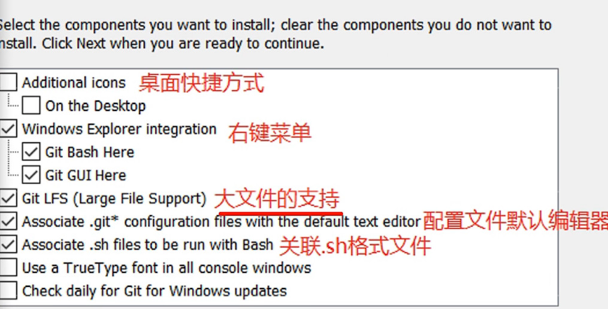


### 工作机制

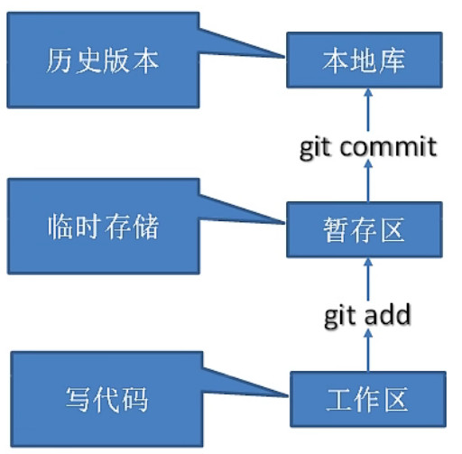


```
三个区域：	
	工作区:
		本人本地代码项目，比如 vue_test
	暂存区:
		临时存储 git add 
	本地库:
		拥有历史版本 git commit

代码托管中心
	GitHub 网络服务器远程代码仓库【远程仓库】
```


## 常用命令

### 命令

```
设置用户签名:
	git config --global user.name "dingzhiqiang"
	git config --global user.email "d614856415@163.com"
初始化本地库:
	git init 
查看本地库状态
	git status
添加到暂存区
	git add 文件名
提交到本地库
	git commit -m "日志信息 文件名"
	
查看历史记录
	git reflog			【基于提交commit】
	git log
版本穿梭
	git reset --hard 版本号 
    【直接会切换本地的代码为旧版本】
	
暂存区删除
	git rm --cache 文件名  
	git rm --cache -r 文件夹
```

### 文件状态

```
🐅 untracked  本地文件创建|更新
🐅 modified	  当前文件被添加到暂存区 add
```


## 代码分支

```
优势：
	1. 同时进行多个动能开发，提高效率
	2. 分支开发的失败，不影响其他分支，提高开发成功率
```

### 命令

```
1. 分支查看
	git branch  [-v]
2. 分支创建
	git branch 新分支
3. 分支切换
	git checkout 目的分支	
	【分支切换，本地数据也会改变，会回到上次的分支版本】
   分支快速创建与切换
	git checkout -b 新目的分支
	
4. 分支合并
	1. 切换分支
		git checkout 目的分支A
	2. 合并C分支到分支A
		git merge C分支
		
5. 分支删除
	git branch -d 待删除分支  
	不能再当前分支上删除当前分支
```

### 分支版本切换

  

```
结构:
	分支两个:
		newbranch
		master
	各分支历史提交的版本
		first|second|third
切换原理:		
	利用master和head指向来切换版本

命令行:
	1. git checkout 目的分支	
	2. git log|reflog
	3. git reset --hard 版本号 
```


### 分支合并

```
产生冲突:
	git merge 分支

冲突原因:
	 同一个文件的同一处位置有不同的修改。Git 无法确定使用哪一个，必须人为确定。
源内容：
	<<<<<<< HEAD
	master 1
	=======
	3123123123
    >>>>>>> newbranch
修改：
	master 1
	3123123123
合并:
	git add 文件
	git commit -m "日志" 文件名【无后缀】
```


## 变基

```
合并commit记录
	git rebase -i HEAD~4 
	
	
```


## 团队协作

### 团队内合作

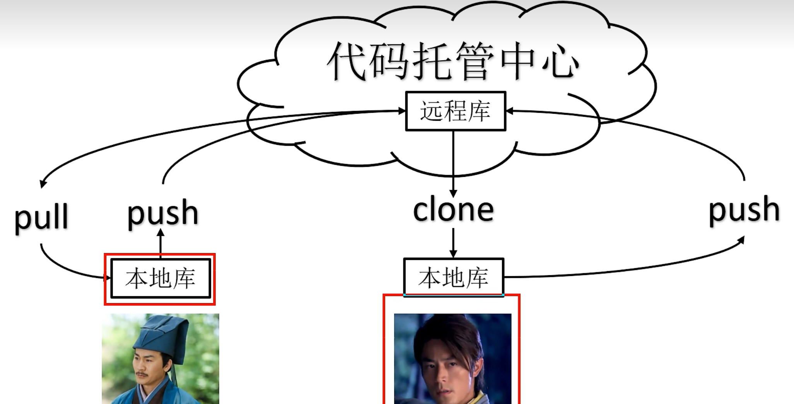


 

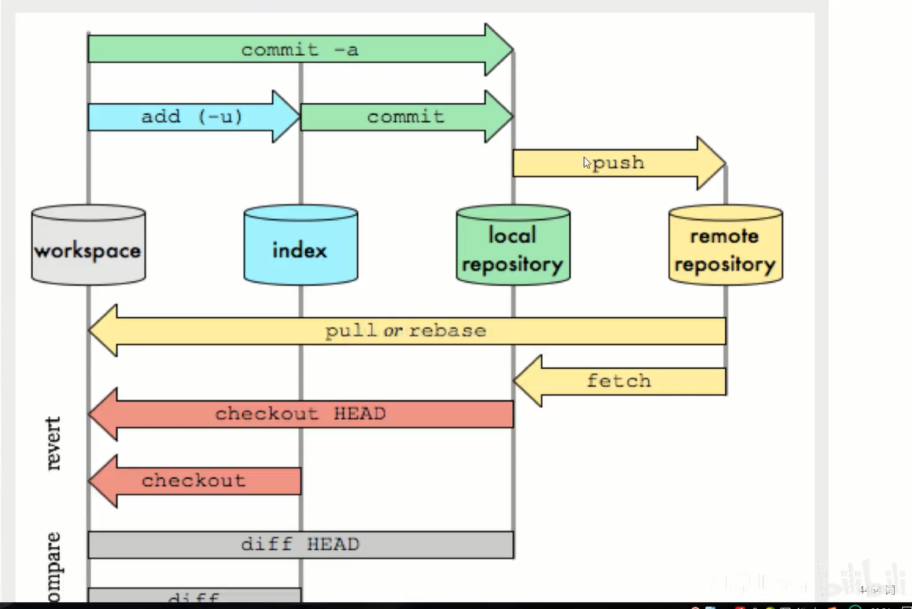 

#### 创建远程仓库

```
GitHub 自行创建
```

#### 创建远程库链接的别名

```
查看当前所有远程地址别名：
	git remote -v
	git remote show
创建远程仓库别名
	git remote add 别名 https://github.com/EternallyDarkSky/GIT_practice.git 
	git remote add origin https://github.com/EternallyDarkSky/GIT_practice.git
删除远程仓库别名
	git remote rm origin

远程仓库分支列表
	git remote show 远程仓库名称
```

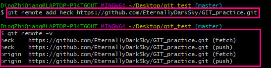 

#### 推送分支到远程库

```
分支推送
	git push 远程仓库别名 本地分支名称:[远程分支名称]

查看远程本地分支映射
	git branch -vv

远程分支删除
	git push origin :master  
	等价
	git push origin --delete master
	表示删除origin主机的master分支

```

#### 拉取远程库到本地分支

```
分支拉取
	git pull 远程仓库别名 远程分支:[本地分支]
```


### 跨团队合作

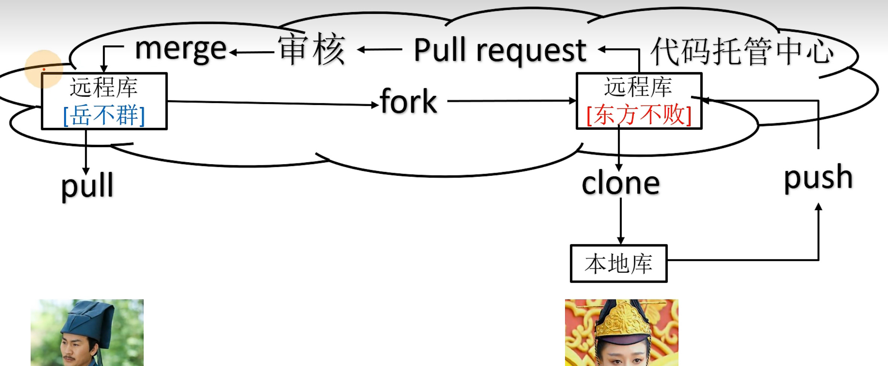


### 免密登录

```
## 免登录
  账号 ：  dingzhiqiang95| 13895099873
  密码：   xxx000000000
免密：
​		C:\Users\d6148
​		ssh-keygen  
​		C:\Users\d6148\.ssh\id_rsa.pub   公钥拷贝到gitgee
```


