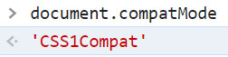
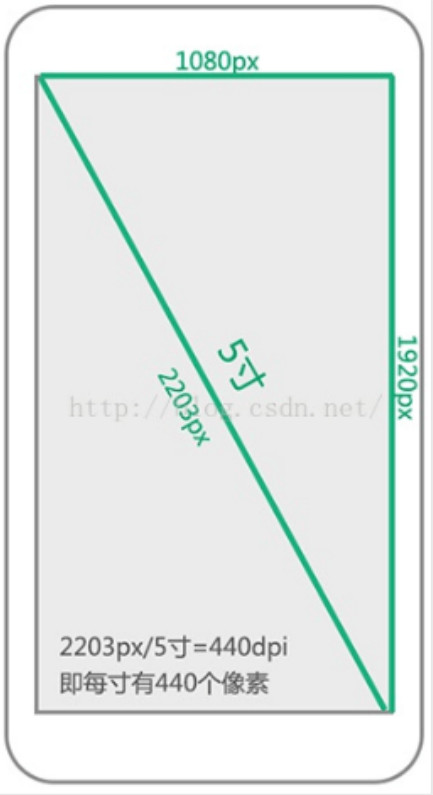

# 知识点介绍


```
CSS 
	布局
	定位
	移动端响应式
ES
	原型 原型链
	作用域 闭包
	异步 单线程
Web API
	DOM BOM
	Ajax 跨域
	事件存储
开发环境
	版本管理
	调试抓包
	打包构建
运行环境
	页面渲染
	性能优化
	Web安全
网络通讯
	headers
	Restful API
	缓存策略
```

# HTML

## 1.src 与 href 区别？

```
使用 “src” 作为属性的标签有：
	img				图片标签
	iframe			行内框架标签
	input			输入标签
	video\audio	 	多媒体标签
	script			
```

```
使用 “href” 作为属性的标签有：
	a				超链接标签
	link			外部样式
	base
```

```
同：
	都属引用外部资源的
异：
	src :表示对资源的引用，它指向的内容会嵌入到当前标签所在的位置。src会将指向的资源下载并应用到文档中。
		当解析该元素时会暂停其他资源的下载和处理，直到该资源被加载、编译、执行。所以js脚本一般放在页面底部。
		【🐉【阻塞】🐉】
	href:表示超文本的引用，它指向一些网络资源，建立与当前元素或本文档的链接关系，当浏览器识别时，就会并行下载，不停止对当前文档的处理。
		【🐉【并行】🐉】
```

## 2.HTML语义化

```
“就是用正确的标签做正确的事”
	header头部、main主题、aside侧边栏、footer底部、nav导航栏这5个语义化标签可以实现网页结构布局。
优势：
	对机器友好，带有语义化的标签更加适合搜索引擎的爬虫爬虫有效信息，有利于SEO,搜索引擎优化
```

## 3.DOCTYPE的作用

```
DOCTYPE是HTML5中一种标准通用的文档类型声明，旨在告诉Browser应该以何种方式的文档定义类型来解析文档。
不同的渲染模式会对CSS代码甚至JS产生影响。它必须在HTML的第一行。

浏览器渲染页面的两种方式：document.compatMode
	CSS1Compat:标准模式，默认模式，浏览器使用W3C的标准解析渲染页面
	BackCompat:混杂模式，浏览器使用自己的方式解析渲染页面
	
HTML5不是基于SGML,	因此不需要对DTD进行引用。但是需要DOCTYPE来规范浏览器的行为。
而HTML4.1 是基于SGML,所以需要对DTD进行引用之后，才能告知浏览器当前文档所使用的文档类型。

SGML：标准通用标记语言
DTD ：文档类型定义
```

 


## 4.script标签中的defer和async区别

```
没有 “defer” 和 “async” 属性，浏览器会立即加载并执行相应的脚本，它不会等到后续加载的文档元素，读取就会开始加载和执行，这就阻塞了后续的文档加载。这可以理解成是由src属性带来的问题。
```

 
$$
\textcolor{blue}{蓝色代表网络加载}、\textcolor{red}{红色代表本地执行}
$$

```
defer 和 async 属性都是去“异步”加载外部的js脚本，它们都不会阻塞页面的解析。
其区别在于执行顺序：
	defer 告诉浏览器延迟执行脚本（直到页面载入并解析完毕后再执行脚本，对内嵌脚本不起作用）
	async 告诉浏览器当异步加载完毕后马上进行执行。
影响：
	多个带 defer 属性的标签，会按照加载顺序执行
	多个带 async 属性的标签，因为异步加载时间不同，不保证执行顺序。
```


## 5.常用meta标签

1.  指定网页编码
2.  为搜索引擎提供关键词
3.  对当前网页内容进行描述
4.  定义网页作者
5.  适配移动端
6.  页面刷新与重定向


## 6.切图适配

```
屏幕尺寸		：	【对角线长度（1英寸=2.54cm）】
像素密度PPI		：  sqrt(x^2+y^2)/屏幕尺寸
分辨率	         ：  x*y
```

 

```
屏幕密度=PPI
```


## 7.img的sreset属性作用

```html

这段代码能实现在屏幕密度为1x情况下加载img-128.png,在屏幕密度为2x下加载img-256.png
```


## 8.行内元素块级元素空元素

```
块级元素：
	div h系列 p ul li ol dl dt dd
行内元素：
	a span img input select strong
void元素：
	空元素没有闭合标签是【单标签】，没有内容的HTML元素
	br换行 hr分割线 img  input link meta
```

## 9.浏览器内核的理解

```
主要分成两部分：
	渲染引擎：负责获取网页内容（HTML,图像等）、整理信息（加入CSS）,计算网页的显示方式。
	JS引擎：解析和执行javaScript来实现网页的效果。
	
常见的浏览器内核：
	TriDent内核:使用者【IE\360\搜狗浏览器】
	GecKo 内核：使用者【火狐\MozillaSuite等】
	PresTo内核：使用者【Oprea7以上】被遗弃
	WebKit内核：使用者【Chrome，Safari】
	
	Blink内核（WebKit分支）：13年以后【Chrom】使用
```


## 10.Web Worker 介绍

```
在HTML中，如何要执行JS脚本时，页面的状态时不可响应的造成页面假死，直到脚本执行完毕后，页面才变成可响应。
虽然可以利用任务队列进行执行，但任务队列的任务也不是多线程进行的。
然而HTML为我们提供了Web Worker API
Web Worker 是一个运行在后台的js,独立于其他脚本，不会影响页面的性能，且通过postMessage 将结果回传到主线程。
这样通过多线程的方式就不会影响主线程。

创建Web Worker
	1.检测浏览器对Web Worker 的支持
	2.创建Web Worker文件（js,callback函数等）
	3.创建Web Worker 对象 
	  var myWorker = new Worker('worker.js', { name : 'myWorker' });

场景：
	加密数据
	预取数据
	预渲染
	复杂数据场景处理
	预加载图片
```

## 11.HTML的离线存储

离线缓存是指在没有因特网连接的情况下，使得用户可以正常访问站点内容，咋子有因特网的条件下对其中的缓存文件进行更新。


## 12.标签的区别

```
Strong 标签有语气，起到加重语气的效果，而b的标签是没有语气的，b标签只是一个简单的粗体文本

h1表示表示“层次明确的标题”，title是用在head标签中，用来表示网页标签的主题

i为斜体，em表示强调的文本
```

## 13.iframe优缺点

```
iframe 元素会创建另一个文档的内联框架

优点：
	可以用来加载速度较慢的广告
	可以是脚本并行下载
	可以实现跨子域通信
缺点：
	iframe 会阻断主页的onload事件
	会产生很多页面不容易管理                                                                        
```

```
onload 最常用于 <body> 元素中，用于在网页完全加载所有内容（包括图像、脚本文件、CSS 文件等）后执行脚本。
```

## 14.label 的作用是什么

```
label 用来定义表单空间的关系，当用户选择label时，浏览器会自动将焦点转到label标签相关的表单控件上。
```


## 15.SVG与Canvas区别

```
canvas 是定义图形容器，必须使用脚本来绘制图形。
SVG 可缩放矢量图形
```

## 16.head标签的作用

```
定义文档头部，是头部元素的容器
其中title是其唯一必须的元素
```

## 17.严格模式

```
严格模式就是让各个浏览器统一执行一套盖饭兼容模式保证各个网站的正常运行。
```

## 18.渐进增强和优雅降级

```
渐进增强：主要是针对低版本的浏览器进行页面重构，在保证基本的功能条件下，针对高级浏览器进行效果、交互等方面的改进，达到更好的用户体验。

优雅降级：一开始进行完整的功能构建、然后针对低级浏览器进行兼容设置。

两者区别：
	优雅降级是从复杂的现状开始，然后试图减少用于的体验供给，而渐进增强是从一个基础能够起作用的 版本开始，在此基础上不断进行扩充，而适应未		来环境的需要
```

## 19.HTML5中的drag API 

```
dragstart：		事件主体是被拖放元素，在开始拖放被拖放元素时触发。
darg：			事件主体是被拖放元素，在正在拖放被拖放元素时触发。
dragenter：		事件主体是目标元素，在被拖放元素进入某元素时触发。
dragover：		事件主体是目标元素，在被拖放在某元素内移动时触发。
dragleave：		事件主体是目标元素，在被拖放元素移出目标元素是触发。
drop：			事件主体是目标元素，在目标元素完全接受被拖放元素时触发。
dragend：		事件主体是被拖放元素，在整个拖放操作结束时触发。
```


# JS

## Ajax

### ajax 使用

```
Ajax 主要用来是实现客户端与服务器的异步通信，实现页面的局部刷新。
早期浏览器并不支持ajax ,可以使用iframe 方式变相的实现异步效果。
使用ajax 原生方式发送请求主要通过XMLRequest (标准浏览器)，AxtiveObject(IE浏览器)对象实现异步通信效果


1. 创建一个XMLHttpRequest 对象
2. 创建一个HTTP请求，指定URL,请求方法，验证信息
3. 设置响应HTTP请求的状态变化函数
4. 发送HTTP
5. 获取异步调用返回的数据
6. 使用javascript 和Dom 实现局部刷新
```


## 响应式布局理解

```
响应式：
	是指一套页面能够适配多种终端。

实现响应式布局的三个技术：
	1. 百分比流式布局（Liquid Layout)
	2. 栅格系统
	3. 媒体查询（@meida)
	
响应式存在的问题
	响应式容易出现各种兼容问题，所以目前主流布局方案，依然是单独制作移动端页面。
```


## 前端如何处理10万条数据

```
1. 懒加载（分页）
	1.通过监听鼠标滚动或者键盘省的时间获取窗口的当前距离。
	2.利用setTimeout进行分页渲染
2. 虚拟滚动技术
```

## 数组

### 数组去重

```js
let arr = [1, 2, 3, 2, 1] ;
// 方式一
function unique_1(arr){
    // return Array.from(new Set(arr)) ;
    return [... new Set(arr)] ;
}
console.log(unique_1(arr));
//方式二
function unique_2(arr){
    let　brr = []
    arr.forEach((item)=>{
        if(brr.indexOf(item)== -1){
            brr.push(item)
        }
    })
    return brr
}
console.log(unique_2(arr));
//方式三
function unique_3(arr){
    arr.sort() ;
    let brr = [] ;
    for(let i=0 ;i<arr.length;i++){
        if(arr[i]!==arr[i-1]){
            brr.push(arr[i ])
        }
    }
    return brr
}
console.log(unique_3(arr));
```

## 对象

### 如何判断一个对象是否为空

```js
let obj = {};
// JSON
function isEmpty1(obj){
    let json = JSON.stringify(obj)
    if(json == "{}"){
        console.log('obj 对象为空');
    }
}
isEmpty1(obj)
// for in
function isEmpty2(obj){
    for(let key in obj){
        return false ;
    }
    return true ;
}
console.log(isEmpty2(obj));
//getOwnPropertyNames
function isEmpty3(obj){
    return Object.getOwnPropertyNames(obj).length == 0 
}
console.log(isEmpty3(obj));
// ES6 新增的方法 keys
function isEmpty4(obj){
    return Object.keys(obj).length == 0 ;
}
console.log(isEmpty4(obj));

```

## web存储

### localStorage\sessionStorage\Cookie的区别

```
共同点：
	用来在客户端存放数据
不同点：	
1. 有效期
	sessionStorage	:  仅在会话存在期间有限，会话消失后数据消失
	localStorage	:  持久化存储，一致有效
	cookie			:  支持自定义过期时间，未过期前，是持久化存储

2. 存储大小
	cookie 			: 4kB
	localStroage	: 5MB  会波动
	sessionStorage	: 5MB  会波动

```


## promise


### promise是什么

一种异步编程的新的解决方案，之前是纯回调的形式，造成回调地狱

回调地狱转链式调用

- 从语法上讲：Promise 是一个构造函数

- 从功能上将：Promise 对象用来封装一个异步操作并获得其结果。


promise状态

- pending--resloved

- pending--rejected


### promise解决了什么

- 指定回调函数的方式更加灵活：旧版本必须在启动异步任务前进行指定
- 支持链式调用
- async|await 是最终异步解决方案


### Promise 异步同步问题

```js
// New Promise()本身是同步的
const p =  new Promise((reslove,reject)=>{
    console.log("run")
    reslove(1)    
})
console.log("main")
p.then(value=>{console.log("then",value)})
/*
            run
            main
            then 1
*/
```


### Promise 状态更新和回调函数

Promise 状态更新和回调函数先后的问题

```js
new Promise((reslove,reject)=>{
    setTimeout(()=>{
        reslove(1)    //后改变的状态，异步执行回调函数
    })
}).then(             //先指定回调函数,保存当前指定的回调函数
    value=>{},
    reson=>{console.log('reason',reson)}
)

new Promise((reslove,reject)=>{
    reslove(1)    //先改变的状态，异步执行回调函数
}).then(          //后指定回调函数,异步执行当前指定的回调函数
    value=>{console.log('value',value)},
    reason=>{console.log('reason',reason)}
)
```


### 重复then 

```js
 new Promise((reslove,reject)=>{
     reslove(1)    
 }).then(          
     value=>{console.log('value1',value)},
     reason=>{console.log('reason1',reason)}
 ).then(          
     value=>{console.log('value2',value)},
     reason=>{console.log('reason2',reason)}
 )
/*
        value1 1
        value2 undefined
        */

new Promise((reslove,reject)=>{
    reject(1)    
}).then(          
    value=>{console.log('value1',value)},
    reason=>{console.log('reason1',reason)}
).then(          
    value=>{console.log('value2',value)},
    reason=>{console.log('reason2',reason)}
)
/*
        reason1 1
        value2 undefined
        */
```


# CSS

## 1.link引入和import引入的区别

```
定性：
	link是一个html标签，故引入方式是html引入
	import 属于css范畴，故引入方式是css引入
时间：
	@import 是在 css版本2 才出现的语法，故对于老版本浏览器存在兼容性问题，link标签则没有这样的问题。
dom加载
	link使用的是href,引入的css可以被并行加载  
	@import引入方式，只会在页面加载完毕后才被加载
js操作
	link支持使用js控制dom进行改变样式，@import 不支持
	即js进行灵活插入link标签来改变样式。 	
```


# Vue 面经

## 讲讲：路由懒加载

​		Vue 是单页面应用， 使用webpack 进行打包构建的时候， 会把所有的js打在一起， 这样的话js 包就会很大，
造成进入首页时需要加载的内容过多， 出现长时间的白屏， 这样就不利于【用户体验】的， 所有就有了路由的懒加载。

​		路由懒加载也叫路由的延时加载，这种方式就是将页面的组件进行划分，当需要用到某个页面组件时，在对其进行加载，这样按需加载路由对应的资源就可以有效的分担首页所承担的加载压力，减少首页加载用时。


```
路由懒加载的实现方式：
	1. Vue 的resolve 异步组件 
		这种方法 webpack 会把每个异步组件单独打包成一个js 文件
	2. Es6 的 import 方法
		这种方法也会被单独的打包成一个单独的 js 文件
		component : ()=>{import("组件Path")}
	3. webpack 的 require.ensure 方法
		只要指定相同的块名称的路由，那么这些相同的组件也就会被合并，打包成一个js文件
	这三种方式 都是为了让资源能够按需加载，减少首页加载压力。
```


## 讲讲：页面出现白屏的原因

原因：
	 🐉$\bf\textcolor{red}{原因 之一}$：

​			首次进入时，页面加载的 Js 包太大，需要加载的资源过多导致的白屏问题

​	 🦋如何优化：

​			使用路由懒加载，在组件页面使用到的时候才进行加载，降低首页的加载压力，减少首页加载用时。


​		

## 讲讲：请求写在created中还是mounted中		

```
答案：
	都可以

1.生命函数分析：
	created :
        这时vm已经创建完成，并且已经初始化了某些属性值，data和methods已经可以被使用了，但是页面还未挂载。
    mounted :
        这时页面已经挂载且渲染，可以进行Dom操作。
2.同步异步分析：
    在实际开发中，请求放在created 或者 mounted 中，大多时候时没有区别的。
    因为created 和 mounted 都是同步，而请求是异步的，所以请求不会阻塞页面渲染的主线程。
    所以写在哪里，是个人的习惯。
    
3. Dom操作分析：
	如果有操作Dom 相关的请求，就要放在mounted 中执行，因为这时页面才挂载完成，才可以进行Dom操作。
	但是因为DOM 的渲染并不是与Vue组件中代码同步的。
	这就会导致Vue中某些代码，因为DOM渲染不够及时而产生的无效执行。
	这时我们如果希望在整个视图都渲染完毕后再执行Dom操作,那么就需要使用this.$nextTrick方法。
	
最终答案：
	在mounted 中写一般优于再 created 中写
```

​	


